# 3D Vision Computing

> Notes Taking: Alex 
>
> Contact: `wang-zx23@mails.tsinghua.edu.cn`
>
> Instructor: Li Yi
>
> Main Reference: `Li Yi 's 3DV lecture & Hao Su's ML-meets-geometry lecture`

[TOC]

## Introduction

Geometry understanding is very important in Robotics, Augmented Reality Autonomous driving and Medical Image Processing. From geometry understanding the robot can get **a priori knowledge of the 3D world**.

- Geometry theories $\to$ Curves, Surface, Rotation ···
- Sensing: Computer Representation of Geometries $\to$ Mesh, Point, ···
- Sensing: 3D reconstruction from a single image $\to$ 
- Geometry Processing: Local geometric property estimation, Surface reconstruction
- Recognition: Object classification, Object detection, 6D pose estimation, Segmentation,Human pose estimation
- Relationship Analysis: Shape correspondences

## **Chapter1 Geometry**: Curves&&Surfaces [**Lecture 1**]

> This Chapter mainly focus on the basic concepts, definition and math property about 3D geometry.

### **1.1 Curves**

#### 1.1.1 Parameterization

##### Definition

A parameterized curve is a map from a 1-dimensional region to $R^n$ .

- 2d curve: $\gamma(t) = (x(t), y(t))$  
  Intuition: A particle moving in space with position $\gamma(t)$ at time $t$.

Use parameterized  methods to represent a curve. 

- 3d curve: $\gamma(t) = (x(t), y(t), z(t))| R \to R^3: t \to p(t)$

- $p(t) = r(cos(t), sin(t)), \quad t \in [0,2\pi)$

##### Application

Bezier Curves, Splines: 


$$
s(t) = \sum_{i = 0}^n \mathbf{p}_iB_i^n(t)
$$


A curve is just like One-dimensional “Manifold", Set of points that locally looks like a line. (however when a cusp occured things becomes extremely  complex)

- **Tangent Vector:**  
  $\gamma'(t) = (x'(t), y'(t)) \in \mathbb{R}^2$  
  Example: For $\gamma(t) = (\cos(t), \sin(t))$,  
  $\gamma'(t) = (-\sin(t), \cos(t))$  
  - $\gamma'(t)$ indicates the direction of movement.  
  - $\|\gamma'(t)\|$ indicates the speed of movement.
- **Arc length**
  $\int_a^b ||\gamma'(t)|| dt$
- **Parameterization by Arc Length**
  $s(t) = \int_{t_0}^t ||\gamma'(t)||dt$
  $t(s)$ = inverse function of $s(t)$ 
  $\hat{\gamma}(s) = \gamma(t(s))$


#### 1.1.2 2D

> Theorem

Define Tangent vector $T(s) = \gamma'(s)$, $ \implies $  $ \|T(s)\| \equiv 1 $  

##### $\|T(s)\| \equiv 1$

> Proof: By definition.

$ S(t) = \int_{t_0}^{t} \|\gamma'(t)\| dt $

$ \frac{ds}{dt} = \|\gamma'(t)\| $

$ T(s) = \|\gamma'(s)\| = \left\|\frac{d\gamma}{ds}\right\| = \left\|\frac{d \gamma}{dt}\right\| \cdot \left\|\frac{dt}{ds}\right\| = |\gamma'(t)| \|\frac{dt}{ds}\| $

$ t(s) = s^{-1}(t)\quad \frac{dt}{ds} = \frac{1}{\frac{ds}{dt}} = \frac{1}{\left\|\gamma'(t)\right\|}$

Thus, $ \|T(s)\| = \frac{\|\gamma'(t)\|}{\|\gamma'(t)\|} = 1 $

##### $N(s):= JT(s)$

Define Normal vector $ N(s)$ where $J$ is the rotation matrix of $90^{\circ}$ in 2D space.
$$
J = 
\begin{bmatrix}
0 & -1\\
1 & 0
\end{bmatrix}
$$
We have the definition of the normal vector: $N(s) := JT(s)$.

##### Frenet Equation

> Theorem

$$
\frac{d}{ds} \begin{bmatrix} T(s) \\ N(s) \end{bmatrix} := \begin{bmatrix} 0 & k(s) \\ -k(s) & 0 \end{bmatrix} \begin{bmatrix} T(s) \\ N(s) \end{bmatrix}
$$
> Proof: By $\|T(s)\| \equiv 1$ and $\frac{d}{dt}<u,v>=\frac{du}{dt}v + \frac{dv}{dt}u$

Now, let's derive the Frenet equations: We know that $T(s)$ is a unit tangent vector, meaning $|T(s)| = 1$, which implies that $\langle T(s), T(s) \rangle = 1$. When we differentiate $\langle T(s), T(s) \rangle = 1$ with respect to $s$, we get: $\langle \frac{dT}{ds}, T \rangle + \langle T, \frac{dT}{ds} \rangle = 0$ $\Rightarrow 2\langle \frac{dT}{ds}, T \rangle = 0$ $\Rightarrow \langle \frac{dT}{ds}, T \rangle = 0$ This shows that $\frac{dT}{ds}$ is orthogonal to $T$. Since $\frac{dT}{ds}$ is orthogonal to $T$, and in a 2D plane, the only orthogonal direction is along the normal vector $N$, we can write $\frac{dT}{ds} = \kappa(s)N(s)$, where $\kappa(s)$ is the curvature. For the normal vector $N(s) = JT(s)$, when we differentiate, we get: $\frac{dN}{ds} = J\frac{dT}{ds} = J(\kappa(s)N(s)) = \kappa(s)JN(s)$ Since $N(s) = JT(s)$, we have $JN(s) = J(JT(s)) = J^2T(s)$ . Computing $J^2$:
$$
J^2 =
\begin{bmatrix}
0 & -1\\
1 & 0
\end{bmatrix}
\begin{bmatrix}
0 & -1\\
1 & 0
\end{bmatrix} =
\begin{bmatrix}
-1 & 0\\
0 & -1
\end{bmatrix} = -I
$$

Therefore, $JN(s) = J^2T(s) = -T(s)$ . Substituting back: $\frac{dN}{ds} = \kappa(s)JN(s) = -\kappa(s)T(s)$

In summary, we have derived: $\frac{dT}{ds} = \kappa(s)N(s)$ $\frac{dN}{ds} = -\kappa(s)T(s)$ These equations can be expressed in matrix form:

$$
\frac{d}{ds} \begin{bmatrix} T(s) \\ N(s) \end{bmatrix} =
\begin{bmatrix}
0 & \kappa(s) \\
-\kappa(s) & 0
\end{bmatrix}
\begin{bmatrix} T(s) \\ N(s) \end{bmatrix}
$$

> Thoughts: Use the geometry self-coordinates to describe the shape of itself.

##### $\mathbb{R}^2$ Curve Theorem  

Radius of Curvature is defined as $\kappa(s) = \frac{1}{R}$  , $R$ is the radius of curvature. The geometry meaning indicated how much the normal changes in the direction tangent to the curve. Or curvature $\kappa(s)$ **characterizes a planar curve up to rigid motion**, which is always positive.

#### 1.1.3 3D

##### Osculating Plane 

The plane determined by $T(s)$ and $N(s)$. And we define the the Binormal Vector $B(s) = T(s) \times N(s)$ Curvature and Torsion

##### Curvature $\kappa$ & Torsion $\tau$

> Definition

$<N'(s), T(s)> = -\kappa(s) \quad <N'(s), B(s)> = \tau(s)$

> Theorem

$T'(s) = \kappa(s)N(s)$  $N'(s) = -\kappa(s)T(s) + \tau(s)B(s)$   $B'(s) = -\tau(s)N(s)$  

> Proof

For the first equation, we know that $T(s)$ is a unit vector, so $\|T(s)\| = 1$. Differentiating $\langle T(s), T(s) \rangle = 1$ with respect to $s$:
$\langle T'(s), T(s) \rangle + \langle T(s), T'(s) \rangle = 0$
$\Rightarrow 2\langle T'(s), T(s) \rangle = 0$
$\Rightarrow \langle T'(s), T(s) \rangle = 0$

This shows that $T'(s)$ is orthogonal to $T(s)$. Since $\{T, N, B\}$ forms an orthonormal basis, $T'(s)$ must lie in the plane spanned by $N$ and $B$:
$T'(s) = \alpha N(s) + \beta B(s)$

To find $\alpha$ and $\beta$, we compute:
$\langle T'(s), N(s) \rangle = \alpha \langle N(s), N(s) \rangle + \beta \langle B(s), N(s) \rangle = \alpha \cdot 1 + \beta \cdot 0 = \alpha$

By definition, $\alpha = \kappa(s)$. Also:
$\langle T'(s), B(s) \rangle = \alpha \langle N(s), B(s) \rangle + \beta \langle B(s), B(s) \rangle = \alpha \cdot 0 + \beta \cdot 1 = \beta$

Since $T$, $N$, and $B$ form a right-handed orthonormal basis, $\langle T'(s), B(s) \rangle = 0$, thus $\beta = 0$.
Therefore, $T'(s) = \kappa(s)N(s)$.

For the second equation, we know that $\{T, N, B\}$ is an orthonormal basis, so $N'(s)$ can be expressed as:
$N'(s) = a T(s) + b N(s) + c B(s)$

Since $\langle N(s), N(s) \rangle = 1$, differentiating gives:
$\langle N'(s), N(s) \rangle + \langle N(s), N'(s) \rangle = 0$
$\Rightarrow 2\langle N'(s), N(s) \rangle = 0$
$\Rightarrow b = 0$

From $\langle N(s), T(s) \rangle = 0$, differentiating:
$\langle N'(s), T(s) \rangle + \langle N(s), T'(s) \rangle = 0$
$\Rightarrow \langle N'(s), T(s) \rangle + \langle N(s), \kappa(s)N(s) \rangle = 0$
$\Rightarrow \langle N'(s), T(s) \rangle + \kappa(s) = 0$
$\Rightarrow a = -\kappa(s)$

By definition, $\langle N'(s), B(s) \rangle = \tau(s)$, thus $c = \tau(s)$.
Therefore, $N'(s) = -\kappa(s)T(s) + \tau(s)B(s)$.

For the third equation, since $B = T \times N$, differentiating:
$B'(s) = T'(s) \times N(s) + T(s) \times N'(s)$
$= \kappa(s)N(s) \times N(s) + T(s) \times (-\kappa(s)T(s) + \tau(s)B(s))$
$= 0 + (-\kappa(s))(T(s) \times T(s)) + \tau(s)(T(s) \times B(s))$
$= 0 + 0 + \tau(s)(T(s) \times B(s))$
$= 0 + 0 + \tau(s)(T(s) \times B(s))$

Since $\{T, N, B\}$ is a right-handed orthonormal basis, $T \times B = -N$. Thus:
$B'(s) = \tau(s)(-N(s)) = -\tau(s)N(s)$
> Thoughts

Curvature indicates how much the **normal** changes in the direction **tangent** to the curve. (Indicates in-plane motion.) Torsion indicates how much normal changes in the direction **orthogonal** to the osculating plane of the curve.(Indicates out-of-plane motion.) Curvature is always **positive** but torsion can be **negative**

##### Frenet Frame

> Theorem:

$$
\frac{d}{ds} \begin{pmatrix} T \\ N \\ B \end{pmatrix} = \begin{pmatrix} 0 & \kappa & 0 \\ -\kappa & 0 & \tau \\ 0 & -\tau & 0 \end{pmatrix} \begin{pmatrix} T \\ N \\ B \end{pmatrix}
$$

> Proof: By the relations above.

##### $\mathbb{R}^3$ Curve Theorem

Curvature $\kappa(s)$ and torsion $\tau(s)$ characterize a 3D curve up to rigid motion.

#### 1.1.4 Geometry Meaning

A curve is defined as a **map** from an **interval** to $\mathbb{R}^n $ The **tangent vecto**r to the curve describes the **direction of motion along the curve**. When the curve is parameterized by arc-length, the derivative of the tangent vector is the normal vector. Both **curvature** and **torsion** are measures that **describe the change in the normal direction of the curve**. Curvature quantifies how much the normal vector changes in the direction tangent to the curve, while **torsion** quantifies **how much the normal vector changes in the direction orthogonal to the osculating plane of the curve**. Curvature is always positive, indicating the rate of bending, whereas torsion can be negative, indicating twisting. Together, curvature and torsion uniquely describe the shape of a curve, up to rigid transformations. The tangent, normal, and binormal vectors together form a moving frame, known as the Frenet frame, which provides a local coordinate system that moves along the curve.

### **1.2 Surface** 

#### 1.2.1 Surface Parametrization

##### $f: U \to \mathbb{R}^3$

- A parameterized surface is a map from a two-dimensional region  $ U \subset \mathbb{R}^2 $ to  $ \mathbb{R}^n $.


- The set of points $f(U)$ is called the image of the parameterization

###### Saddle Example

$$
U := \{(u, v) \in \mathbb{R}^2 : u^2 + v^2 \leq 1\}\\
f(u, v) = [u, v, u^2 - v^2]^T
$$


#### 1.2.2 Differentiable Manifold

> Inspiration

- Things that can be discovered by local observation: point + neighborhood.

> Properties

- **Local Properties**: properties that can be discovered by local observation (points + neighborhoods).
- **Smoothness**: a continuous one-to-one mapping from local to global.
- **Tangent Plane**: each point can have a tangent plane attached to it, which contains all possible directions passing tangentially from that point, defined as $T_p(\mathbb{R}^3)$

##### $Df_p$

Differential of a Surface  $Df_p: T_p(\mathbb{R}^2) \to T_{f(p)}(\mathbb{R}^3)$

- Relate the movement of point in the domain and on the surface.

$df = \frac{\partial f}{\partial u} du + \frac{\partial f}{\partial v} dv$

- If the point $ p \in \mathbb{R}^2 $ is moving along the vector $ X = [u, v]^T $ with velocity $ \epsilon $, the motion of the point $ f(p) $ on the surface is:
    $
    \Delta f_p \approx \frac{\partial f}{\partial u} (\epsilon u) + \frac{\partial f}{\partial v} (\epsilon v) = \epsilon \left[ \frac{\partial f}{\partial u}, \frac{\partial f}{\partial v} \right] \begin{bmatrix} u \\\\ v \end{bmatrix} = \epsilon [Df_p]X
    $
  $
  Df_p := \left[ \frac{\partial f}{\partial u}, \frac{\partial f}{\partial v} \right] \in \mathbb{R}^{3 \times 2}
  $ is a linear mapping that maps tangent vectors in the parameter domain to tangent vectors in space, where  $X$ is the velocity in the 2D domain, and the $[Df_P]X$ is the velocity in the 3D space.


> Thought

- Intuitively, the differential of a parameterized surface tells us how tangent vectors on the domain get mapped to tangent vectors in space. w.r.t, Maps a vector in the tangent space of the domain to the tangent space of the surface.
- Tells us the velocity of point in 3D when the parameter
  changes in 2D.
- Allows us to construct the bases of tangent plane.

###### Saddle Example-Continue


$$
f(u, v) = [u, v, u^2 - v^2]^T\\
Df_p = \begin{bmatrix}
  \frac{\partial f_1}{\partial u} & \frac{\partial f_1}{\partial v} \\
  \frac{\partial f_2}{\partial u} & \frac{\partial f_2}{\partial v} \\
  \frac{\partial f_3}{\partial u} & \frac{\partial f_3}{\partial v}
  \end{bmatrix}
  = \begin{bmatrix}
  1 & 0 \\
  0 & 1 \\
  2u & -2v
  \end{bmatrix}
\\
  X := \frac{3}{4} \begin{bmatrix} 1 \\ -1 \end{bmatrix}
 \quad
  Df(X) = \frac{3}{4} \begin{bmatrix} 1 \\ -1 \\ 2(u + v) \end{bmatrix}
 
 \\
\text{e.g. for } (u, v) = (0,0) \quad 
Df(X) = \left[ \frac{3}{4}, -\frac{3}{4}, 0 \right]^T \\

\text{e.g. for }p = (u, v) = (1, 1), f(p) = (1,1,0) \quad 
\\
T_{f(p)}(\mathbb{R}^3) 
= \text{span of }\begin{bmatrix}
1 & 0\\
0 & 1\\
2 & -1
\end{bmatrix}
$$

#### 1.2.3 Curvature

##### $N_p$

> Definition

$$
N(u, v) = \frac{f_u \times f_v}{\| f_u \times f_v \|}\\
 \text{where} f_u = \frac{\partial f}{\partial u} \quad  f_v = \frac{\partial f}{\partial v}
$$

###### Cylinder Example

$$
f(u, v) := [\cos(u), \sin(u), u + v]^T \\
Df_{(u,v)} = \begin{bmatrix} -\sin(u) & 0 \\ \cos(u) & 0 \\ 1 & 1 \end{bmatrix}\\
N(u,v) = \begin{bmatrix} -\sin(u) \\ \cos(u) \\ 1 \end{bmatrix} \times \begin{bmatrix} 0 \\ 0 \\ 1 \end{bmatrix} = \begin{bmatrix} \cos(u) \\ \sin(u) \\ 0 \end{bmatrix}
$$

| Calculate Normal on a surface                                | Local change of normal                                       |
| ------------------------------------------------------------ | ------------------------------------------------------------ |
|  |  |

> Local change

Assume $q$ moves along a curve $\gamma $ parameterized by arclength $q = \gamma(s)$:, and the normal is $N(s)$ with unit norm. From $\frac{d}{ds}<N(s), N(s)> = 0$ . We know that the local change of normal is always in the tangent plane!

##### $DN_p$


$$
dN = \frac{\partial N}{\partial u} du + \frac{\partial N}{\partial v} dv \\
\text{If point } p \in \mathbb{R}^2 \text{moves with velocity}\\
 X \text{ by }  \epsilon \text{, the movement of } N_p:
\\
\Delta N_p = \frac{\partial N}{\partial u} (\epsilon u) + \frac{\partial N}{\partial v} (\epsilon v) = \epsilon \begin{bmatrix} \frac{\partial N}{\partial u}, \frac{\partial N}{\partial v} \end{bmatrix} \begin{bmatrix} u \\ v \end{bmatrix} = \epsilon [DN_p] X
\\
DN_p := \begin{bmatrix} \frac{\partial N}{\partial u}, \frac{\partial N}{\partial v} \end{bmatrix} \in \mathbb{R}^{3 \times 2} 
$$
Let $\|Df_p[\mu X]\| = 1$, $\mu = \frac{1}{\|Df_pX\|}$, thus $DN_p[\mu X] = \frac{DN_pX}{\|Df_pX\|}$. 

#####  $\mathbf{\kappa} $

> Definition

Vector $\mathbf{\kappa} = DN_p[\mu X] = \frac{DN_pX}{\|Df_pX\|}$

> Principal Curvatures

$$
\kappa_n := <\mathbf{T}, \kappa> = \frac{<Df_pX, DN_pX>}{\|Df_pX|\|^2}>
$$


>Geodesic curvature

$$
\kappa_g := <\kappa, \mathbf{N} \times  \mathbf{T}>
$$


###### Cylinder Example-Continue

| Calculte $\kappa_n$                                          | Cylinder                                                     |
| ------------------------------------------------------------ | ------------------------------------------------------------ |
| $$Df_{p} = \begin{bmatrix} -\sin(u) & 0 \\ \cos(u) & 0 \\ 1 & 1 \end{bmatrix}\\N_p = \begin{bmatrix} -\sin(u) \\ \cos(u) \\ 1 \end{bmatrix} \times \begin{bmatrix} 0 \\ 0 \\ 1 \end{bmatrix} = \begin{bmatrix} \cos(u) \\ \sin(u) \\ 0 \end{bmatrix}\\DN_p =\begin{bmatrix}-\sin(u) & 0\\cos(u) & 0\\0 & 0\end{bmatrix} \\  \text{Thus }  X_1 = \begin{bmatrix} 0 \\ 1 \end{bmatrix}, \quad \kappa_n(X_1) = \frac{\langle Df(X_1), DN(X_1) \rangle}{\|Df(X_1) \|^2} = 0,\\X_2 = \begin{bmatrix} -1 \\ 1 \end{bmatrix}, \quad \kappa_n(X_2) = \frac{\langle Df(X_2), DN(X_2) \rangle}{\|Df(X_2) \|^2} = 1$$ |  |

##### $\kappa_1$ $\kappa_2$

> Definition

- The direction that bends fastest / slowest are principal directions, which are orthogonal to each other.

$$
\text{Maximum curvature }\kappa_1 = \kappa_{\text{max}} = \max_{\phi} \kappa_n(\phi) , \\
\quad \phi_1 \to \text{Principle directure 1}\\
\text{Minimun curvature } \kappa_2 = \kappa_{\text{min}} = \min_{\phi} \kappa_n(\phi)\\
\quad \phi_2 \to \text{Principle directure 2}\\
$$

| Visualization                                                | min curvature && max curvature                               |
| ------------------------------------------------------------ | ------------------------------------------------------------ |
|  |  |

> Theorem

The principal directions are always orthogonal.

> Proof

Consider the shape operator (Weingarten mapping) $$S_p: T_p(M) \to T_p(M)$$, which can be expressed as:$$S_p(X) = -DN_p(X)$$ where $$DN_p$$ is the normal vector differential. The shape operator is self-adjoint, i.e., for any tangent vectors $X, Y \in T_p(M)$: $$\langle S_p(X), Y \rangle = \langle X, S_p(Y) \rangle$$. The principal curvatures $\kappa_1, \kappa_2$ are the eigenvalues of the shape operator $$S_p$$ and the corresponding principal directions $$\phi_1, \phi_2$$ are its eigenvectors: $$S_p(\phi_1) = \kappa_1 \phi_1$$ $$S_p(\phi_2) = \kappa_2 \phi_2$$. Since $$S_p$$ is self-concomitant, when $$\kappa_1 \neq \kappa_2$$, the corresponding eigenvectors are necessarily orthogonal. The proof is as follows: $$ \langle S_p(\phi_1), \phi_2 \rangle = \langle \kappa_1 \phi_1, \phi_2 \rangle = \kappa_1 \langle \phi_1, \phi_2 \rangle$$ Simultaneous: $$\langle \phi_1, S_p(\phi_2) \rangle = \langle \phi_1, \kappa_2 \phi_2 \rangle = \kappa_2 \langle \phi_1, \phi_2 \rangle$$ By the self-concomitant property: $$\langle S_p(\phi_1), \phi_2 \rangle = \langle \phi_1, S_p(\phi_2) \rangle$$, thus: $$ \kappa_1 \langle \phi_1, \phi_2 \rangle = \kappa_2 \langle \phi_1, \phi_2 \rangle$$ $$(\kappa_1 - \kappa_2) \langle \phi_1, \phi_2 \rangle = 0$$

| ---                                                          | ---                                                          | ---                                                          |
| ------------------------------------------------------------ | ------------------------------------------------------------ | ------------------------------------------------------------ |
|  |  |  |

> Theorem: Euler’s Theorem: 

Planes of principal curvature are orthogonal and independent of parameterization. 
$$
\kappa_n(\phi) = \kappa_1 \cos^2 \phi + \kappa_2 \sin^2 \phi
$$

##### Shape Operator

> Definition

- The shape operator $S$ is a linear map that relates the change in the normal vector to the change in the surface point. $DN_p(X) $and $ Df_p(X) $ are both in the tangent plane. Therefore, the column space of$DN_p$is a subspace of the column space of $Df_p$.

$$
\exists S \in \mathbb{R}^{2 \times 2} \quad \text{such that} \quad DN_p = Df_p S \\
\text{This implies: }
\forall X \in T_p(\mathbb{R}^2), \quad [DN_p]X = [Df_p]S X
$$

- Actually,  $S$ is the "Normal Change Prediction Operator",  When a point $p$ moves along a direction $SX$, the normal change vector $\vec d \in \mathbb{R}^3$. $S$ can represent some information about the normal of the surface. Actually，this linear map$S$ predicts the normal change when $p$ moves along any direction.

> Computation of Principal Directions

$S$ has some super cool properties:

- The principal directions are the eigenvectors of the shape operator $S$ 
- The principal curvatures are the eigenvalues of $S$
- Note: The shape operator $ S $ is a linear map that relates the change in the normal vector to the change in the surface point.

###### Cylinder-example-continue

$$
f(u, v) = [\cos(u), \sin(u), u + v]^T\\
Df = \begin{bmatrix}
-\sin(u) & 0 \\
\cos(u) & 0 \\
1 & 1
\end{bmatrix}

N = [\cos(u), \sin(u), 0]^T
\\
DN = \begin{bmatrix}
-\sin(u) & 0 \\
\cos(u) & 0 \\
0 & 0
\end{bmatrix}\\
X_1 = \begin{bmatrix} 0 \\ 1 \end{bmatrix}, \quad \kappa_n(X_1) = 0\\
X_2 = \begin{bmatrix} -1 \\ 1 \end{bmatrix}, \quad \kappa_n(X_2) = 1\\
\text{To verify the eigenvalues of} S:
DN_p = Df_p S \Rightarrow S = \begin{bmatrix} 1 & 0 \\ -1 & 0 \end{bmatrix}
$$

#### 1.2.4 First Fundamental Form

##### First Claim 

Curvature completely determines local surface geometry. However, it is insufficient to determine surface globally. See this below as an example：  $\exist f \text{and} f^*$ curvature value and directions are the same for any pair $(f(p), f^*(p)), \forall p \in U$.


> Inspiration

Other than measuring how the surface bends, we should also measure length and angle.

##### Definition

The first fundamental form $ I_p $ is defined as the inner product in the tangent space $ T_p(\mathbb{R}^3) $.

$I_p(X, Y) = \langle Df_p X, Df_p Y \rangle$ where $ X, Y \in T_p(\mathbb{R}^2) $. $I_p(X, Y) = X^T (Df_p^T Df_p)Y$

 This form $I_p$ is dependent on both the surface $ f $ and the point $ p $.

- Arc-length by $ I(X, Y) $ : The arc-length of a curve on the surface can be determined using the first fundamental form.

  - **Velocity of a Point**:
    
    - Suppose a point $ p \in U $ moves with velocity $ X(t) $.
    - The curve on the surface is given by:
      $
      \gamma(t) = f(p(t)) = f(p_0 + \int_0^t X(t) dt)
      $
    - The derivative of the curve is:
      $
      \gamma'(t) = Df_p(t) [X(t)]
      $
    - The arc-length $ s(t) $ is:
      $$
      s(t) = \int_0^t \| \gamma'(t) \| dt \\
      = \int_0^t \sqrt{\langle Df_p(t) X(t), Df_p(t) X(t) \rangle }dt\\
      = \int_0^t \sqrt{I_p(t)(X(t), X(t))} dt
      $$

- With $I$ , we have completely determined curve length within the surface without referring to $f$

##### Local Isometric Surfaces Example


Two surfaces $ M $ and $ M^* $ are locally isometric if there exist parameterizations $ f $ and $ f^* $ such that the first fundamental forms are equal.

$
f(u, v) = [u, v, 0]^T \quad \text{and} \quad f^*(u, v) = [\cos u, \sin u, v]^T
$
on $ U = \{(u, v) : u \in (0, 2\pi), v \in (0, 1)\} $.

Proof:

For the plane parameterization $f(u,v) = [u, v, 0]^T$:
$$Df_p = \begin{bmatrix} 
1 & 0 \\
0 & 1 \\
0 & 0
\end{bmatrix}$$

Computing the first fundamental form matrix:
$$Df_p^T Df_p = \begin{bmatrix} 
1 & 0 & 0 \\
0 & 1 & 0
\end{bmatrix}
\begin{bmatrix} 
1 & 0 \\
0 & 1 \\
0 & 0
\end{bmatrix} = 
\begin{bmatrix} 
1 & 0 \\
0 & 1
\end{bmatrix}$$

For the cylinder parameterization $f^*(u,v) = [\cos u, \sin u, v]^T$:
$$Df^*_p = \begin{bmatrix} 
-\sin u & 0 \\
\cos u & 0 \\
0 & 1
\end{bmatrix}$$

Computing the first fundamental form matrix:
$$Df^*_p{}^T Df^*_p = \begin{bmatrix} 
-\sin u & \cos u & 0 \\
0 & 0 & 1
\end{bmatrix}
\begin{bmatrix} 
-\sin u & 0 \\
\cos u & 0 \\
0 & 1
\end{bmatrix} = 
\begin{bmatrix} 
\sin^2 u + \cos^2 u & 0 \\
0 & 1
\end{bmatrix} = 
\begin{bmatrix} 
1 & 0 \\
0 & 1
\end{bmatrix}$$

Since $\sin^2 u + \cos^2 u = 1$, we have:
$$Df_p^T Df_p = Df^*_p{}^T Df^*_p = 
\begin{bmatrix} 
1 & 0 \\
0 & 1
\end{bmatrix}$$

Therefore, the first fundamental forms of the plane and cylinder are identical:
$$I_p(X, Y) = X^T(Df_p^T Df_p)Y = X^T(Df^*_p{}^T Df^*_p)Y = I^*_p(X, Y)$$

This proves that the plane and cylinder are locally isometric. Intuitively, this makes sense because we can roll a plane into a cylinder without stretching or tearing, preserving all distances and angles.

Here are some applications of first form.

- Shape Classification by Isometry

  

- Geodesic Distances

  


- Distance Distribution Descriptor

  > Compute distribution of distances for point pairs by randomly picked on the surface

  


- The angle between two vectors on the surface can be determined using the first fundamental form.
  $ \cos \phi = \frac{\langle Df_p X, Df_p Y \rangle}{\| Df_p X \| \| Df_p Y \|} = \frac{I(X, Y)}{\sqrt{I(X, X) I(Y, Y)}} $

With $I$, we have completely determined angles within the surface without referring to $f$

##### Second Fundamental Form

$$
II(X, Y) = \langle DN_p X, Df_p Y \rangle
$$

> Theorem

A smooth surface is determined up to rigid motion by its first and second fundamental forms.

#### 1.2.6 Gaussian and Mean Curvature

> Definition

- **Gaussian Curvature**:
  $
  K := \kappa_1 \kappa_2
  $
- **Mean Curvature**:
  $
  H := \frac{1}{2} (\kappa_1 + \kappa_2)
  $

> Theorem

Gaussian and mean curvature also fully describe local bending.


> Gauss's Theorema Egregium

The Gaussian curvature of an embedded smooth surface in  $\mathbb{R}^3$is invariant under the local isometries.

> Thought

Locally Isometric Surfaces are invariant measured by Gaussian curvature. Gaussian curvatures are vulnerable to noises in practice and not informative. Needed for more robust surface analysis.

## **Chapter2 Representation && Transformation** [**Lectue 2, 3**]

> This chapter mainly focuses on 3D representations and transformations, including mesh, point cloud and implicit representation methods.

Other than parametric representations, we use rasterized form(regular grids), including **multi-view** representation, **depth map**,  **volumetric**. And also use irregular geometric form like **mesh**, **point cloud** and **implicit shape** methods(use $F(x) = 0$ to represent the geometry of the surface).

### **2.1 Meshes**


#### 2.1.1 Formulation

Mesh formulation can be seen as **manifold condition** plus a set of :

$V=\{v_1,v_2,...,v_n\} \subset \mathbb{R}^3$

$E=\{e_1,e_2,...,e_k\} \subseteq V \times V$

$F=\{f_1,f_2,...,f_m\} \subseteq V \times V \times V$

Manifold condition of discrete mesh is defined as:

1. Each edge is incident to one or two faces.
2. Faces incident to a vertex form a closed or open fan.

Polygonal meshes are piece-wise linear approximation of smooth surfaces. Assume the situation of that you want to map points to real numbers, a.k.a you want to storage scalar on surface,($f(mesh) \to R$) there exists problem that the scale of  the mesh triangle is very important. Why is Meshing an Issue?
Interpreting one value per vertex can be challenging, especially when storing scalar functions on the surface.

So good triangulation is important (manifold, equi-length). While real-data 3D are often point clouds, meshes are quite often used to visualize 3D and generate ground truth for machine learning algorithms. Non-manifold edges violate the manifold conditions, leading to topological inconsistencies. "Triangle Soup" is a collection of triangles without any connectivity information, meshes with non-uniform areas and angles can lead to poor quality and interpretation issues. Cleaning, repairing and remeshing are techniques to improve mesh quality.

## 

#### 2.1.2 Storage

The geometry(3D coordinates), Topology, Normal, color, texture coordinates, Per vertex, face, edge all should be contained in the mesh information(?)

##### Triangle List

- **STL format**: Used in CAD.
- **Storage**: Each face is stored with 3 positions.
- **No connectivity information**.

##### Indexed Face Set

- **Formats**: OBJ, OFF, WRL.
- **Storage**:
  - Vertex: Position
  - Face: Vertex indices
  - Convention: Save vertices in counterclockwise order for normal computation.

#### 2.1.3  Normals

Normal can be computed using various methods, including the right-hand rule and cross products. By indicating the normal continuity  surface can be divided into orientable  that have a consistent normal direction. Otherwise non-orientable: Surfaces like the Möbius strip.

#### 2.1.4 Curvatures

Rusinkiewicz’s Method
An effective approach for face curvature estimation:

- Assume a local frame at a small triangle.
- Assume that normals are roughly parallel.
- Solve for the shape operator $ S $ using least squares.

 Assume a local $f: U \to \mathbb{R}^{3}$ at a small triangle, $T_{p_{i}}$ ’s are roughly parallel, and $D f[\begin{array}{l}u  \quad v\end{array}]=u \vec{\xi}_{u}+v \vec{\xi}_{v}$, i.e., $D f=[\vec{\xi}_{u}, \vec{\xi}_{v}]$. Recall the shape operator $D N=D f \cdot S$, so $S = D f^{T} D N$. (This is because we can choose the $Df$ to be orthogonal ). By approximating $D f^{T}(D N[\begin{array}{l}u \quad  v\end{array}])\approx D f^{T}\Delta \vec{n}$, we can set up a system of equations. Solving the least - square problem (6 equations and 4 unknowns) gives $S\in \mathbb{R}^{2 ×2}$, from which principal curvatures can be computed. This method is effective for face curvature estimation, robust to moderate noise, and can be used for point clouds as well .


### **2.2 Point Cloud**

#### 2.2.1 Representation

A point cloud is **a set of points** in 3D space, representing the surface of an object.

- **From the real world**:
  - 3D scanning techniques (LIDAR, Kinect, Stereo).
  - Challenges: Resolution, occlusion, noise, registration.
- **From existing virtual shapes**:
  - Lightweight shape representation.
  - Compact storage and easy to build algorithms.

#### 2.2.2 Application-based Sampling

- **Storage or analysis purposes**:
  - Preserve surface information.
- **Learning data generation**:
  - Minimize virtual-real domain gap.

##### (point cloud) Uniform Sampling

- Independent identically distributed (i.i.d.) samples by surface area, and usually the easiest to implement

- Issue: Irregularly spaced sampling.

  

##### (point cloud) Farthest Point Sampling

- Goal: Sampled points are far away from each other.
- NP-hard problem.
- Greedy approximation method.


> Iterative Furthest Point Sampling

- Step 1: Over-sample the shape by any fast method.

- Step 2: Iteratively select $ K $ points.

  


> Issues Relevant to Speed

- Naive implementation complexity: $ \mathcal{O}(KN) $.
- Optimization techniques:
  - CPU: Vectorization (numpy, scipy.spatial.distance.cdist).
  - GPU: Shared memory, complexity reduced to $ \mathcal{O}(K(N/M + \log M)) $.

> Implementation Tricks

- References for GPU implementations:
  - [mvpnet](https://github.com/maxjaritz/mvpnet/blob/master/mvpnet/ops/cuda/fps_kernel.cu)
  - [Pointnet2_PyTorch](https://github.com/erikwijmans/Pointnet2_PyTorch/blob/master/pointnet2_ops_lib/pointnet2_ops/_extsrc/src/sampling_gpu.cu)

#### 2.2.3 Voxel Down sampling

- Uses a regular voxel grid to downsample.
- Allows higher parallelization.
- Generates regularly spaced sampling.

> Issues Relevant to Speed

- Mapping each point to a bin.
- Complexity: $ \mathcal{O}(N) $.

> Dictionary-based Implementation in Numpy

```python
def voxel_downsample(points: np.ndarray, voxel_size: float):
    points_downsampled = dict()
    points_voxel_coords = (points / voxel_size).astype(int)
    for point_idx, voxel_coord in enumerate(points_voxel_coords):
        key = tuple(voxel_coord.tolist())
        if key not in points_downsampled:
            points_downsampled[key] = points[point_idx]
    points_downsampled = np.array(list(points_downsampled.values()))
    return points_downsampled
```

> Unique-based Implementation in Torch

```python
def voxel_downsample_torch(points: torch.Tensor, voxel_size: float):
    points = torch.as_tensor(points, dtype=torch.float32)
    points_voxel_coords = (points / voxel_size).long()
    unique_voxel_coords, points_voxel_indices, count_voxel_coords = torch.unique(
        points_voxel_coords, return_inverse=True, return_counts=True, dim=0
    )
    M = unique_voxel_coords.size(0)
    points_downsampled = points.new_zeros([M, 3])
    points_downsampled.scatter_add_(
        dim=0, index=points_voxel_indices.unsqueeze(-1).expand(-1, 3), src=points
    )
    points_downsampled = points_downsampled / count_voxel_coords.unsqueeze(-1)
    return points_downsampled
```

#### 2.2.4 Estimating Normals

- **Plane-fitting**: Find the plane that best fits the neighborhood of a point of interest.

##### Least-square Formulation

- Assume the plane equation is $ w^T(x - c) = 0 $ with $ \|w\| = 1 $.
- Solve the least square problem:
  $$
  \min_{w,c} \sum_i \|w^T(x_i - c)\|^2_2 \quad \text{subject to} \quad \|w\|^2 = 1
  $$
- Solution:
  - Let $ M = \sum_i (x_i - \bar{x})(x_i - \bar{x})^T $ and $ \bar{x} = \frac{1}{n} \sum_i x_i $.
  - $ w $ is the smallest eigenvector of $ M $.
  - $ c = w^T \bar{x} $.


Normal can be computed through PCA over a local neighborhood. And the choice of neighborhood size is important. RANSAC can improve quality in the presence of outliers.

### 2.3 Implicit Representations

In explicit representations of geometry, all points are given directly, genrally can be represented as $f: \mathbb{R}^2 \to \mathbb{R}^3 ; (u, v) \to (x, y,z)$. In the explicit representations points sampling is quite easy which make some tasks easy. However for the task that distinguish something inside or outside of the surface, we can turn to the implicit representations of geometry.

- How to constructive solid geometry: We can combine implicit geometry via Boolean operations.


- Distance functions: giving minimum distance (could be signed distance) from anywhere to object. Instead of booleans, gradually blend surfaces together using distance functions.

  

- There are no “best” geometric representation !

> More details about implicit representation will be given in `Chapter4.1.3 NeRF`. The remain of this chapter focuses on the transformation and rotation of 3D objects.

### 2.4 Homogeneous Transformation

> Rigid Transformations and Homogeneous Coordinates

- Degrees of Freedom **DoF**: Degree of freedom, representing the number of independent parameters required to describe a transformation.


A **rigid transformation** can be described using a pair $(R_{s \rightarrow b}, \mathbf{t}_{s \rightarrow b})$, where:
- $R_{s \rightarrow b}$ is the rotation matrix.
- $\mathbf{t}_{s \rightarrow b}$ is the translation vector.

We use $\mathcal{F}_s$ to denote the coordinate frame. For example:

- The origin of frame $b$ in frame $s$ is given by:
  $$
  o_b^s = o_s^s + \mathbf{t}_{s \rightarrow b}^s
  $$
- A point $x_b$ in frame $b$ is transformed to frame $s$ as:
  $$
  [x_b^s, \cdots] = R_{s \rightarrow b}^s [x_s^s, \cdots]
  $$

Combining these, the relationship between points in frames $s$ and $b$ is:
$$
p^s = R_{s \rightarrow b}^s p^b + \mathbf{t}_{s \rightarrow b}^s
$$

The transformation is non-linear due to the translation component. For example:
$$
p_2^s = R_{s \rightarrow b}^s p_2^b + \mathbf{t}_{s \rightarrow b}^s
$$
$$
p_1^s + p_2^s \neq R_{s \rightarrow b}^s (p_1^b + p_2^b) + \mathbf{t}_{s \rightarrow b}^s \quad \text{when} \quad \mathbf{t}_{s \rightarrow b}^s \neq \mathbf{0}
$$

- Homogeneous Coordinates

To represent translations as linear transformations, we use homogeneous coordinates:
$$
\hat{x} = [x, 1]^T \in \mathbb{R}^4
$$

- Homogeneous Transformation Matrix

The homogeneous transformation matrix $T_{s \rightarrow b}^s$ is defined as:
$$
T_{s \rightarrow b}^s = \begin{bmatrix}
R_{s \rightarrow b}^s & \mathbf{t}_{s \rightarrow b}^s \\
0 & 1
\end{bmatrix}
$$

- Linear Form of Coordinate Transformation

Using homogeneous coordinates, the transformation can be written in linear form:
$$
\hat{x}^s = T_{s \rightarrow b}^s \hat{x}^b
$$

For a general notation, we can write:
$$
\hat{x}^1 = T_{1 \rightarrow 2}^1 \hat{x}^2
$$

The transformation between two coordinate systems is related by the inverse of the transformation matrix:
$$
T_{2 \rightarrow 1}^2 = (T_{1 \rightarrow 2}^1)^{-1}
$$

- Visualizing 2D Transformations in 2D-H


- **Scaling**

$$
S_s = \begin{bmatrix}
  s_x & 0 & 0 & 0 \\
  0 & s_y & 0 & 0 \\
  0 & 0 & s_z & 0 \\
  0 & 0 & 0 & 1
  \end{bmatrix}
$$
- **Reflection**

$$
R = T_{\mathbf{p}_0} R_{\mathbf{n}} T_{-\mathbf{p}_0}\\
T_{\mathbf{p}_0} = \begin{bmatrix}
1 & 0 & 0 & x_0 \\
0 & 1 & 0 & y_0 \\
0 & 0 & 1 & z_0 \\
0 & 0 & 0 & 1
\end{bmatrix}, \quad
R_{\mathbf{n}} = \begin{bmatrix}
1 - 2a^2 & -2ab & -2ac & 0 \\
-2ab & 1 - 2b^2 & -2bc & 0 \\
-2ac & -2bc & 1 - 2c^2 & 0 \\
0 & 0 & 0 & 1
\end{bmatrix}, \quad
T_{-\mathbf{p}_0} = \begin{bmatrix}
1 & 0 & 0 & -x_0 \\
0 & 1 & 0 & -y_0 \\
0 & 0 & 1 & -z_0 \\
0 & 0 & 0 & 1
\end{bmatrix}
$$

- **Translation**
  $$
  T_{\mathbf{t}} = \begin{bmatrix}
  1 & 0 & 0 & t_x \\
  0 & 1 & 0 & t_y \\
  0 & 0 & 1 & t_z \\
  0 & 0 & 0 & 1
  \end{bmatrix}
  $$

- **Rotation**
  $$
  R_z(\theta) = \begin{bmatrix}
  \cos \theta & -\sin \theta & 0 & 0 \\
  \sin \theta & \cos \theta & 0 & 0 \\
  0 & 0 & 1 & 0 \\
  0 & 0 & 0 & 1
  \end{bmatrix}
  $$

### **2.5 Rotation**

#### 2.5.1 Some Mathematics

The set of rotations in $n$-dimensional space is defined by the Special Orthogonal Group $SO(n)$, which consists of all $n \times n$ orthogonal matrices with determinant 1:
$$
SO(n) = \{ R \in \mathbb{R}^{n \times n} : \det(R) = 1, RR^T = I \}
$$
This group is significant because:

- **Group**: It forms a group under matrix multiplication.
- **Orthogonal**: Matrices satisfy $RR^T = I$.
- **Special**: The determinant of each matrix is 1.

Specific cases include:

- $SO(2)$: 2D rotations, with 1 degree of freedom (DoF).
- $SO(3)$: 3D rotations, with 3 degrees of freedom (DoF).

> Topology of $SO(n)$

The topology of $SO(n)$ is crucial for understanding its properties:

- $SO(2)$ has the same topology as a circle, indicating it is a one-dimensional manifold.


- $SO(3)$ has a different topology from $(-1,1)^n$, which is significant because:
  - Circles do not have the same topology as $(-1,1)^n$, meaning there are no differentiable bijections between $SO(2)$ and $(-1,1)^n$.
  - This difference affects how rotations can be parameterized and used in computational models.

#### 2.5.2 Parameterizing Rotation in NN

When using rotations in neural networks, ideal parameterizations should:

1. Map from $(-l, l)^n$ (as network output) to $SO(2)$.
2. Be a differentiable bijection.

However, challenges arise when:

- Input data points are close, but their corresponding $\theta$ predictions are far apart after convergence. Since the network is a continuous function, it may make inaccurate predictions between these points.
- Special network designs are needed to handle these issues effectively.


#### 2.5.3 Three kinds of Rotation representations

- **Euler Angles**

Euler angles are a way to represent 3D rotations using three angles. These angles represent rotations about the principal axes $(x, y, z)$. The rotation matrix for Euler angles $(\alpha, \beta, \gamma)$ is given by:
$$
R = R_z(\gamma) R_y(\beta) R_x(\alpha)
$$
where:
$$
R_x(\alpha) = \begin{bmatrix}
1 & 0 & 0 \\
0 & \cos \alpha & -\sin \alpha \\
0 & \sin \alpha & \cos \alpha
\end{bmatrix}, \quad
R_y(\beta) = \begin{bmatrix}
\cos \beta & 0 & \sin \beta \\
0 & 1 & 0 \\
-\sin \beta & 0 & \cos \beta
\end{bmatrix}, \quad
R_z(\gamma) = \begin{bmatrix}
\cos \gamma & -\sin \gamma & 0 \\
\sin \gamma & \cos \gamma & 0 \\
0 & 0 & 1
\end{bmatrix}
$$


Euler angles provide an intuitive way to represent rotations but suffer from gimbal lock.

(1) Non-uniqueness in representation.


(2) Loss of a degree of freedom under certain conditions, making it impossible to distinguish between certain rotations. Eg: for $\beta = \pi /2$


Since changing  and  has the same effects, a  degree of freedom disappears.

- **Axis-Angle Representation**

> Euler Theorem: Any rotation in the special orthogonal group $SO(3)$ can be represented as a rotation about a fixed axis $\hat{\omega} \in \mathbb{R}^3$ through a positive angle $\theta$

$\hat{\omega}$ denotes the unit vector of the rotation axis, ensuring that $\|\hat{\omega}| = 1$, and $\theta$ is the angle of rotation. This relationship can be mathematically expressed as $R \in SO(3) := \text{Rot}(\hat{\omega}, \theta)$. Given a unit vector $\hat{\omega}$ and an angle $\theta$, determining the corresponding rotation matrix $R \in SO(3)$ involves understanding the dynamics of point rotation around the specified axis. Consider a point $q$. At time $t = 0$, its position is $q_0$. Rotating $q$ with a unit angular velocity around axis $\hat{\omega}$ can be described by the equations:
$$
\dot{q}(t) = \hat{\omega} \times q(t) = [\hat{\omega}]q(t)
$$
This leads to the **solution of the ordinary differential equation** (ODE) being $q(t) = e^{[\hat{\omega}]t}q_0$. Given that $\|\hat{\omega}| |= 1$, the swept angle $\theta$ is equivalent to $t$, i.e., $\theta = \|\hat{\omega}t\| = t$. Consequently, the position at time $\theta$ is $q(\theta) = e^{[\hat{\omega}]\theta}q_0$, and the rotation matrix can be expressed as $\text{Rot}(\hat{\omega}, \theta) = e^{[\hat{\omega}]\theta}$, which is known as the exponential map. The exponential map can be further elaborated using the definition of matrix exponential:
$$
e^{[\hat{\omega}]\theta} = I + \theta[\hat{\omega}] + \frac{\theta^2}{2!}[\hat{\omega}]^2 + \frac{\theta^3}{3!}[\hat{\omega}]^3 + \cdots
$$
The sum of this infinite series can be simplified using the **Rodrigues formula**, which leverages the fact that $[\hat{\omega}]^3 = -[\hat{\omega}]$. By applying the Taylor expansion of sine and cosine, the formula becomes:
$$
e^{[\hat{\omega}]\theta} = I + [\hat{\omega}]\sin\theta + [\hat{\omega}]^2(1 - \cos\theta)
$$
where $[\mathbf{\omega}]$ is represented as **a skew-symmetric matrix**:
$$
[\mathbf{\omega}] = \begin{bmatrix}
0 & -\omega_z & \omega_y \\
\omega_z & 0 & -\omega_x \\
-\omega_y & \omega_x & 0
\end{bmatrix}
$$

The parameterization of rotations is not unique. For instance, $(\hat{\omega}, \theta)$ and $(-\hat{\omega}, -\theta)$ yield the same rotation. Moreover, when $R = I$, $\theta = 0$, and $\hat{\omega}$ can be arbitrary. However, under the restriction that $\theta \in (0, \pi]$ and $\text{tr}(R) \neq -1$, a unique parameterization exists. 

> Rotation Matrix to Axis-Angle

The angle $\theta$ can be computed by 
$$
\theta = \arccos\frac{1}{2}[\text{tr}(R) - 1]
$$
 and the skew-symmetric matrix $[\hat{\omega}]$ can be derived as
$$
[\hat{\omega}] = \frac{1}{2\sin\theta}(R - R^T)\text{ when }\text{tr}(R) \neq -1
$$
 In cases where $\text{tr}(R) = -1$, $\theta = \pi$, corresponding to rotations around the x, y, or z axis by $\pi$.

> Rotations distance in $SO(3)$

 How to measure the distance between two rotations, represented by matrices $R_1$ and $R_2$ in the special orthogonal group $SO(3)$?

To measure the distance between two rotations, a natural approach is to quantify the minimal effort required to rotate one body from the pose described by $R_1$ to the pose described by $R_2$. This can be mathematically formulated by considering the rotation matrix $R_2R_1^T$, which represents the relative rotation from $R_1$ to $R_2$. The distance between these rotations is given by the angle $\theta$ of this relative rotation, which can be computed using the formula:
$$
\text{dist}(R_1, R_2) = \theta(R_2R_1^T) = \arccos \frac{1}{2}[\text{tr}(R_2R_1^T) - 1]
$$
This formula arises from the properties of rotation matrices and the relationship between the trace of a matrix and the cosine of the rotation angle. 

From a learning perspective, particularly when these rotations are parameterized and used within neural networks, a significant challenge emerges. Suppose we are estimating a rotation represented as a 3D vector $\theta \hat{\omega}$, where $\hat{\omega}$ is a unit vector and $\theta$ is the angle of rotation. To maintain a unique parameterization, it's assumed that $\theta \in (0, \pi]$. However, if the current solution is $\pi \hat{\omega}$, then $(\pi - \epsilon)(-\hat{\omega})$ maps to a nearby point in $SO(3)$ but not within the neighborhood of the domain, causing issues for gradient descent optimization methods. This discrepancy highlights the need for special network designs that can effectively handle such scenarios.

- **Quaternion Representation**

Quaternions are a four-dimensional extension of complex numbers and can be used to represent 3D rotations.A quaternion $ q $ is defined as $ q = w + xi + yj + zk $, where $ w $ is the real part and $ (x, y, z) $ form the imaginary part. The imaginary units $ i, j, k $ satisfy the following anti-commutative properties: $ i^2 = j^2 = k^2 = ijk = -1 $, $ ij = k = -ji $, $ jk = i = -kj $, and $ ki = j = -ik $.
$$
q = w + xi + yj + zk
$$
The product of two quaternions $ q_1 = (w_1, \mathbf{v}_1) $ and $ q_2 = (w_2, \mathbf{v}_2) $ is given by $ q_1 q_2 = (w_1 w_2 - \mathbf{v}_1^T \mathbf{v}_2, w_1 \mathbf{v}_2 + w_2 \mathbf{v}_1 + \mathbf{v}_1 \times \mathbf{v}_2) $. The conjugate of a quaternion $ q $ is defined as $ q^* = (w, -\mathbf{v}) $, and its norm is $ \|q\|^2 = w^2 + \mathbf{v}^T \mathbf{v} = qq^* = q^* q $. The inverse of a quaternion is $ q^{-1} = \frac{q^*}{\|q\|^2} $.

A unit quaternion can represent a rotation in 3D space. Geometrically, it can be thought of as the shell of a 4D sphere. To rotate a vector $ \mathbf{x} $ by a quaternion $ q $, the vector is first augmented to a quaternion $ \mathbf{x}' = (0, \mathbf{x}) $, and then the rotation is performed as $ \mathbf{x}' = q \mathbf{x} q^{-1} $. Composing rotations using quaternions is straightforward: if a vector is first rotated by $ q_1 $ and then by $ q_2 $, the combined rotation can be represented as $ q_2 q_1 $, since $ (q_2 (q_1 \mathbf{x} q_1^*) q_2^*) = (q_2 q_1) \mathbf{x} (q_1^* q_2^*) $.

> **Quaternion to Rotation Matrix**

Quaternions can also be converted to and from rotation matrices. Given a quaternion $ q $, the corresponding rotation matrix $ R(q) $ can be computed as $ R(q) = E(q) G(q)^T $, where $ E(q) = [-\mathbf{v}, wI + [\mathbf{v}]_\times] $ and $ G(q) = [-\mathbf{v}, wI - [\mathbf{v}]_\times] $. Here, $ [\mathbf{v}]_\times $ denotes the skew-symmetric matrix of $ \mathbf{v} $.

Where $(w, x, y, z)$ are real numbers and $i, j, k$ are the quaternion units. The rotation matrix corresponding to a quaternion $q$ is:
$$
R(q) = \begin{bmatrix}
1 - 2y^2 - 2z^2 & 2xy - 2wz & 2xz + 2wy \\
2xy + 2wz & 1 - 2x^2 - 2z^2 & 2yz - 2wx \\
2xz - 2wy & 2yz + 2wx & 1 - 2x^2 - 2y^2
\end{bmatrix}
$$

> **Axis-Angle to Quaternion**:

Quaternions are closely related to the angle-axis representation of rotations. The exponential coordinate quaternion is given by $ q = [\cos(\theta/2), \sin(\theta/2) \hat{\omega}] $, where $ \theta $ is the rotation angle and $ \hat{\omega} $ is the unit axis of rotation. Conversely, given a quaternion $ q = [w, \mathbf{v}] $, the rotation angle $ \theta $ can be obtained as $ \theta = 2 \arccos(w) $, and the rotation axis $ \hat {\omega} $ is $ \hat \omega = \frac{\mathbf{v}}{\sin(\theta/2)} $ if $ \theta \neq 0 $, otherwise $ \hat \omega = 0 $. 

Each representation has its own advantages and disadvantages, and converting between them allows us to choose the most suitable representation for a given task. Euler angles are intuitive but suffer from gimbal lock. Axis-angle representation is useful for understanding the geometric interpretation of rotations. Quaternions provide a compact and efficient way to represent and compose rotations, making them popular in computer graphics and robotics.

> Thought about Axis angle

The axis-angle representation of rotations offers an intuitive way to describe rotations. By constraining the domain of $\theta$, this representation can be unique at most points. It can be converted to and from rotation matrices via the exponential map and its inverse, when possible. Moreover, this representation induces a distance between rotations, which serves as a metric in $SO(3)$, independent of the parameterization used. From a learning perspective, each rotation corresponds to two quaternions, which is known as "double-covering." When using quaternions in neural networks, it is necessary to normalize them to unit length, which may cause issues with gradient magnitudes in practice. Quaternions are computationally efficient and are widely used in various applications, such as physical engines and robotics. It is important to pay attention to the convention used for representing quaternions, such as $(w, x, y, z) $or$ (x, y, z, w)$. Some popular conventions include $(w, x, y, z) $for SAPIEN, transforms3d, Eigen, Blender, MuJoCo, and V-Rep, while $(x, y, z, w)$ is used in ROS, PhysX, and PyBullet.

## **Chapter 3 Reconstruction from Multi-view** [**Lecture 4, 5, 6**]

> This chapter focus on pipelines that take multiview images as input and output a 3d sterio. Section with * are not include in lectures.

### **3.1 Basics** [Lecture 4]

#### 3.1.1 Camera Model: Mapping 3D to 2D

> 注意：这一小节使用的都是小孔相机模型

##### Conventions

- Camera coordinate system $ O^c: [X^c, Y^c, Z^c]^T \in \mathbb{R}^3 $ with units in millimeters.
- World coordinate system $ O^w: [X^w, Y^w, Z^w]^T \in \mathbb{R}^3 $ with units in millimeters.
- Physical imaging plane $ O: [x, y]^T \in \mathbb{R}^2 $ with units in millimeters.
- Pixel space $ \mathbf{p}: [x_{pixel}, y_{pixel}， 1]^T, \in \mathbb{R}^2 $, dimensionless.

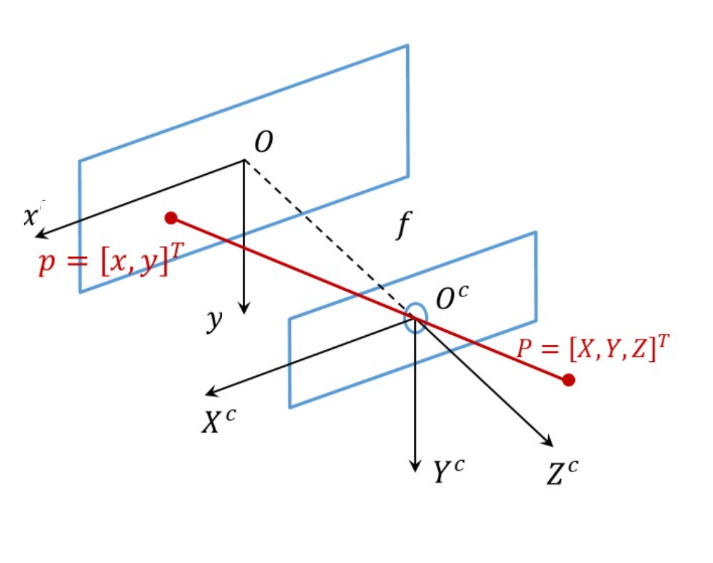

##### Intrinsic

According to the principles of lens imaging, the object plane can be approximated as being at infinity, with the image formed on the physical image plane. The relationship between the camera coordinate system $ O^c: [X^w, Y^w, Z^w]^T \in \mathbb{R}^3 $ and the physical imaging plane $ O: [x, y]^T \in \mathbb{R}^2 $ can be directly derived through similar triangles:

$$
\begin{cases} 
x = f \frac{X^c}{Z^c} \\
y = f \frac{Y^c}{Z^c} \\
\end{cases} \quad \text{Homogenized to} \quad
Z^c \begin{bmatrix} x \\ y \\ 1 \end{bmatrix} = \begin{bmatrix} f & 0 & 0 & 0 \\ 0 & f & 0 & 0 \\ 0 & 0 & 1 & 0 \end{bmatrix} \begin{bmatrix} X^c \\ Y^c \\ Z^c \\ 1 \end{bmatrix}
\text{Vectorized to} \quad
Z^c\mathbf{p} = \mathbf{M}\mathbf{P^c} \quad \mathbf{M} = \begin{bmatrix} f & 0 & 0 & 0 \\ 0 & f & 0 & 0 \\ 0 & 0 & 1 & 0 \end{bmatrix}
$$
rom the physical imaging plane $ O $ to the pixel space $ \mathbf{p}: [x_{pixel}, y_{pixel}]^T, \in \mathbb{R}^2 $, considerations must be made for central shift and distortion. Let $ k = \frac{1}{d_x} \quad l = \frac{1}{d_y} $ where $ d_x $ and $ d_y $ are the pixel width and height (in millimeters), respectively.

$ u_0 $ and $ v_0 $ are dimensionless central shift quantities. Substituting $ x, y $ into the expressions gives:
$$
\begin{cases} 
x_{pixel} = \frac{1}{d_x}x -\frac{1}{d_x}\cot \theta y + u_0 \\
y_{pixel} = \frac{1}{d_y \sin \theta} y + v_0\\
\end{cases}
\to
\begin{cases} 
x_{pixel}  = \alpha \frac{X^c}{Z^c} - \alpha \cot \theta \frac{Y^c}{Z^c} + u_0 \\
y_{pixel}  = \frac{\beta}{\sin \theta} \frac{Y^c}{Z^c} + v_0 
\end{cases}\quad
\alpha = kf, \beta = lf
$$
Thus, we have:

$$
Z^c  \begin{bmatrix}
x_{pixel} \\
y_{pixel} \\
1
\end{bmatrix}
=
\begin{bmatrix} \alpha & -\cot \theta & u_0 \\ 0 & \frac{\beta}{\sin \theta} & v_0 \\ 0 & 0 & 1 \end{bmatrix} \begin{bmatrix} X^c \\ Y^c \\ Z^c \end{bmatrix}
\text{Vectorized to}
\to
\mathbf{p} = \frac{1}{Z^c} \mathbf{K}\mathbf{P^c} =\mathbf{K}\begin{bmatrix} \frac{X^c}{Z^c} \\ \frac{Y^c}{Z^c} \\ 1 \end{bmatrix}
$$
有时候，为了方便讨论，我们会引入一个虚拟的归一化成像平面，$O': \mathbf{P'} = [X^c/Z^c, Y^c/Z^c, 1] \in \mathbb{R}^2$，则
$$
\mathbf{p} = \mathbf{K} \mathbf{P'}
$$
这个式子在后面会经常用到

##### Extrinsic


(Transformation from the world coordinate system $ O^w: [X^w, Y^w, Z^w]^T $ to the camera coordinate system $ O^c: [X^c, Y^c, Z^c]^T $)

$$
O^w \to O^c: \quad \mathbf{P^c} = \mathbf{R} \mathbf{P^w} + \mathbf{t}\\
  \begin{bmatrix} X^c \\ Y^c \\ Z^c \\ 1 \end{bmatrix} = \begin{bmatrix} \mathbf{R} & \mathbf{t} \\ 0 & 1 \end{bmatrix} \begin{bmatrix} X^w \\ Y^w \\ Z^w \\ 1 \end{bmatrix}\quad 
\begin{bmatrix} X^c \\ Y^c \\ Z^c \end{bmatrix} = \begin{bmatrix} \mathbf{R} & \mathbf{t} \end{bmatrix} \begin{bmatrix} X^w \\ Y^w \\ Z^w \\ 1 \end{bmatrix}
$$

##### Imaging Formula

From the world coordinate system $ O^w: [X^w, Y^w, Z^w]^T $ to the pixel space $ \mathbf{p} = [x_{pixel}, y_{pixel}] $

$$
\mathbf{P^c} = [\mathbf{R} \quad \mathbf{t}]\mathbf{P^w} \quad 
\mathbf{p}_{pixel} = \frac{1}{Z^c} \mathbf{K} \mathbf{P^c}\to
\mathbf{p}_{pixel} = \frac{1}{Z^c}\mathbf{K}[\mathbf{R} \quad \mathbf{t}]\mathbf{P^w}\\
\text{where }
\mathbf{K} = 
\begin{bmatrix} \alpha & -\cot \theta & u_0 \\ 0 & \frac{\beta}{\sin \theta} & v_0 \\ 0 & 0 & 1 \end{bmatrix}

 ,\mathbf{R} = \begin{bmatrix} R_{11} & R_{12} & R_{13} \\ R_{21} & R_{22} & R_{23} \\ R_{31} & R_{32} & R_{33} \end{bmatrix} ,\mathbf{t} = \begin{bmatrix} t_1 \\ t_2 \\ t_3 \end{bmatrix} \\
$$

#### 3.1.1* Camera Calibration

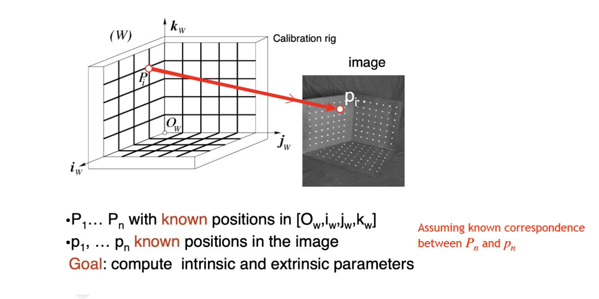

Camera calibration involves determining the intrinsic and extrinsic parameters of a camera to accurately map 3D world coordinates to 2D image coordinates.

Assume $ n $ images are captured, each with $ k $ chessboard corners.

- **Input**: Chessboard corner coordinates $ M_j (j \in 1,2,...,k) $ and their corresponding image coordinates $ m_{ij} (i \in 1,2,...,n, j \in 1,2,...,k) $.
- **Output**: Camera intrinsic parameters $ \mathbf{K} $, and extrinsic parameters $ \mathbf{R}_i, \mathbf{t}_i $ for each image.
- **Objective**: Minimize the reprojection error:

$$
\sum_{i=1}^{n} \sum_{j=1}^{k} \| m_{ij} - \hat{m}(\mathbf{K}, \mathbf{R}_i, \mathbf{t}_i, M_j) \|^2
$$

where $ \hat{m}(\mathbf{K}, \mathbf{R}_i, \mathbf{t}_i, M_j) $ represents the projection of $ M_j $ onto the $ i $-th image.

1. **Collect Data**: Capture a set of images of a known calibration pattern (e.g., a checkerboard) from different viewpoints.
2. **Detect Feature Points**: Detect and identify feature points in each image.
3. **Estimate Intrinsic Parameters**: Use a nonlinear optimization algorithm to minimize the reprojection error.
4. **Estimate Extrinsic Parameters**: Estimate the extrinsic parameters for each image.
5. **Refine the Model**: Iteratively refine the camera model by re-estimating the parameters.
6. **Validate the Model**: Validate the accuracy of the camera model.

In homogeneous coordinates, the projection point in the chessboard coordinate system is $ \tilde{m} = [u, v, 1]^T $, which has the corresponding relationship:
$$
\lambda \tilde{m} = \lambda \begin{bmatrix} u \\ v \\ 1 \end{bmatrix} = \mathbf{K} \begin{bmatrix} r_1 & r_2 & r_3 & t \end{bmatrix} \begin{bmatrix} X \\ Y \\ Z \\ 1 \end{bmatrix}
$$
Assuming the chessboard corners are on the plane $ Z = 0 $:
$$
\lambda \tilde{m} = \lambda \begin{bmatrix} u \\ v \\ 1 \end{bmatrix} = \mathbf{K} \begin{bmatrix} r_1 & r_2 & t \end{bmatrix} \begin{bmatrix} X \\ Y \\ 1 \end{bmatrix}
$$
Let $ \tilde{M} = [X, Y, 1]^T $, then:
$$
\lambda \tilde{m} = \mathbf{H} \tilde{M} \quad \mathbf{H} = \mathbf{K} \begin{bmatrix} r_1 & r_2 & t \end{bmatrix}
$$
where $ \mathbf{H} $ is the homography matrix.

#### 3.1.2* Depth Images: 2.5D Representation

We want to aggregate complete 3D scenes from partial observation of the world. Beyond the image taken by camera which are in 2D pictures(single view/ single frame), there are actually different types of sensors and visual data as input.

| **Depth sensors**                                            | Depth image                                                  |
| ------------------------------------------------------------ | ------------------------------------------------------------ |
| 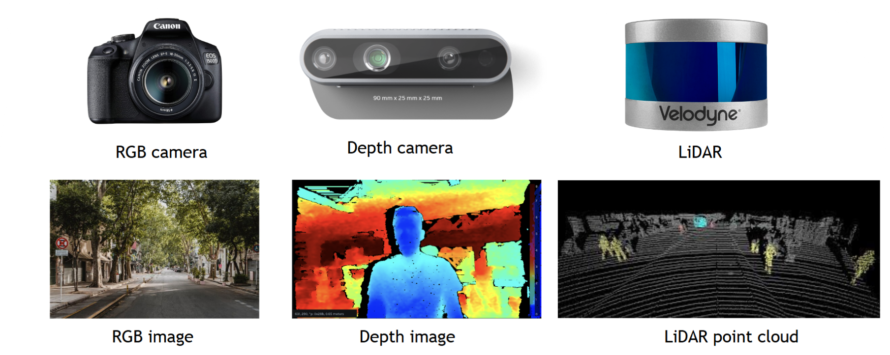 | 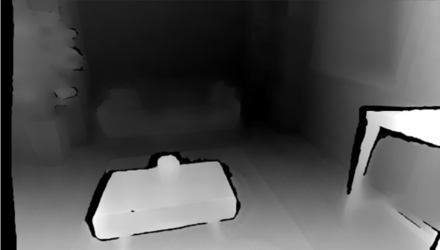 |

- **Depth sensors** are a form of 3D range finder, which measure multi-point distance information across a wide Field-of-View (FoV). 

- **A depth image** is a single-channel image filled by depth values. Attention that depth image records z depth, i.e., **the distance along z axis** (optical axis) from the optical center to the point, **not ray depth** (the distance between the optical center and the point).

- **Why 2.5D？**True 3D representation should enable distance measurement between two points, in addition to depth,  you need $K$ to compute $(x,y,z)$ that is truly 3D, therefore depth is only 2.5D

- **Stereo Sensors** (1) *estimate correspondence*, (2) *compute disparity* and then (3) *turn it into depth*.

  | Stereo Sensors                                               | Point Triangulation                                          |
  | ------------------------------------------------------------ | ------------------------------------------------------------ |
  | 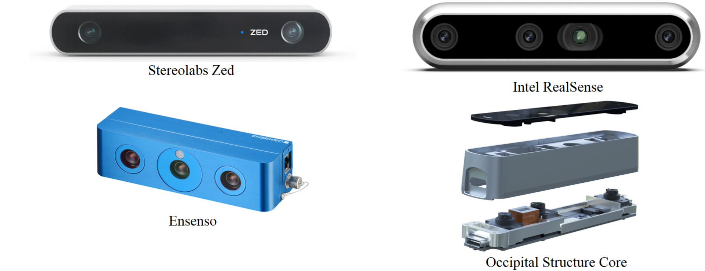 | 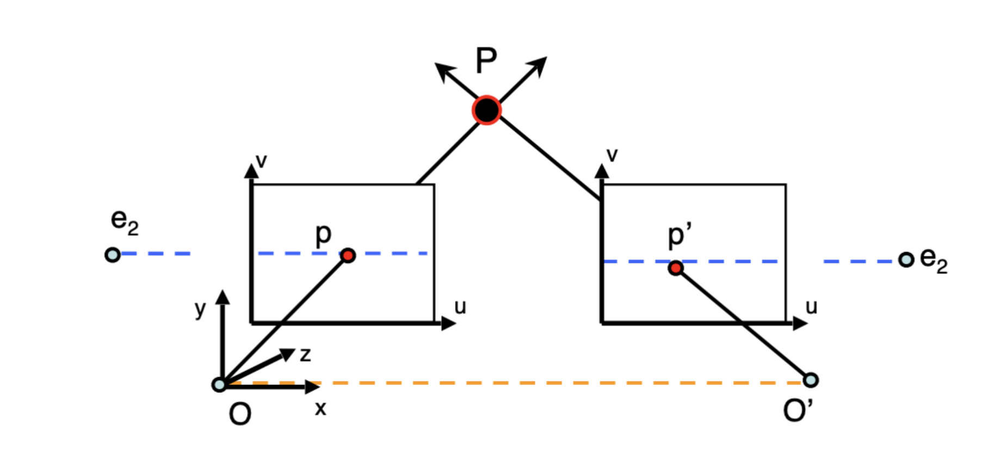 |

- **Disparity Maps**

  | Disparity                                                    | Parallel binocular depth                                     |
  | ------------------------------------------------------------ | ------------------------------------------------------------ |
  | 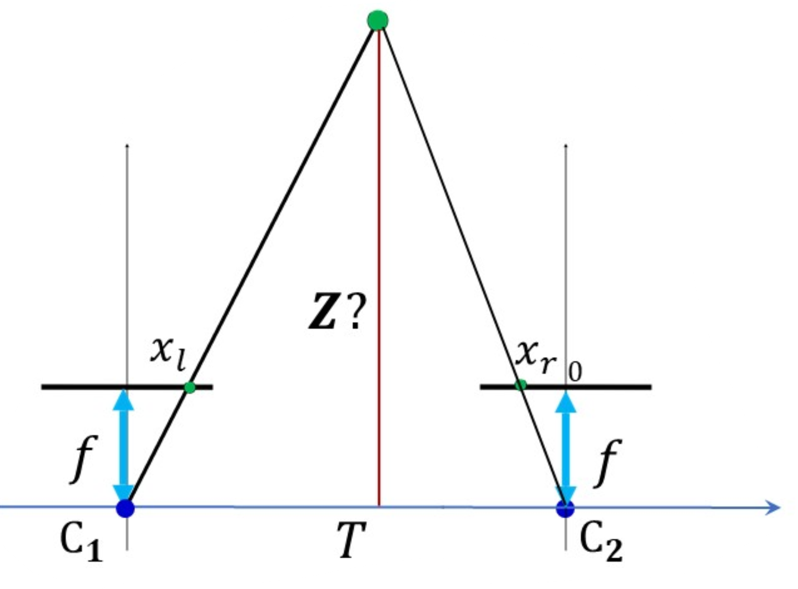 | 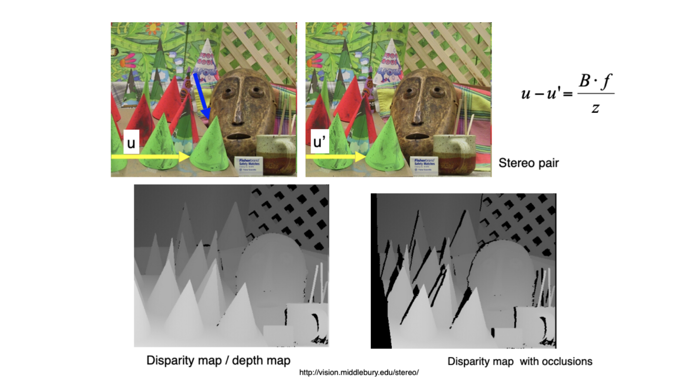 |

  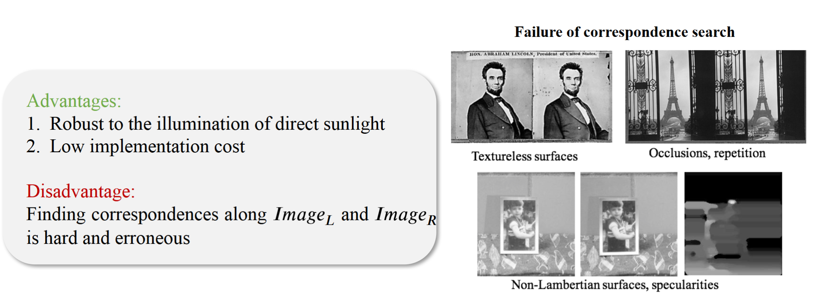

- To fix the disadvantages of passive sterio sensors we can use **Structure Light**.

  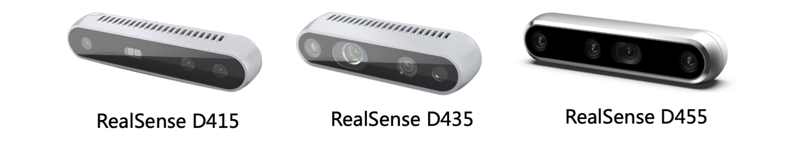

  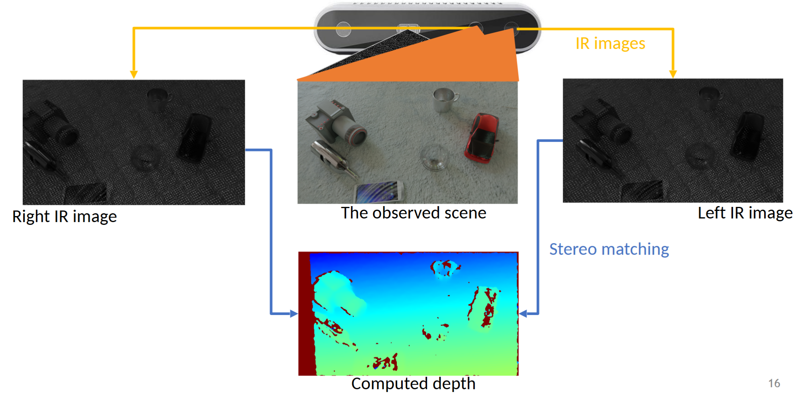

#### 3.1.3  Epipolar Geometry

##### Epipolar constraint

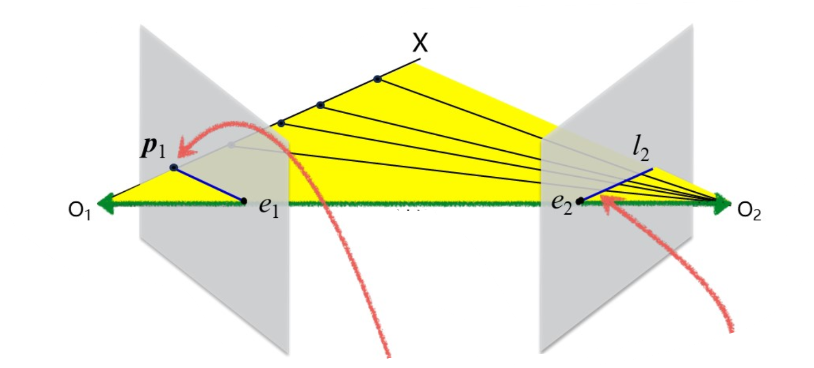

When a 3D point X is projected onto the first image as point x₁, its corresponding projection in the second image must lie on a specific line known as the epipolar line. As shown in the figure, the potential matches for point p₁ must lie on the epipolar line l₂.

##### Relating Two Views

The coordinate transformation from plane I₁ to plane I₂ is represented by [R|t]. For a point with coordinates X in the I₁ coordinate system, its coordinates in the I₂ system are RX+t. Alternatively, this can be described as O₂ having extrinsic parameters R and t relative to O₁. In the diagrams, the blue frames represent pixel planes (using a perspective camera model rather than the pinhole camera model discussed earlier). Points p₁ and p₂ are located on these pixel planes. If we choose the left camera coordinate system as the world coordinate system, the right camera has extrinsic parameters [R|t] relative to the left camera. According to the equation $\mathbf{p} = \frac{1}{Z^c} \mathbf{K}\mathbf{P^c}$, we have:
$$
z_1p_1 = K_1P \quad z_2p_2 = K_2 (RP + t)
$$
To relate the two views using epipolar constraints: Points x₁ and x₂ in the diagrams are on the normalized image planes , denoted as $P'$. According to $\mathbf{p} = \mathbf{K} \mathbf{P'}$, we have:

$$x_1 = \mathbf{K_1}^{-1}\mathbf{p_1} = \mathbf{K_1}^{-1}\frac{1}{z_1} \mathbf{K_1}P$$
$$x_2 = \mathbf{K_2}^{-1}\frac{1}{z_2}\mathbf{K_2}(RP+t)$$

In terms of scale, we can approximate $z_1 \approx z_2$ This gives us $Rx_1+t \approx x_2$. Taking the cross product with t on both sides:
$$t \times(Rx_1 + t) \approx t \times x_2$$ Then taking the dot product with x₂ on both sides:
$$x_2 \cdot [t_{\times}]Rx_1 = x_2 \cdot (t \times x_2)$$ Defining the **essential matrix** $E = [t_{\times}]R$, we get the first equation:
$$x_2^TEx_1 = 0$$ Substituting the expressions for x₁ and x₂:
$$p_2^TK^{-T}[t_{\times}]RK^{-1}p_1 = 0$$ Defining the **fundamental matrix** $F = K^{-T}[t_{\times}]RK^{-1}$, we get:
$$p_2^T Fp_1 = 0$$

| 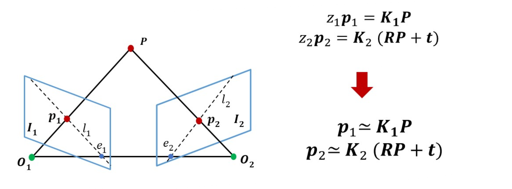 | 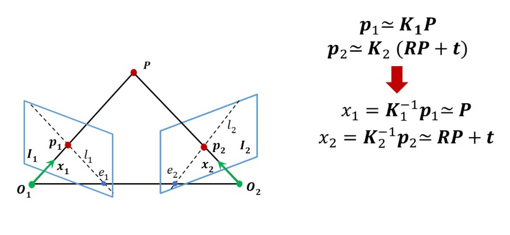 |
| ------------------------------------------------------------ | ------------------------------------------------------------ |
| 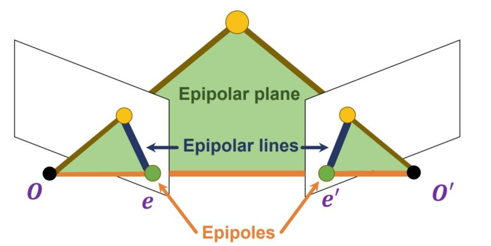 | 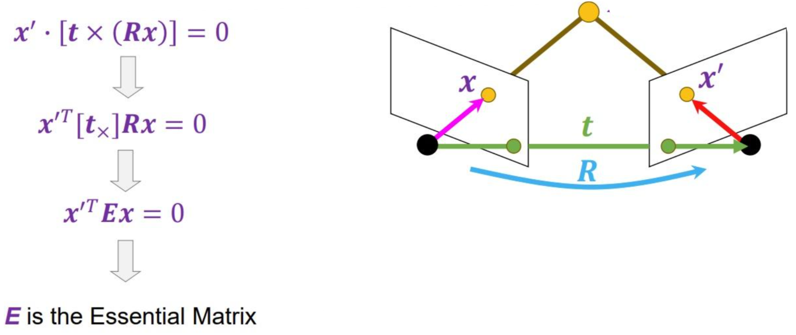 |

### **3.2 SfM**: Structure from Motion [Lecture 4]

#### 3.2.1 Overview

SfM is the process of reconstructing 3D structure from its projections into a series of images taken from different viewpoints. (Johannes L.Schonberger, e.t.c.) The concept involves analyzing the apparent motion of features across multiple images to recover the 3D structure of a scene and the camera motion. The aim is to reconstruct sparce 3D model in a large wide.

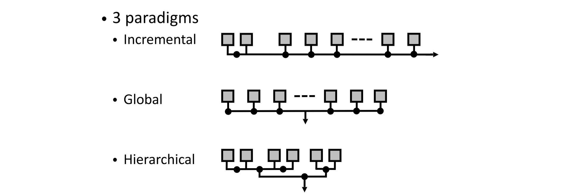

 Incremental SfM is a sequential processing pipeline with an iterative reconstruction component

#### 3.2.2 Pipeline

0. **Data Association**

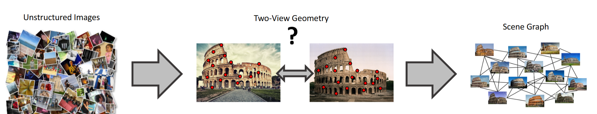

- Input: Unstructured Images

- Outputs: 
  - 1) identified pairs of overlapping images
  - 2) geometrically verified inlier matches (and optionally, feature descriptors for later use)
  - 3) related camera poses (if known calibration)

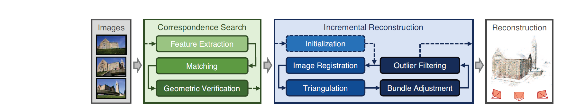

1. **Feature Extraction and Matching** : Detect distinctive features in each image and establish correspondences between them across different images.

   

2. **Initial Reconstruction** : Select an initial image pair(two non-panoramic view $||t||\neq 0$), estimate the relative camera pose between them, and triangulate the inlier correspondences to obtain their 3D coordinates. (for example, by estimating F matrix?)

   

3. **Bundle Adjustment Optimization** : Refine both camera parameters and 3D point positions by minimizing the reprojection error across all observations.
   $$
   \min_{P,X}||x - \pi(P,X)||\\
   $$

4. **Incremental Reconstruction** : For each additional image, estimate its camera pose relative to the existing reconstruction and triangulate new 3D points. Repeat the bundle adjustment to optimize the entire model.

   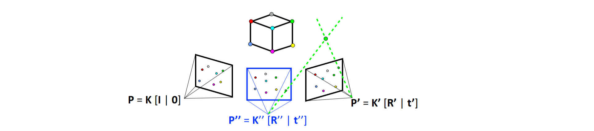

> Bundle Adjustment

Bundle Adjustment is a critical optimization technique used in both Structure from Motion (SFM) and Simultaneous Localization and Mapping (SLAM). It jointly optimizes camera parameters and 3D point positions by minimizing the sum of reprojection errors across all observations.
$$
\text{Minimize sum of squared reprojection errors}:\\
g(X, R, t) = \sum_{i = 1}^m \sum_{j = 1}^n w_{ij}·||P(x_i, R_j, t_j) - x||^2
$$
Specifically, it adjusts the camera extrinsic parameters (position and orientation) and the 3D point coordinates to minimize the difference between the observed 2D feature locations and the projected locations of their corresponding 3D points. This optimization is typically solved using least squares methods and is essential for achieving high-precision 3D reconstruction and camera pose estimation.

#### 3.2.3 Related

Global SFM estimate global rotations: $\min_{R} ||R_{ij} - R_iR_j T||$


The complete understanding of SFM requires knowledge from multiple areas, including:

- Stereo vision and triangulation
- Camera calibration and pose estimation
- Feature detection and matching algorithms
- Optimization techniques for non-linear systems
  Several important papers and SLAM (Simultaneous Localization and Mapping) algorithms have contributed significantly to this field, providing robust solutions for various applications in computer vision, robotics, and augmented reality.

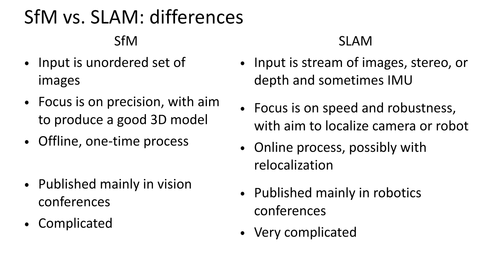


#### 3.2.4 Learning Based SfM

> How to use learning-based methods to improve the robustness/precision of the SfM pipeline？Two thoughts:
>
> 1. Improving **features and keypoints** for matching
>
> 2. Improving the **matching process** via global reasoning

##### SuperPoint: A Learned Detector and Descriptor

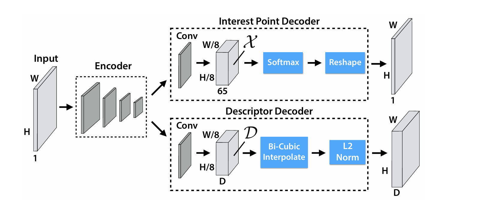

What makes for good key points? Points should be **repeatable and distinctive**. 

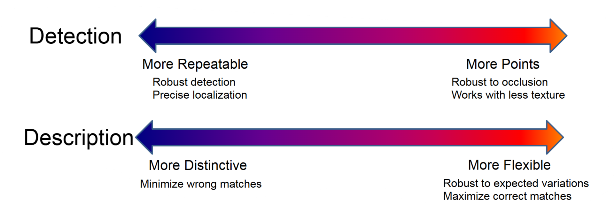

| Detector                                                     | Descriptor                                                   |
| ------------------------------------------------------------ | ------------------------------------------------------------ |
| 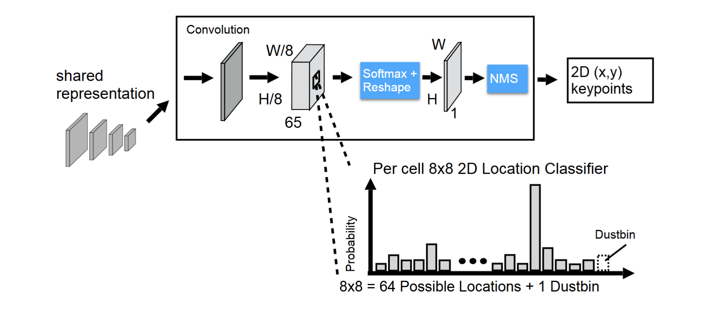 | 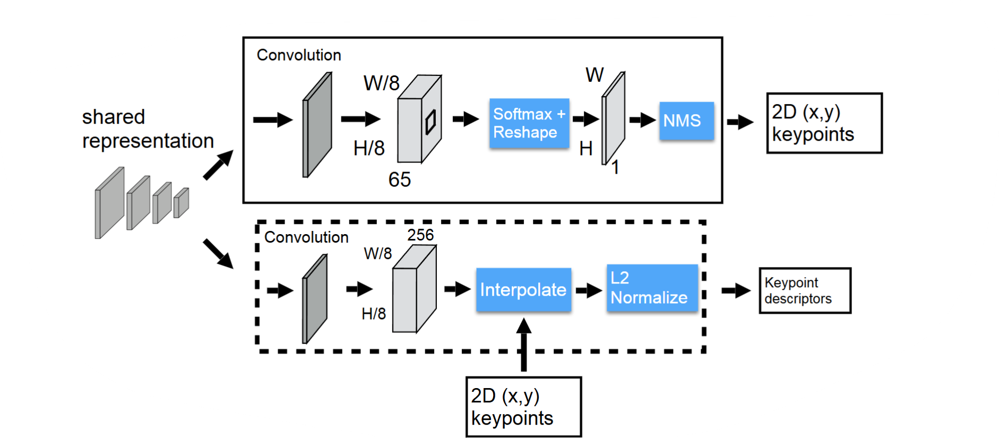 |
| No upsampling layers<br/>Each output cell responsible for a 8 X 8 pixel patch | Bilinear interpolation using keypoint locations to get descriptors |

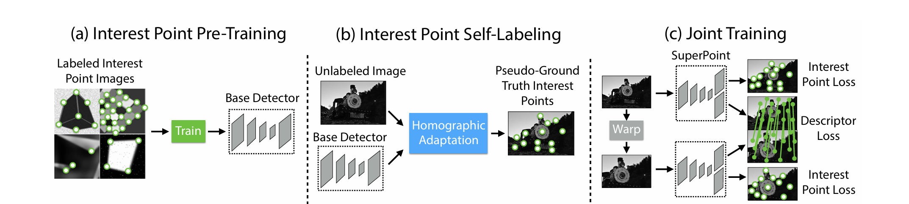

1. **Synthetic Pre - training**
   - **Dataset Creation**: A synthetic dataset “Synthetic Shapes” is created, composed of 2D geometric shapes (e.g., quadrilaterals, triangles). Interest points are clearly defined at junctions and specific positions. After rendering, homographic warps are applied to augment data.
   - 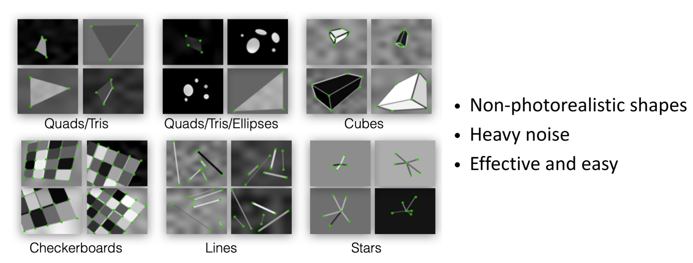
   - **MagicPoint Training**: Use the detector part of SuperPoint architecture to train on “Synthetic Shapes”. Let the detector function be $f_{\theta}(\cdot)$, and train it with the data from the synthetic dataset. Denote the input image as $I$, and the output interest points as $x = f_{\theta}(I)$. MagicPoint outperforms traditional detectors on this dataset in terms of mean Average Precision (mAP).

2. **Homographic Adaptation**

   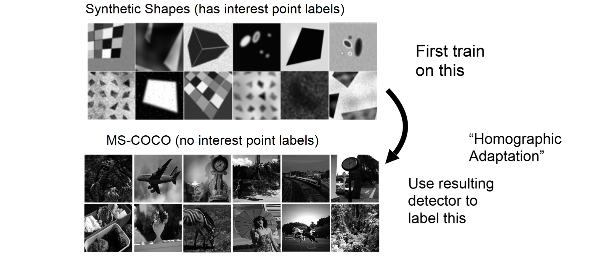

   1. **Formulation**: Based on the idea that an ideal interest point operator should be covariant with respect to homographies. Given a random homography $H$, if $f_{\theta}(\cdot)$ is covariant, then $\mathcal{H}x = f_{\theta}(\mathcal{H}(I))$, which can be rewritten as $x=\mathcal{H}^{-1} f_{\theta}(\mathcal{H}(I))$. In practice, we use the empirical sum over a set of random homographies. The improved detector $\hat{F}(\cdot)$ is defined as $\hat{F}\left(I ; f_{\theta}\right)=\frac{1}{N_{h}} \sum_{i = 1}^{N_{h}} \mathcal{H}_{i}^{-1} f_{\theta}\left(\mathcal{H}_{i}(I)\right)$, where $N_{h}$ is the number of homographies.

   2. **Choosing Homographies**: Decompose potential homographies into simple transformations (translation, scale, etc.). Sample these transformations within pre - determined ranges and compose them. Experiments show that $N_{h}=100$ gives a good balance in performance improvement.

   3. **Iterative Process**: Apply Homographic Adaptation iteratively to improve the base MagicPoint architecture on real - world images. The resulting model after adaptation is SuperPoint.

      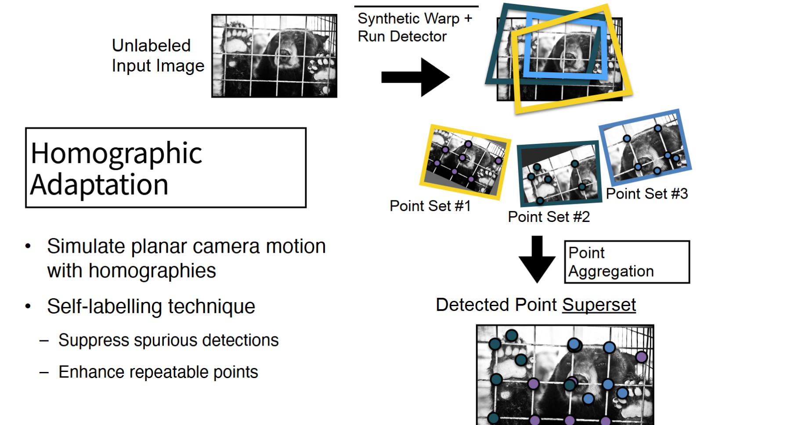

3. **Joint Training of SuperPoint**
   - **Pseudo - ground Truth Generation**: Use the MagicPoint detector and MS - COCO 2014 training dataset (resized to 240×320 and grayscale) to generate pseudo - ground truth labels. Apply Homographic Adaptation with $N_{h}=100$ twice.
   - **Training with Loss Functions**
     - The final loss $\mathcal{L}$ is the sum of the interest point detector loss $\mathcal{L}_{p}$ and the descriptor loss $\mathcal{L}_{d}$, weighted by $\lambda$, i.e., $\mathcal{L}=\mathcal{L}_{p}+\mathcal{L}_{p}'+\lambda \mathcal{L}_{d}$.
     - For the interest point detector loss $\mathcal{L}_{p}$, it is a cross - entropy loss over cells $x_{h w}$ in the output of the interest point detector. Given the ground - truth labels $y_{h w}$, $\mathcal{L}_{p}(\mathcal{X}, Y)=\frac{1}{H_{c} W_{c}} \sum_{\substack{h = 1\\w = 1}}^{H_{c}, W_{c}} l_{p}\left(x_{h w} ; y_{h w}\right)$, where $l_{p}\left(x_{h w} ; y\right)=-\log \left(\frac{\exp \left(x_{h w y}\right)}{\sum_{k = 1}^{65} \exp \left(x_{h w k}\right)}\right)$.
     - For the descriptor loss $\mathcal{L}_{d}$, it is applied to pairs of descriptor cells $d_{h w}$ and $d_{h' w'}'$. Given the homography - induced correspondence $s_{h w h' w'}$, $\mathcal{L}_{d}\left(\mathcal{D}, \mathcal{D}', S\right)=\frac{1}{\left(H_{c} W_{c}\right)^{2}} \sum_{\substack{h = 1\\w = 1}}^{H_{c}, W_{c}} \sum_{\substack{h' = 1\\w' = 1}}^{H_{c}, W_{c}} l_{d}\left(d_{h w}, d_{h' w'}' ; s_{h w h' w'}\right)$, where $l_{d}\left(d, d' ; s\right)=\lambda_{d} * s * \max \left(0, m_{p}-d^{T} d'\right)+(1 - s) * \max \left(0, d^{T} d'-m_{n}\right)$. 

##### SuperGlue: context aggregation + matching + filtering

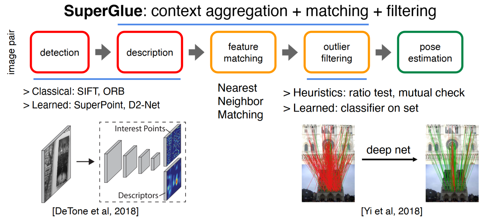

> Main focus: Context is important in matching!

- Formulation

  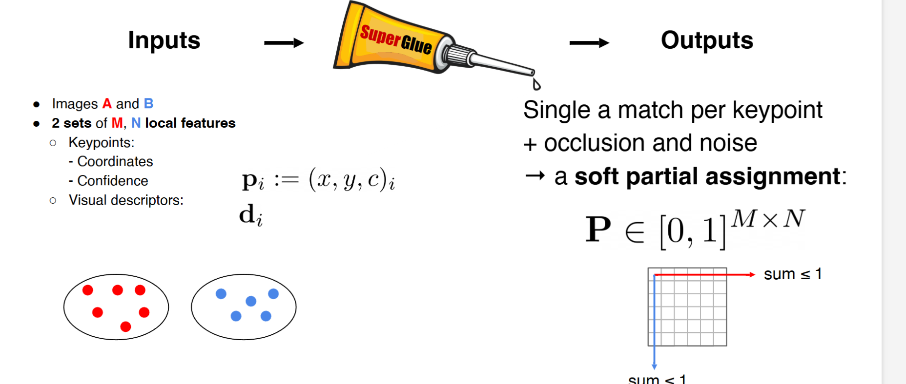

- Components

  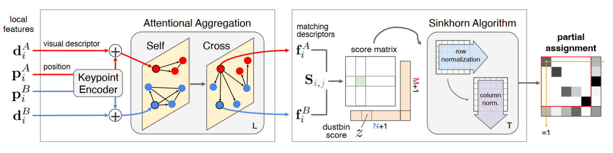

  - A **Graph Neural Network with attention**: Encodes contextual cues & priors and reasons about the 3D scene.
  - **Solving a partial assignment problem**: Using Differentiable solver and enforces the assignment constraints agree to domain knowledge

- Pipeline

  | 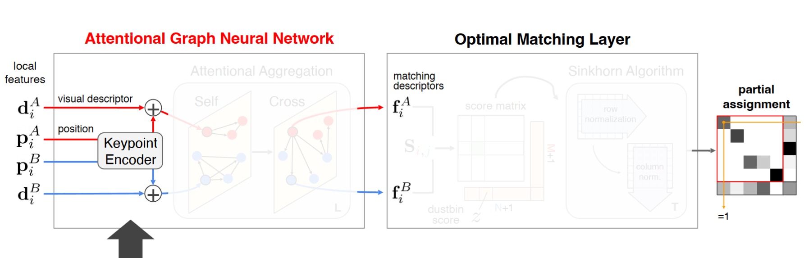 | 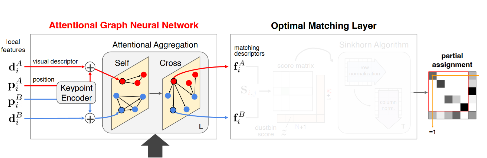 | 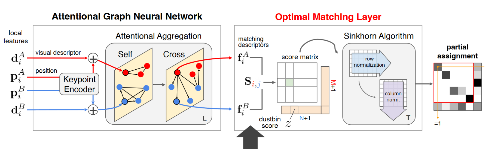 |
  | ------------------------------------------------------------ | ------------------------------------------------------------ | ------------------------------------------------------------ |
  | 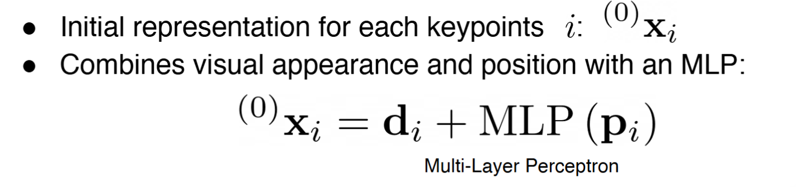 | 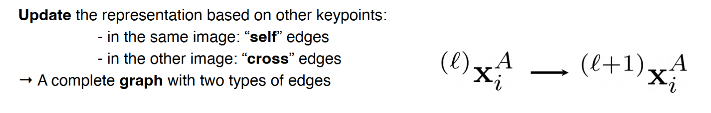</br>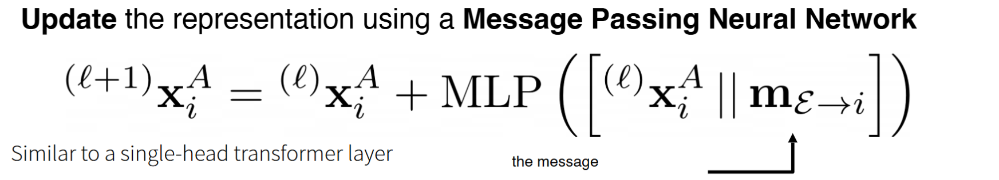 | 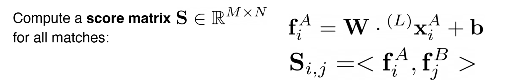 |
  | 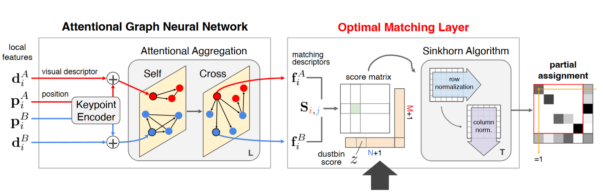 | 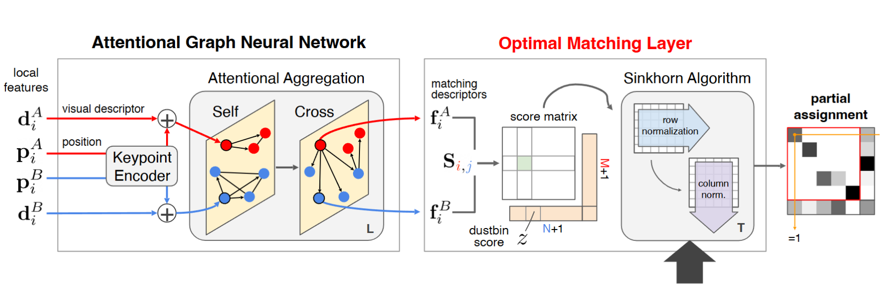 | 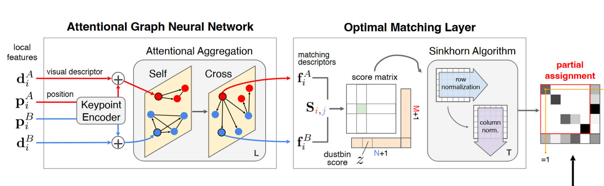 |
  | 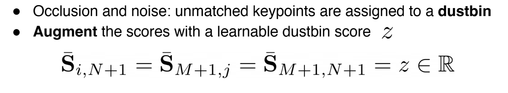 | 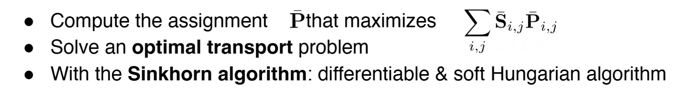 | 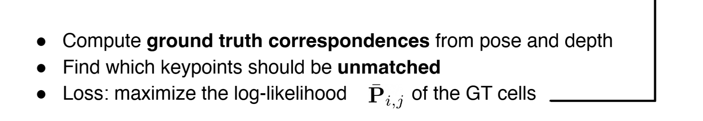 |

### 3.3 **MVS**: Muti-View Stereo [Lecture 5]

| Fron image to dense 3D                     | MVS Pipeline                                                 |
| ------------------------------------------ | ------------------------------------------------------------ |
| 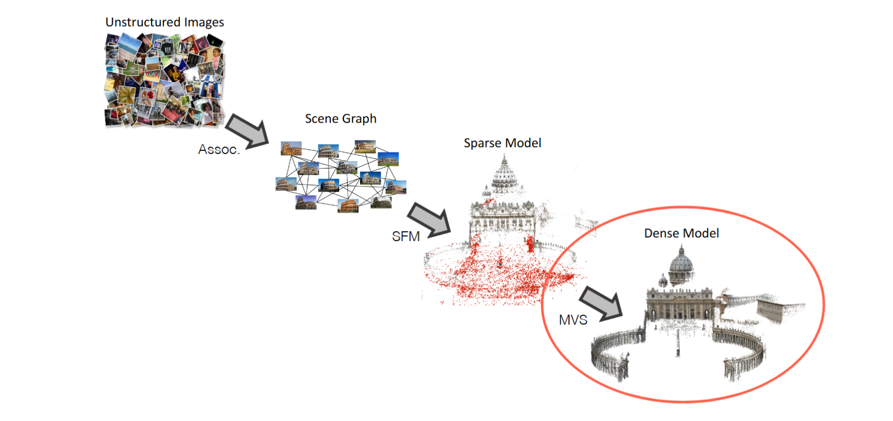 |  |

#### 3.3.1 Overview

The **definition** of multi-view stereo is reconstructing the dense 3D shape from a set of images 
and camera parameters. There are many application based on this tech: (1) Enable inspection in hard to reach areas with drone photos and 3D reconstruction (2) Create 3D model from images (3) Provide tools to inspect on images and map interactions to 3D.

Multi - View Stereo (MVS) aims to compute the three - dimensional (3D) structure of an object or a scene from multiple calibrated images. The input for MVS is a set of multi - view images of a scene or object. These images are captured from different viewpoints, and the camera parameters (both intrinsic and extrinsic) are assumed to be known. Additionally, a set of sparse matching points (from feature - based matching algorithms) may also be provided as input in some cases.

- Given the multi - view images with known camera parameters, the main goal of MVS is to estimate the dense 3D surface coordinates of the scene or object. This involves finding the depth value for each pixel in the images (or a subset of pixels) and then using these depth values to construct a 3D point cloud or a surface model.
- Mathematically, for each pixel $p$ in a reference image $I_{r}$, we want to find its corresponding 3D point $P=(X, Y, Z)$ in the world coordinate system. Using the camera projection equations $p = K[R|t]P$, where $K$ is the camera intrinsic matrix, $[R|t]$ is the camera extrinsic matrix, we can relate the 2D pixel coordinates $p=(u, v)$ to the 3D world coordinates $P$. However, in MVS, we need to solve this problem in a multi - view context, considering multiple images $I_{1},I_{2},\cdots,I_{n}$ to disambiguate the depth values and get more accurate 3D reconstructions.

#### 3.3.2 Classical Pipeline

-  Step 1: Select Matching Views
    Choose several matching views corresponding to the reference view.
- Step 2: Pixel - level Processing in Iterations
    - **i**: For each pixel in the reference view, further select matching views. This is to narrow down the views that are most relevant for calculating the depth information of this specific pixel.
    - **ii**: Define the range of depth and normal values. This provides a search space for estimating the 3D position of the pixel.
    - **iii**: Compute the photometric matching cost (such as Normalized Cross - Correlation, NCC) between the reference view and multiple matching views. This cost measures how well the regions around the pixel in different views match in terms of photometric properties.
    - **iv**: Select the candidate 3D point with the optimal (lowest in most cases) matching cost. This 3D point is considered as the best estimate for the position of the pixel in 3D space.
- Step 3: Post - processing
    Filter out noisy depth values and fuse multiple depth maps. This step aims to improve the quality of the depth information by removing incorrect or inconsistent depth values and combining depth maps from different processing steps or views.

The basic idea of **Dense Depth Estimation** which is the core step in MVS (estimate the depth values for a large number of pixels, ideally all pixels in the images) is **reconstruction from photometric consistency**. The assumption is that corresponding points in multiple images of the same scene should have similar photometric properties (such as color and intensity). By minimizing the photometric differences (e.g., photometric consistency loss) between projected points across different views, we can estimate the 3D structure. For example, in a multi - view setup, if a point in one image is projected to another image based on a hypothesized 3D position, the color/intensity at the projected location should match the actual pixel value in that image as closely as possible.

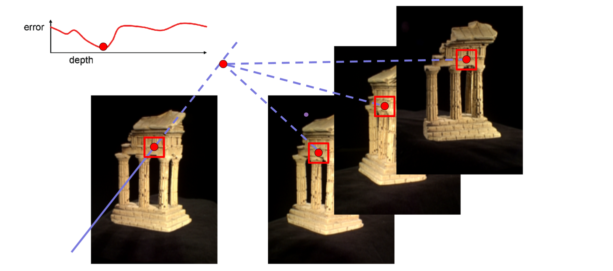

- **Plane Sweep**: We form different depth planes based on the reference view. For each depth plane, we use a **homography matrix** $H$ to **map the plane to the source views and calculate the matching cost** (such as Normalized Cross - Correlation - NCC) between the projected regions. The depth value with the minimum matching cost is considered as the estimated depth for the pixel in the reference view.
  $$
  SSD=\sum_{i, j}(W_1(i, j)-W_2(i, j))^{2}
  $$

  $$
  \text{NCC:normalized cross corrlaion}\\
  NCC=\frac{\sum_{i, j}\left(W_1(i, j)-\mu_{W_1}\right)\left(W_2(i, j)-\mu_{W_2}\right)}{\sqrt{\sum_{i, j}\left(W_1(i, j)-\mu_{W_1}\right)^{2} \sum_{i, j}\left(W_2(i, j)-\mu_{W_2}\right)^{2}}}
  $$

  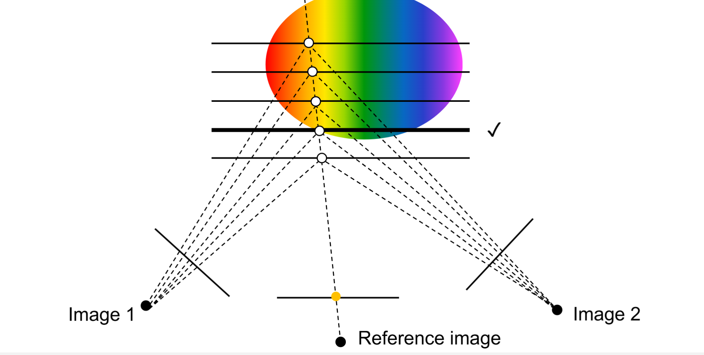

  

  - Details: Calculation of the Homography Matrix $H$

    - Assume that the world coordinate system is the coordinate system of the reference camera. Then:
      - A pixel $p_1 = [(x, y, 1)]^T$ in the reference image satisfies $p_1\cong K_1P$.
      - $P$ is a point on the plane $\Pi_d$ formed by back - projecting the reference image at a distance $d$ into space. The plane $\Pi_d$ is parallel to the imaging plane.
      - Let $n$ be the normal vector of $\Pi_d$ ($n = [0, 0, 1]^T$). Then $n^TP + d = 0$, which implies $-\frac{n^TP}{d}=1$.
    - For any source camera, with camera intrinsic matrix $K_i$ and extrinsic matrices $R_i, t_i$:
      - A pixel $p_i$ in the source image satisfies $p_i\cong K_i(R_iP + t_i)=K_i\left(R_iP + t_i\cdot\left(-\frac{n^TP}{d}\right)\right)=K_i\left(R_i-\frac{t_i\cdot n^T}{d}\right)P$.
      - Also, $p_i\cong K_i\left(R_i-\frac{t_i\cdot n^T}{d}\right)K_1^{-1}p_1$.
      - The matrix $H = K_i\left(R_i-\frac{t_i\cdot n^T}{d}\right)K_1^{-1}$ is defined. This matrix $H$ establishes the correspondence between pixels of the two images and is called the homography matrix. 

    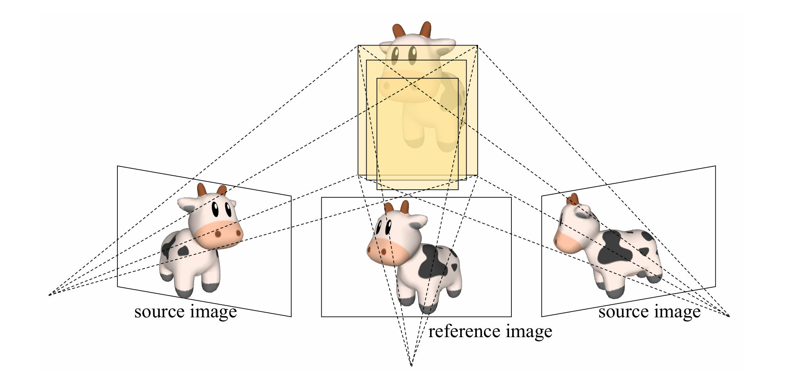

- Selecting multiple matching views: 

  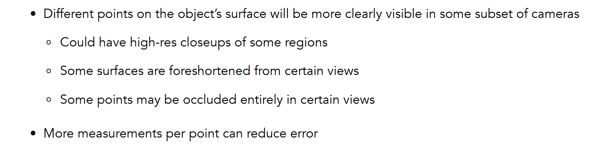

| Principles of selecting views                                | Selecting Examples                                           |
| ------------------------------------------------------------ | ------------------------------------------------------------ |
| **Geometric Proximity**: Views that are geometrically close to the reference view are preferred. Geometrically close views are more likely to have overlapping regions that can provide consistent information for depth estimation. For example, cameras that are adjacent in a multi - camera setup covering a scene. <br/>**Photometric Similarity**: Views with similar photometric properties to the reference view are chosen. Views where the intensity and color of corresponding regions match well are more suitable for calculating accurate depth information. If there are significant photometric differences (e.g., due to different lighting conditions), it can lead to errors in depth estimation. <br/>**Spatial Coverage**: Views that cover different parts of the scene relative to the reference view are selected. This helps in getting a more comprehensive understanding of the 3D structure. |  |

#### 3.3.3 Learning-based MVS

Why learning based methods? Learned feature can do more robust matching and the shape prior learned by the network can do more complex reconstruction. MVSNet

##### MVSNet: A first pipeline

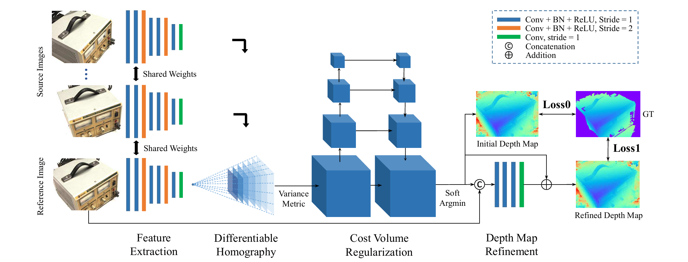

- **Image Feature Extraction**
  - **Input**: $N$ input images $\{I_{i}\}_{i = 1}^{N}$.
  - **Process**: An eight - layer 2D CNN is utilized. Strides of layer 3 and 6 are set to 2, dividing the feature towers into three scales. In each scale, two convolutional layers (with Batch Normalization (BN) and Rectified Linear Unit (ReLU), except the last layer) are applied, and parameters are shared among all feature towers.
  - **Output**: $N$ 32 - channel feature maps $\{F_{i}\}_{i = 1}^{N}$, which are $1/4$ the size of the input images in each dimension. 

> **Homography**

| 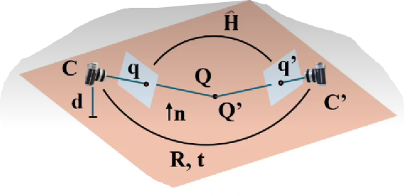 |  |
| ------------------------------------------------------------ | ------------------------------------------------------------ |
| $q' = K\left(R + \frac{1}{d}tn^T\right)K^{-1}q$<br/>The homography matrix $H$ between the pixel coordinate systems of two cameras for a point on the plane is defined as $H = K\left(R + \frac{1}{d}tn^T\right)K^{-1}$<br/>the homography matrix $\hat{H}$ between the two camera coordinate systems (ignoring intrinsic effects) is$\hat{H}=R + \frac{1}{d}tn^T$ | All feature maps are warped into different frontoparallel planes of the reference camera to form N feature volumes ${V_{i}}_{i = 1}^{N}$ |

- **Cost Volume Construction**

  - **Input**: Extracted feature maps $\{F_{i}\}_{i = 1}^{N}$, camera parameters $\{K_{i}, R_{i}, t_{i}\}_{i = 1}^{N}$ of the input cameras.
  - **Process**:
      - **Differentiable Homography**: All feature maps are warped into different frontoparallel planes of the reference camera to form $N$ feature volumes $\{V_{i}\}_{i = 1}^{N}$. The coordinate mapping is $x' \sim H_{i}(d) \cdot x$, where $H_{i}(d)=K_{i} \cdot R_{i} \cdot\left(I-\frac{\left(t_{1}-t_{i}\right) \cdot n_{1}^{T}}{d}\right) \cdot R_{1}^{T} \cdot K_{1}^{T}$.
      - **Cost Metric**: A variance - based cost metric $M$ aggregates the $N$ feature volumes $\{V_{i}\}_{i = 1}^{N}$ into a single cost volume $C$. $C=\mathcal{M}(V_{1},\cdots,V_{N})=\frac{\sum_{i = 1}^{N}(V_{i}-\overline{V_{i}})^2}{N}$, with $\overline{V_{i}}$ being the average volume among all feature volumes.
      - **Cost Volume Regularization**: A multi - scale 3D CNN (akin to a 3D version of UNet) refines the cost volume $C$ to generate a probability volume $P$ for depth inference. After the first 3D convolutional layer, the 32 - channel cost volume is reduced to 8 - channel, and the number of convolutions in each scale changes from 3 to 2 layers. The last convolutional layer outputs a 1 - channel volume, followed by a softmax operation along the depth direction for probability normalization.

  - **Output**: Probability volume $P$. The cost volume in this context is constructed based on the frustum of the reference camera. It implicitly encodes camera geometries in the network to build 3D cost volumes from 2D image features, which is crucial for depth map inference.


- **Depth Map Generation**

  - **Input**: Probability volume $P$, reference image $I_1$.

  - **Process**:

      - **Initial Estimation**: The depth map $D$ is computed as the expectation value along the depth direction, $D=\sum_{d = d_{min}}^{d_{max}} d \times P(d)$.

        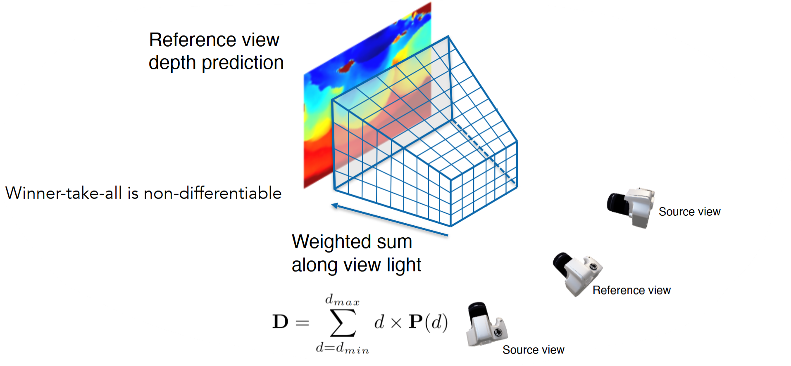

      - **Probability Map**: The quality of a depth estimation $\hat{d}$ is defined by the probability sum over the four nearest depth hypotheses.

      - **Depth Map Refinement**: A depth residual learning network is employed. The initial depth map and the resized reference image are concatenated as a 4 - channel input, passed through three 32 - channel 2D convolutional layers followed by one 1 - channel convolutional layer to learn the depth residual. The initial depth map is added back after pre - scaling to $[0, 1]$ and post - scaling back.

  - **Output**: Refined depth map.


- **Loss Calculation**

  - **Input**: Ground truth depth map, initial depth map $\hat{d}_{i}$, refined depth map $\hat{d}_{r}$.

  - **Process**: The loss function is $Loss=\sum_{p \in p_{valid}} \vert d(p)-\hat{d}_{i}(p)\vert+\lambda \cdot \vert d(p)-\hat{d}_{r}(p)\vert$, where $p_{valid}$ is the set of valid ground truth pixels, $d(p)$ is the ground truth depth value of pixel $p$, and $\lambda = 1.0$ in experiments.

  - **Output**: Loss value for training the network. 

##### Improvements

- **Analyze per-pixel confidence intervals** && Narrow down the sampling range based on uncertainty

  | Coarse-to-fine Sampling                                      | Cascaded Depth Prediction                                    |
  | ------------------------------------------------------------ | ------------------------------------------------------------ |
  | 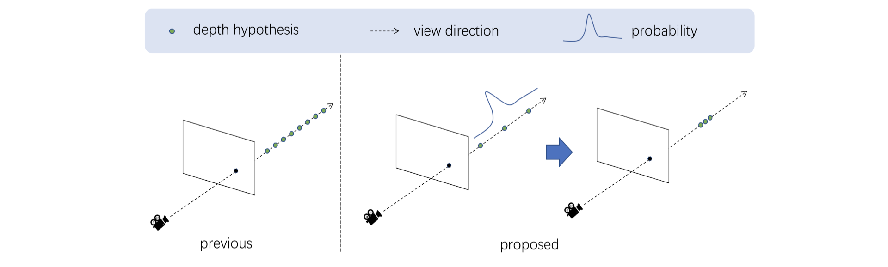 | 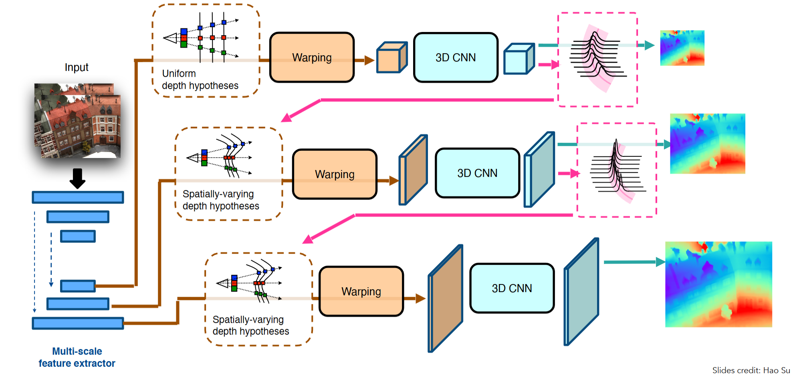 |

- **Point - based Multi - View Stereo Network**

  | ---                                                          | ---                                                          |
  | ------------------------------------------------------------ | ------------------------------------------------------------ |
  |  | Represent the scene with point cloud, which is suitable for sparse occupancy and memory - efficient. First, estimate a low - resolution depth map with existing methods, then unproject to get the initial point cloud. The goal is to refine the input depth map by moving the unprojected points along the camera direction. The flow prediction is calculated as the expected offset, such as $Delta d_{p}=E(ks)=\sum_{k = - m}^{m}ks\times Prob(\tilde{p}_{k})$ |

- **Depth - Normal Consistency**
      - **Normal Estimation as Auxiliary Loss**: Estimate the normal along with the depth map. Using normal estimation as an auxiliary loss in the depth - map prediction process has shown to be quite effective.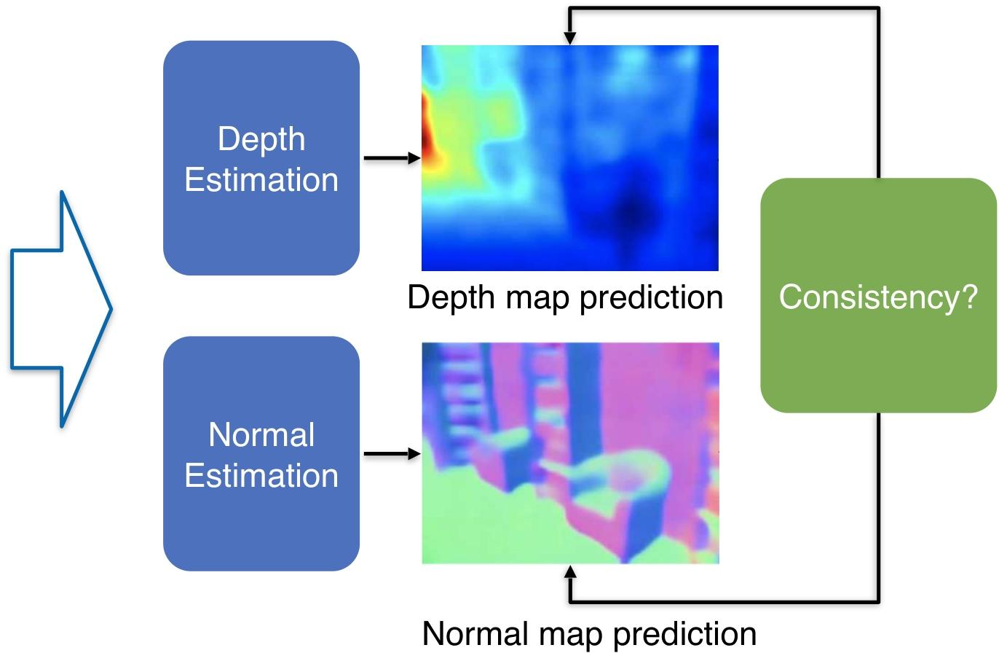
          - **Refine Depth from Normal**: Assume that pixels within a local neighborhood lie on the same tangent plane, expressed as $\vec{n}^{T}(p - p_{i}) = 0$. Based on this, the depth of neighbor pixels can be derived from the current pixel normal. For example, $z_{i\to j}'=\frac{n_{ix}x_{j}+n_{iy}y_{j}+n_{iz}z_{j}}{(u_{i}-u_{0})n_{ix}/f_{0}+(v_{i}-v_{0})n_{iy}/f_{0}+n_{iz}}$, where $\vec{n}=(n_{ix},n_{iy},n_{iz})$ is the normal vector, $(x_{j},y_{j},z_{j})$ are the coordinates of the neighbor pixel, and $(u_{i},v_{i})$ and $(u_{0},v_{0})$ are related to the camera's optical properties and pixel coordinates. This method regularizes the depth by normals to improve depth accuracy and surface smoothness. 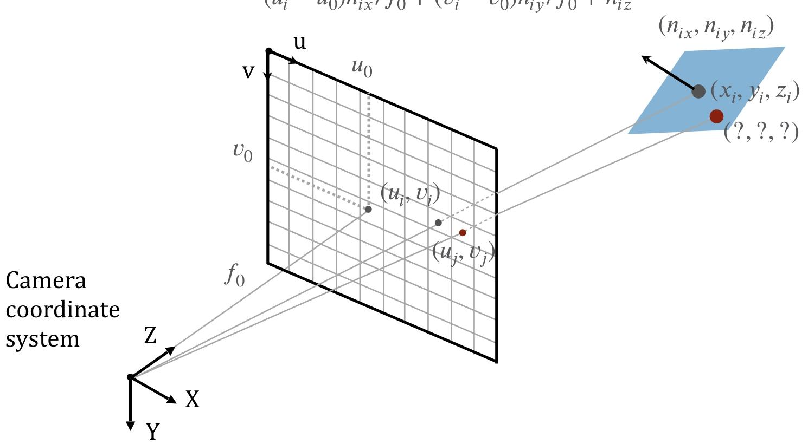

> Summary of learning based MVS: Deep volumetric stereo has the potential to achieve more robust matching and more complete 3D reconstruction. However, volume - based methods face a significant drawback in terms of computational efficiency. This is mainly because the 3D target scenes they deal with are often sparse, resulting in unnecessary computations over large volumes of empty or redundant space. To address this issue, adaptive sampling emerges as a viable solution. By intelligently adjusting the sampling process according to the characteristics of the scene, it can enhance both computational efficiency and the quality of reconstruction. Additionally, normal prediction, which is relatively easier compared to depth prediction, can play a crucial role. Incorporating normal prediction into the depth - estimation process can help improve depth accuracy and smoothness, further refining the overall 3D reconstruction results. 

### 3.4 **NeRF**: Neural Radiance Field [Lecture 6]

#### 3.4.1 Implicit Representation

The difference of implicit and  explicit representation:

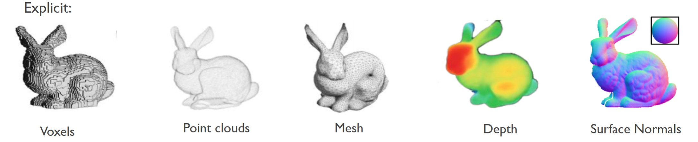

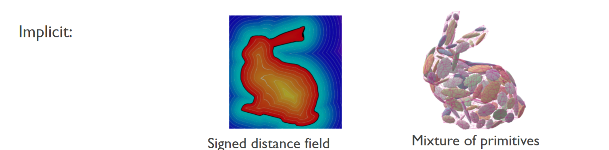

> 2 ways of implicit representation

- Signed Distance Field (SDF) maps each 3D points p to it’s signed distance to the object surface S. The sign is positive if the P is inside the object, and negative otherwise.  $S D F(p)=sign(p) \cdot min _{q \in \mathcal{S}}\| p-q\|$

- Mixture of Gaussians represents a shape as a mixture of local implicit functions (3D gaussians)  
  $$
  F(x, \Theta)=\sum_{i \in[N]} f_{i}\left(x, \theta_{i}\right)\\ f_{i}\left(x, \theta_{i}\right)=c_{i} exp \left( \sum _{d\in \{ x,y,z\} } \frac{-\left( p_{i, d}-x_{d}\right)^{2}}{2 r_{i, d}^{2}}\right)
  $$
  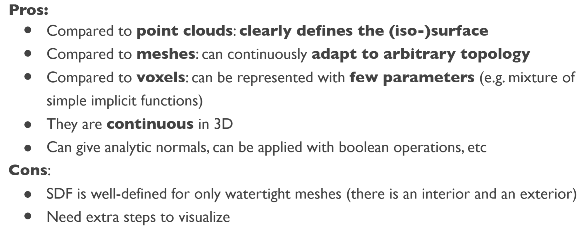

  - ! [important] **Not all complex shapes can be efficiently / accurately represented with simple primitives**

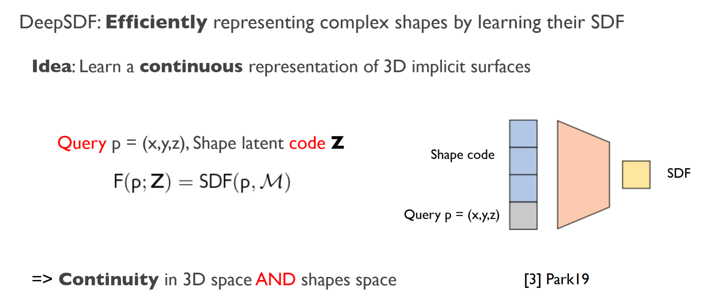

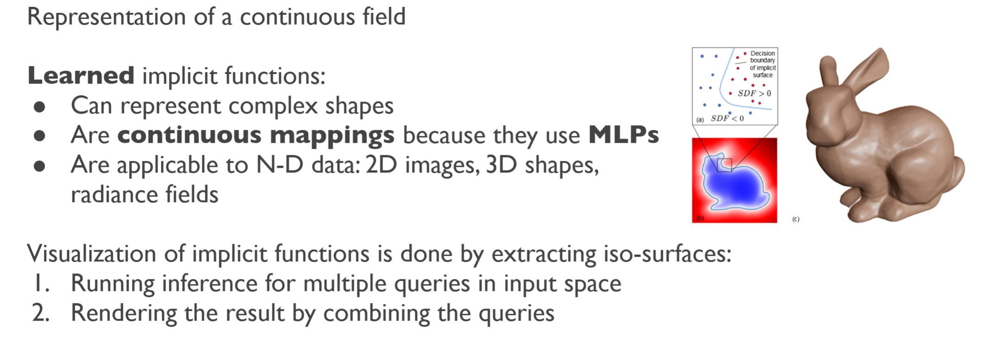

#### 3.4.2 Overview

When focusing about 3D scene rendering, the material, lighting and geometry should be taken into consideration. Camera that take the scene's photo is defined by intrinsics and extrinsics (6DoF). The high level idea of neuaral rendering is to use a neural network to encodes entire scene description, lighting, materials, etc. And then use the rendering equation to get the image given view point. 
$$
L_o(\mathbf{x}, \, \omega_o, \, \lambda, \, t) \, = \, L_e(\mathbf{x}, \, \omega_o, \, \lambda, \, t) \, + \, \int_{\Omega} f_r(\mathbf{x}, \, \omega_i, \, \omega_o, \, \lambda, \, t) \, L_i(\mathbf{x}, \, \omega_i, \, \lambda, \, t) \, (\omega_i \, \cdot \, \mathbf{n}) \, \, \mathrm{d} \, \omega_i
$$
However the direct use of volume representation leads to horrible storage requirements. 

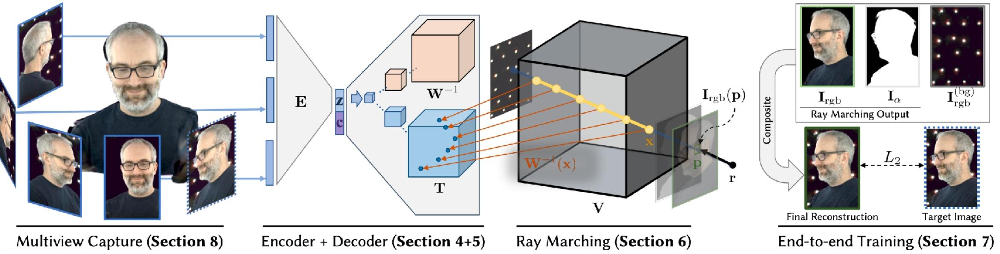

NeRF uses an implicit function to replace the volume representation, and track light emission along different directions.
$$
\mathcal{F}_{\pi }(x,y,z,\theta, \phi)  = (r,g,b,\sigma)
$$
There are 2 general idea behind NeRF: The appearance of the surface will be observed at views along the camera ray && If we have a light transport model from the surface along the ray to the pixels, we will know the pixel color. 

##### Volumetric Light Transport Model

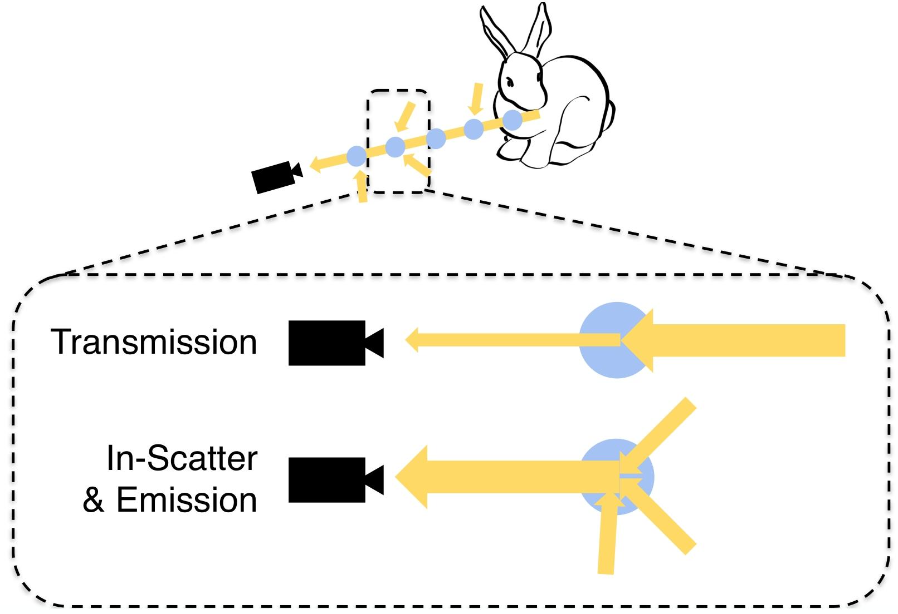

Transmission in the volumetric light transport model is related to the attenuation of light as it passes through the volume. The attenuation coefficient $\sigma$ (also representing transparency) is a key factor. A higher $\sigma$ means more attenuation of light. Mathematically, the transparency of a ray segment of length $t$ is described by the **Beer - Lambert's Law**: $\alpha(t)=1 - exp(−\sigma t)$. Here, $\alpha(t)$ represents the opacity of the ray segment at length $t$. As $t$ increases or $\sigma$ increases, the opacity $\alpha(t)$ increases, indicating more light is being attenuated. **In - Scatter & Emission**: In - scatter refers to the process where light scatters within the volume, and emission is about the light being emitted from points within the volume. The emission radiance is denoted as $c$. The total light emitted along a ray segment from $t = 0$ to $t=\delta$ is calculated as $\int_{0}^{\delta}(1-\alpha(t)) c(t) dt$. When $c(t)$ is assumed to be a constant $c$, we can approximate this integral. First, substitute $\alpha(t)=1 - exp(−\sigma t)$ into the integral:
$$
\begin{align*}
\int_{0}^{\delta}(1-(1 - exp(−\sigma t))) c dt&=\int_{0}^{\delta}exp(−\sigma t) c dt\\
&=c\int_{0}^{\delta}exp(−\sigma t) dt\\
\end{align*}
$$
Integrating $exp(−\sigma t)$ with respect to $t$ gives 
$$
\left[-\frac{1}{\sigma}exp(−\sigma t)\right]_{0}^{\delta}=-\frac{1}{\sigma}(exp(−\sigma \delta)-1)=\frac{1}{\sigma}(1 - exp(−\sigma \delta))
$$
So the light emitted is $\frac{c}{\sigma}(1 - exp(−\sigma \delta))$, which can also be written as $\alpha(\delta)\left(\frac{c}{\sigma}\right)$ using the Beer - Lambert's Law relationship. In practice, for numerical computation, we use ray marching to discretize the radiance integration. For a single point along the ray, the light intensity $I_{1}$ after passing through that point is given by $I_{1}=\alpha_{1}\left(\frac{c_{1}}{\sigma_{1}}\right)$, where $\alpha_{1}$ is the opacity of the point, $c_{1}$ is the predicted emission radiance at that point, and $\sigma_{1}$ is the attenuation coefficient at that point. When there are multiple points, the light intensity at each subsequent point takes into account the light from previous points. For example, for two points, $I_{2}=\alpha_{2}\left(\frac{c_{2}}{\sigma_{2}}\right)+(1 - \alpha_{2})I_{1}$. The term $(1 - \alpha_{2})I_{1}$ represents the light that is transmitted from the first point to the second point. In general, for $n$ points along a ray, the transmittance 
$$
T_{i}=\prod_{j = i + 1}^{n}(1-\alpha_{j})=exp \left(-\sum_{j = i + 1}^{n} \sigma_{j} \delta_{j}\right)
$$
 and the final radiance of the ray 
$$
I=\sum_{i} T_{i} \alpha_{i}\left(\frac{c_{i}}{\sigma_{i}}\right)
$$
This formula sums up the contributions of light from all the points along the ray, considering both the emission from each point and the attenuation and transmission of light from previous points.

#### 3.4.3 Pipeline

$$
\text{What NeRF learns}\\ 
\left(\alpha_{i}, \frac{c_{i}}{\sigma_{i}}\right)=F_{\Theta}(x, y, z, \theta, \phi)\\
I=\sum_{i}\prod_{j = i + 1}^{n}(1-\alpha_{j}) \alpha_{i}\left(\frac{c_{i}}{\sigma_{i}}\right)
$$

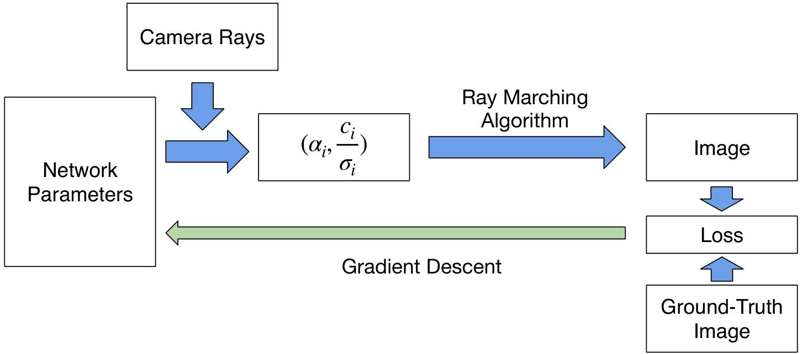

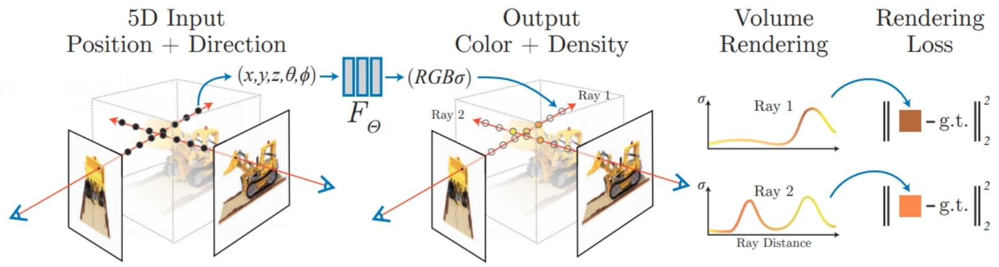

- 2 Trick of implemention

  | Positional Encoding                                          | Hierarchical Sampling - Fine Sampling                        |
  | ------------------------------------------------------------ | ------------------------------------------------------------ |
  | 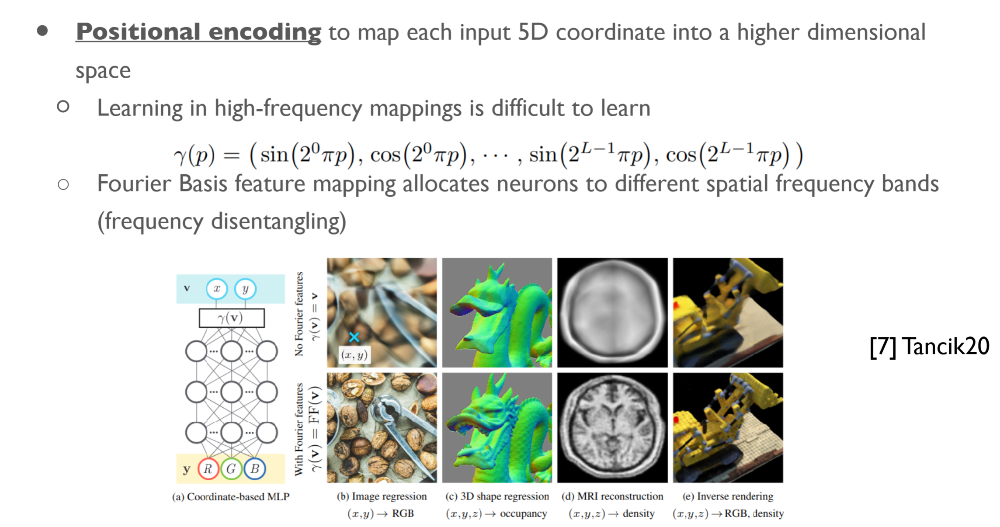 | 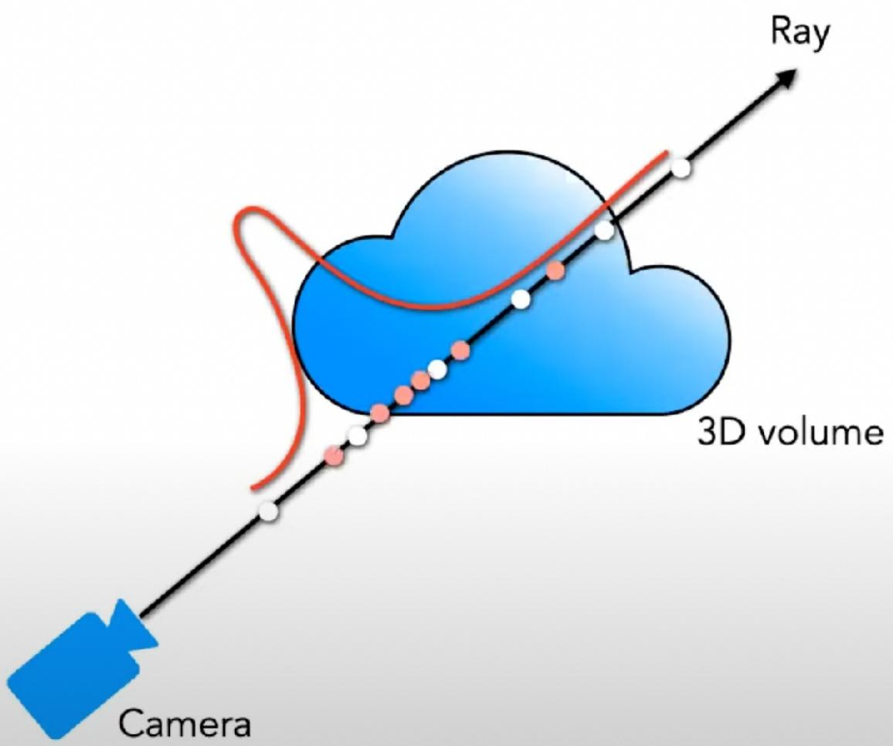 |

- **Summary**

  

#### 3.4.4 Extentions

> Thought: Remaining 2 main issue of the original NeRF: 
>
> • Handling dynamic scenes when acquiring calibrated views $\to$ D-NeRF: Neural Radiance Fields for Dynamic Scenes
>
> • One network trained per scene - no generalization $\to$ PixelNeRF

##### DNeRF

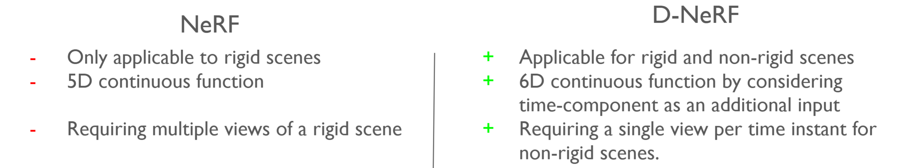

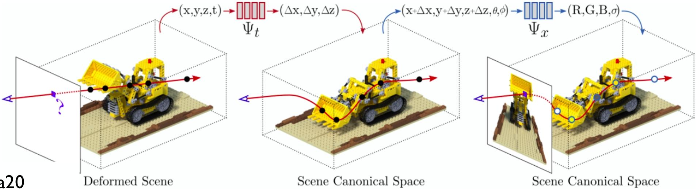

The scene is represented in a 6D radiance field, incorporating 3D spatial coordinates $(x, y, z)$, a time coordinate $t$, and viewing direction $(\theta, \phi)$. The deformation network $\Psi_{t}$ plays a crucial role. It predicts the deformation field between the scene at time $t$ and the canonical space ($t = 0$) and is defined as

$$
\Psi_{t}(x, t)=
\begin{cases}
\Delta x, & \text{if } t\neq0 \\
0, & \text{if } t = 0
\end{cases}
$$
where $\Delta x$ is the deformation vector. This network allows D - NeRF to model scene changes over time.

The canonical network $\Psi_{x}$ predicts the color $c$ and density $\sigma$ in the canonical configuration. Given a 3D point $x$ and viewing direction $d$, it outputs:$\Psi_{x}(x, d)\mapsto(c, \sigma)$
These values are essential for determining the appearance and transparency of points in the scene. Volumetric rendering in D - NeRF is similar to that in NeRF but adjusted for dynamic scenes. The color of a ray $C(p, t)$ passing through the scene at time $t$ is calculated as:
$$
C(p, t)=\int_{h_{n}}^{h_{f}} \mathcal{T}(h, t) \sigma(p(h, t)) c(p(h, t), d) dh\\
\text{where } p(h, t)=x(h)+\Psi{t}(x(h), t)
$$
The transmittance $\mathcal{T}(h, t)$ along the ray from the near plane $h_{n}$ to the current position $h$ is defined as:$\mathcal{T}(h, t)=exp\left(-\int_{h_{n}}^{h} \sigma(p(s, t)) ds\right)$ The values of$c(p(h, t), d)$ and $\sigma(p(h, t))$ are obtained from the canonical network $\Psi_{x}$ after deforming the point using $\Psi_{t}$. In the overall D-NeRF rendering pipeline, for each pixel in the output image at a specific time $t$, a ray is cast from the camera. The ray passes through the 6D radiance field. First, the deformation network $\Psi_{t}$ deforms the points along the ray according to the time - dependent deformation field. Then, the canonical network $\Psi_{x}$ predicts the color and density values for the deformed points. Finally, the volumetric rendering equation is used to integrate the contributions of these points along the ray, considering the transmittance, to obtain the final color of the pixel. This process is repeated for all pixels in the image to generate the rendered image at time $t$. Thus, D-NeRF's rendering pipeline effectively combines deformation, canonical representation, and volumetric rendering to handle dynamic scenes and enable the synthesis of novel views for scenes with moving or deforming objects. 

##### PixelNeRF

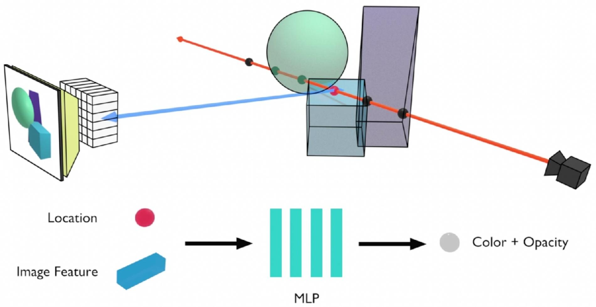

The traditional NeRF optimizes the radiance field of each scene independently and requires many calibrated views. It also uses a canonical coordinate frame. PixelNeRF, introduces several key improvements. It trains across multiple scenes to learn a scene prior. This allows the model to generalize better and make more accurate predictions even with a sparse set of views, which is crucial for the few - shot view synthesis task. Mathematically, while NeRF represents a 5D mapping from spatial and viewing direction coordinates $(x, y, z, \theta, \phi)$ to color and density $(RGB, \sigma)$                                                                                                                                                                                                                                                                                                                                                                                                                                                                                                                                                                                                                                                                                                                                                                                                                                                                                                                                                                                $(x, y, z, \theta, \phi)\xrightarrow{F_{\Theta}}(RGB, \sigma)$, PixelNeRF builds on this concept but with a different approach. It predicts a NeRF representation in the camera coordinate system, which simplifies the process and makes it more adaptable to the input images. In its architecture, PixelNeRF uses a CNN encoder to extract image features from the input images. These features are then fed into an MLP along with the location information. The MLP outputs the color and opacity values. This integration of CNN - based feature extraction and MLP - based prediction allows PixelNeRF to incorporate a variable number of posed input views. For example, if only one or two images are available, the model can still leverage the learned scene prior and the features from these images to generate a reasonable NeRF representation.

##### DreamDiffusion: Text to 3D synthesis

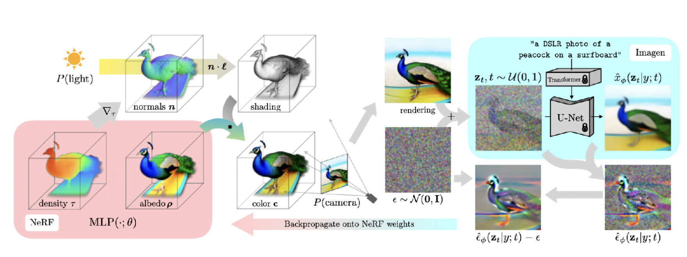

DreamFusion uses a pretrained 2D text - to - image diffusion model to perform text - to - 3D synthesis. It initializes a neural radiance field (NeRF) randomly. During training, it samples random camera and light positions. The NeRF renders 2D images from these viewpoints. The Score Distillation Sampling (SDS) loss is computed based on the difference between the noise predicted by the diffusion model for these rendered (noisy) images and the injected noise. This loss is used to optimize the NeRF parameters via gradient descent. By minimizing this loss over many iterations (e.g., 15,000), the NeRF is trained to generate 2D renderings that match what the diffusion model expects for the given text prompt, ultimately resulting in a 3D model that can be viewed, relit, or composited in 3D environments. 

### 3.5 **3DGS**: 3D Gaussian Splatting

#### 3.5.1 Overview

3D Gaussian Splatting (3DGS) is a method for representing and rendering radiance fields. Compared to NeRF, which parametrize radiance densely, its idea is to parameterize the radiance field sparsely, only where the density is non-zero. Instead of representing the entire 3D space densely as in some traditional methods or like the full-volume representation in early neural rendering approaches, 3DGS uses 3D Gaussian blobs floating in space. Mathematically, a 3D Gaussian function is defined as $\mathcal{G}_{V}(x - p)=\frac{1}{2 \pi|V|^{\frac{1}{2}}} e^{-\frac{1}{2}(x - p)^{T} V^{-1}(x - p)}$, where $x$ is the coordinate in 3D space, $p$ is the mean of the Gaussian, and $V$ is the covariance matrix. In 3DGS, these Gaussians are used to represent the radiance field. Each Gaussian blob has its own set of parameters ($p$, $V$) that determine its position, shape, and the contribution to the radiance field.

| GS representation                                            | Volume randering?                                            |
| ------------------------------------------------------------ | ------------------------------------------------------------ |
| 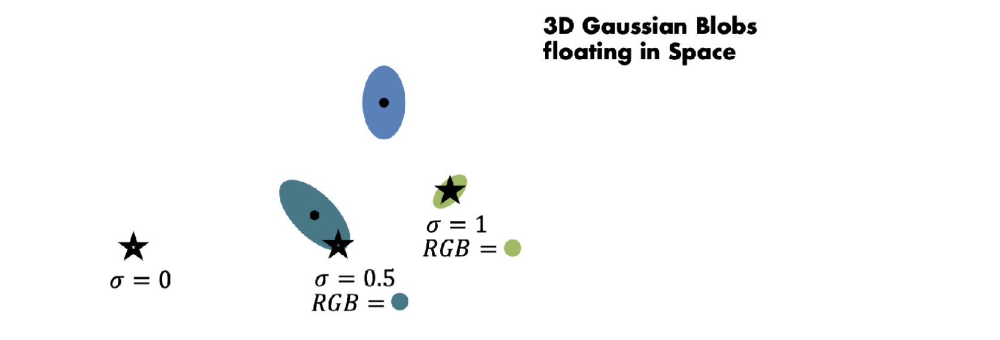 |  |

#### 3.5.2 Pipeline

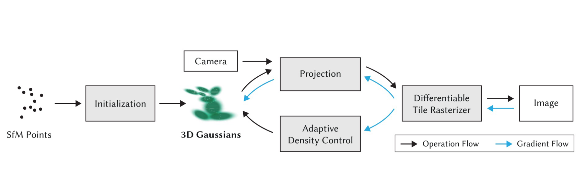

- **Initialization**: The process starts with an initialization step. This may involve using Structure from Motion (SfM) points to determine the initial positions and properties of the 3D Gaussians. The SfM points provide an initial estimate of the 3D structure of the scene, which serves as a basis for placing the Gaussian blobs.

- **Density Control**: 3DGS focuses on areas of non - zero density. The density of the Gaussians is carefully controlled. If a region has a higher density, more Gaussians are placed or adjusted to better represent the radiance in that area. This density - based placement of Gaussians is a key difference from methods like NeRF, which represent the entire volume.

- **Projection**: When rendering, the 3D Gaussians are projected onto the 2D image plane. Since Gaussians are closed under affine transforms, an affine mapping $\Phi = Mx + p$ (such as the cam2world matrix) can be applied. For a 3D Gaussian $\mathcal{G}_{V}(x - p)$, after the affine mapping, it becomes $\mathcal{G}_{V}\left(\Phi^{-1}(u)-p\right)=\frac{1}{\left|M^{-1}\right|} \mathcal{G}_{M V M^{T}}(u-\Phi(p))$, where $u$ is the coordinate in the new (projected) space. And when integrating along an axis, $\int_{\mathbb{R}} \mathcal{G}_{V}^{3}(x - p) dx_{2}=\mathcal{G}_{\hat{V}}^{2}(\hat{x}-\hat{p})$, which shows how the 3D Gaussian projects to a 2D Gaussian on the image plane. We can **Using Rasterization Instead of Volume Rendering**!

  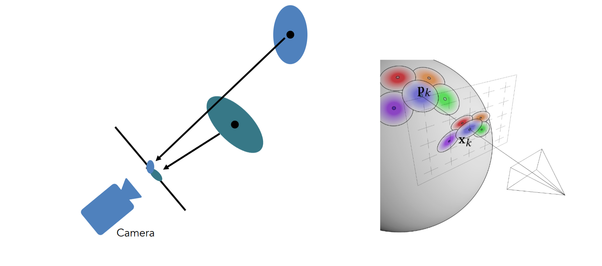

- **Rasterization**: Instead of using volume rendering as in NeRF, 3DGS often uses rasterization. Rasterization is a process of converting the 3D Gaussians into 2D pixels on the image plane. This can be more computationally efficient in some cases, especially when dealing with scenes where the radiance field can be well - approximated by a sparse set of Gaussians.

- **Adaptive Operation and Gradient Flow**: 3DGS includes adaptive operations to optimize the representation of the radiance field. These operations can adjust the parameters of the Gaussians (such as their positions, shapes, and colors) based on the error between the rendered image and the ground - truth (if available). The gradient flow is used to update these parameters during the training process, similar to how neural networks are trained.

#### 3.5.3 Comparison with NeRF
- **Representation**:
    - NeRF represents the radiance field as a continuous 5D function $(x, y, z, \theta, \phi)\to(RGB,\sigma)$, where $(x, y, z)$ are spatial coordinates, $(\theta, \phi)$ are viewing direction coordinates, and $(RGB,\sigma)$ are the output color and density. It densely parameterizes the entire volume of the scene.
    - 3DGS, on the other hand, sparsely parameterizes the radiance field using 3D Gaussian blobs. It only focuses on regions with non - zero density, which can lead to more efficient representation, especially for scenes with large empty spaces.
    
- **Rendering Method**:
    - NeRF uses volume rendering with ray marching. The final radiance of a ray is calculated as $I=\sum_{i} T_{i} \alpha_{i}\left(\frac{c_{i}}{\sigma_{i}}\right)$, where $T_{i}=\prod_{j = i + 1}^{n}(1-\alpha_{j})=exp \left(-\sum_{j = i + 1}^{n} \sigma_{j} \delta_{j}\right)$. This involves integrating the contributions of multiple points along the ray through a series of complex calculations.
    - 3DGS uses rasterization, which is generally faster for scenes that can be well - represented by a sparse set of Gaussians. Rasterization directly projects the 3D Gaussians onto the 2D image plane, simplifying the rendering process.
    
- **Training and Efficiency**:
    - NeRF requires training on a per - scene basis and often takes a relatively long time to train due to the complexity of volume rendering and the need to optimize a large number of parameters for each scene. For example, Mip - NeRF360 takes 48h to train.
    
    - 3DGS can achieve relatively high - speed rendering with competitive PSNR values. For instance, some 3DGS - based methods can train in a few minutes (e.g., 6 minutes or 7 minutes) and achieve PSNR values comparable to or better than some NeRF - based methods, while also having high rendering frame rates (e.g., 135fps or 93fps).
    
      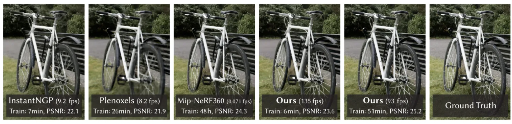

## **Chapter 4 3D Generation** [Lecture 7, 8, 9]

> This chapter focus on different techs that recover or generate 3D geometry, section 4.1 talks about how 3D geometry (specially point cloud) is generated from images and section 4.2 talks about how mesh is recovered from coarse point cloud representation. Section 4.3 includes modern pipelines that generate 3D object.

### 4.1 **Single image to 3D** [Lecture 7]

#### 4.1.1 Overview

| Task                                      | ---                                                          | ---                              |
| ----------------------------------------- | ------------------------------------------------------------ | -------------------------------- |
| Single image to depth map                 | 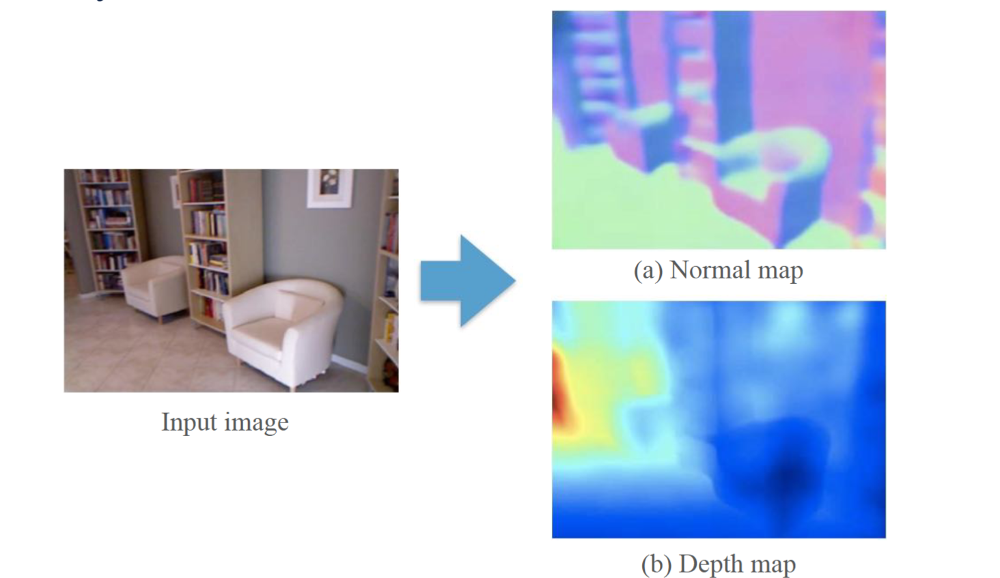 | https://arxiv.org/pdf/2012.06980 |
| Single image to 3D point cloud generation |  | https://arxiv.org/pdf/1612.00603 |
| Single image to implicit field function   |  | https://arxiv.org/pdf/1802.05384 |


#### 4.1.2 Synthesis-for-Learning Pipeline

For the task that takes single image as input and outputs a 3D object, information are not sufficient. Training deep neural network to do the inference needs  lot of data with labels. In this case, we need many image-3D shape pairs. The fist solution is to use ToF or stereo sensors(Kinect, RealSence) and LiDAR to get real 3D data. The second solution is to develop a synthesis pipeline. By rnedering object form the shape dataset, we can get synthesis 2D images - 3D shape pairs for the training. 

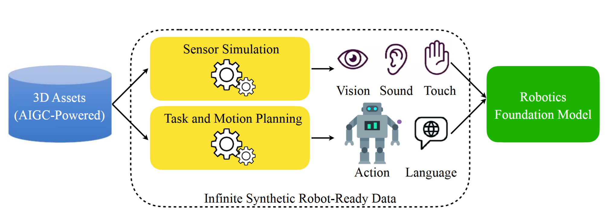

```txt
ShapeNet: http://www.shapenet.org
Objaverse-XL (10M CAD): https://objaverse.allenai.org/
```

#### 4.1.2 Single-image to Point Cloud

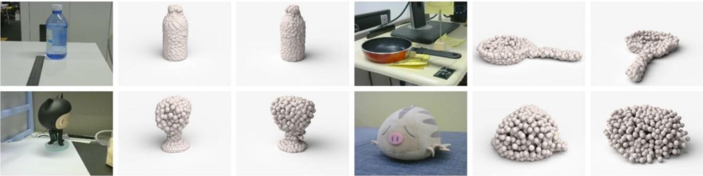

##### Pipeline

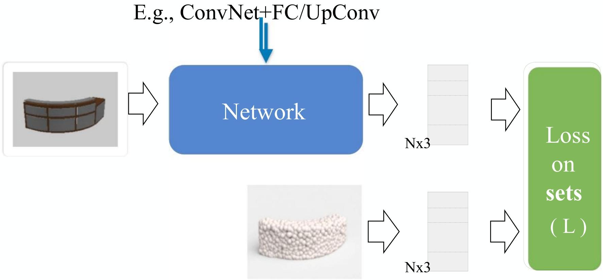

Point cloud has permutation invariance thus loss needs to be invariant to ordering of points! Following are 2 popular distance metric for measuring 2 points sets.

- **Earth Mover's Distance (EMD)**: Since point clouds are sets of orderless points, traditional $L_{2}$ loss does not work. EMD is used to measure the distance between two point sets. It finds a 1 - 1 correspondence between point sets. $d_{EMD}(S_{1}, S_{2})=\min_{\phi: S_{1}\to S_{2}}\sum_{x\in S_{1}}\|x - \phi(x)\|_{2}$, where $\phi: S_{1}\to S_{2}$ is a bijection. EMD is continuous and differentiable except for a zero - measure set. Many algorithmic studies focus on fast EMD computation, and there are parallelizable implementations on CUDA, as well as fast approximated EMD implementations.
- **Chamfer Distance (CD)**: Another popular metric for point clouds. It is based on the nearest neighbor correspondence for each point. The formula is $d_{CD}(S_{1}, S_{2})=\sum_{x\in S_{1}}\min_{y\in S_{2}}\|x - y\|_{2}^{2}+\sum_{y\in S_{2}}\min_{x\in S_{1}}\|x - y\|_{2}^{2}$. It is also used as a loss function in the learning process of single - image to point cloud reconstruction.
- **Differences**
   - **Calculation Principle**:
      - CD simply sums the closest distances without considering a global optimal matching. It is a more local - based measure, looking at the nearest neighbor relationships for each individual point.
      - EMD, on the other hand, finds an optimal global bijection \(\phi\) between the two point sets. It takes into account the overall distribution and matching of points, aiming for a more globally optimal alignment.
   - **Sensitivity to Sampling**:
      - CD is insensitive to sampling. Changes in the sampling density of the point clouds do not significantly affect its value, as it only focuses on the closest distances between individual points.
      - EMD is sensitive to sampling. Since it depends on finding an optimal one - to - one mapping, variations in the number or distribution of points (sampling) can greatly influence the calculated distance. 

Inspiration of the 2 branch architecture:

| Up sampling                                                  | FC                                                           |
| ------------------------------------------------------------ | ------------------------------------------------------------ |
| 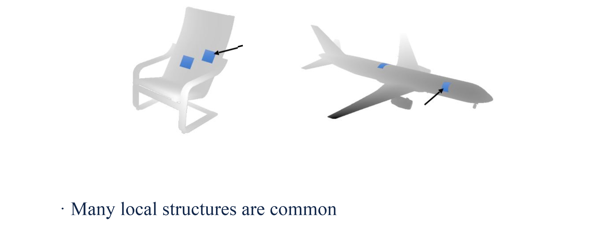 |  |

| 2 branch architecture                                        | visualization of 2 branch output                             |
| ------------------------------------------------------------ | ------------------------------------------------------------ |
| 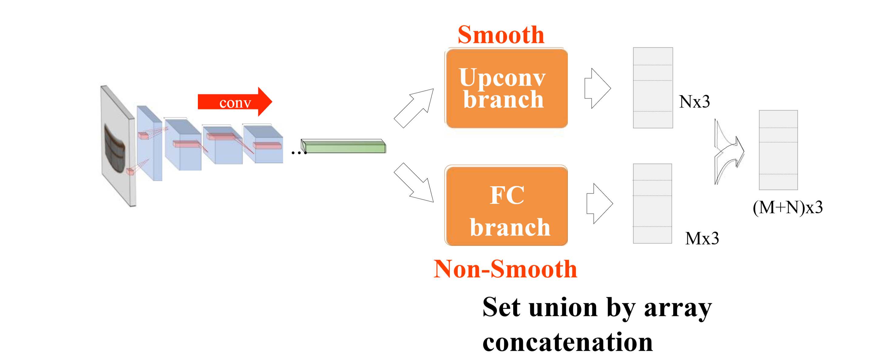 | 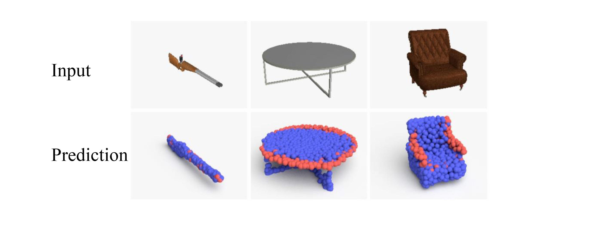 |

The paper adopt a two - branch architecture (e.g., ConvNet + FC/UpConv), where different branches are designed to handle different aspects of the point cloud generation. The Upconv branch learns a smooth surface parameterization from 2D to 3D consistent across objects. However the FC branch finds more ntricate structures which are more non-smooth and change more.

| Design of Upconvolution Branch                               | Visualization                                                |
| ------------------------------------------------------------ | ------------------------------------------------------------ |
| 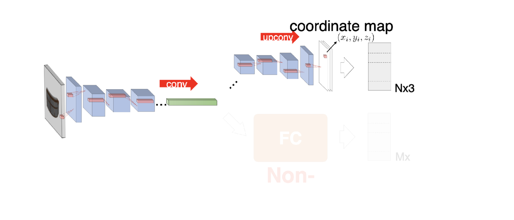 | 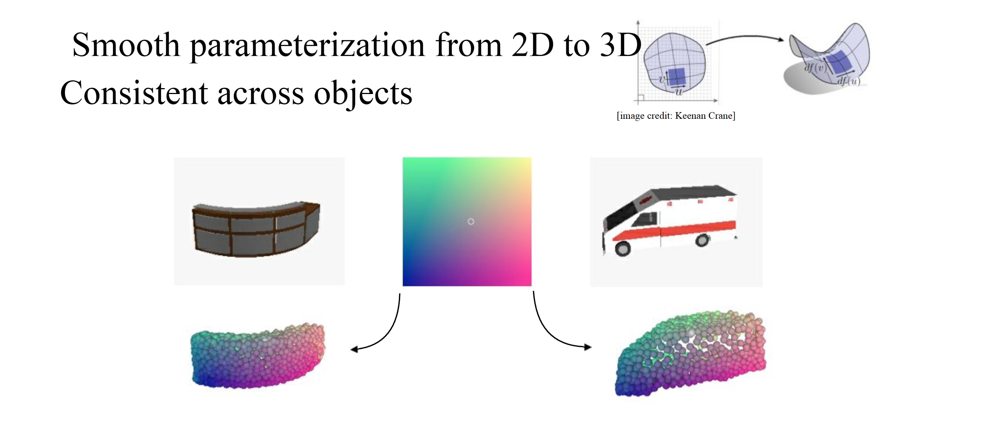 |

#### 4.1.3 Single-image to Mesh

Designing Loss for Edge Prediction is Hard: Ambiguity

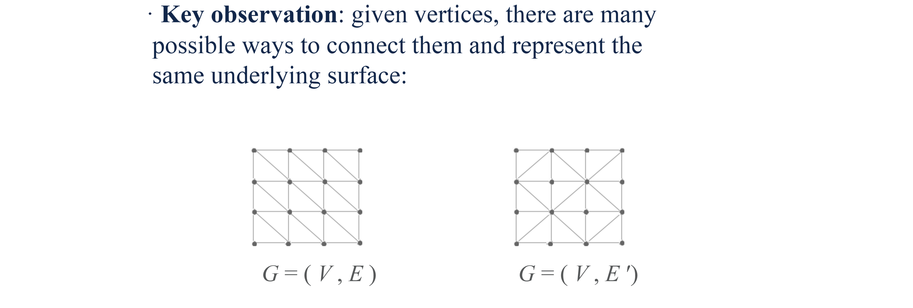

One option is to first build a high-resolution intermediate representation, and then convert the point cloud to mesh. (Section 4.2 )

##### Editing-based Mesh Modeling

Key idea: starting from an established mesh and modify it to become the target shape.

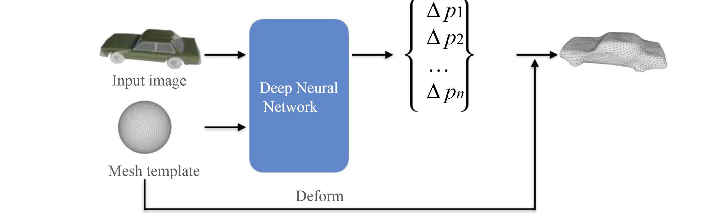

Loss selection is crucial!

- **Vertices Distance Metrics**:
    - **Earth Mover's Distance (EMD)**:  $d_{EMD}(S_{1}, S_{2})=\min_{\phi: S_{1}\to S_{2}}\sum_{x\in S_{1}}\|x - \phi(x)\|_{2}$. This metric helps in measuring the dissimilarity between the two sets of vertices.
    - **Chamfer Distance (CD)**: Use the CD to measure the distance between vertex sets. $d_{CD}(S_{1}, S_{2})=\sum_{x\in S_{1}}\min_{y\in S_{2}}\|x - y\|_{2}^{2}+\sum_{y\in S_{2}}\min_{x\in S_{1}}\|x - y\|_{2}^{2}$. 
- **Uniform Vertices Distribution**: Penalize flying vertices and overlong edges with the loss function $L_{unif}=\sum_{p}\sum_{k\in N(p)}\|p - k\|_{2}^{2}$, where $p$ represents a vertex and $N(p)$ is the set of its neighboring vertices. This encourages equal edge lengths between vertices and helps in obtaining high - quality recovered 3D geometry.
- **Mesh Smoothness**: Encourage the intersection angles of faces to be close to 180 degrees using the loss $L_{smooth}=\sum_{i}(\cos\theta_{i}+1)^{2}$, where $\theta_{i}$ is the intersection angle of faces. This promotes a smoother mesh surface.
- **Normal Loss**: Assume that vertices within a local neighborhood lie on the same tangent plane. Regularize the edge to be perpendicular to the underlying ground - truth vertex normal. One approach to find the vertex normal is to use the nearest ground - truth point normal as the current vertex normal. The loss penalizes the deviation of the edge direction from being perpendicular to the vertex normal.


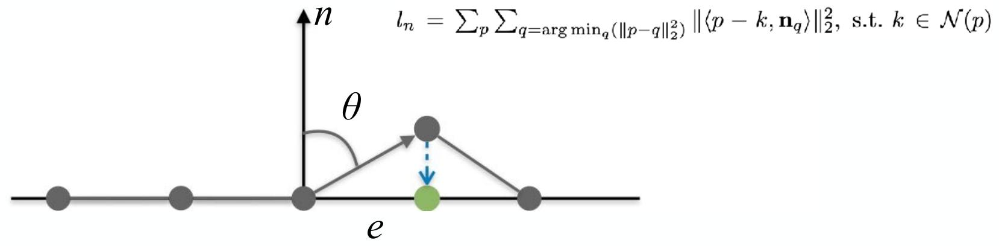 


##### Summary

The synthesis-for-learning pipeline utilizes easily-obtainable synthetic data to tackle challenging 3D visual understanding tasks. It has been demonstrated that generating a 3D point cloud from a single image is feasible when employing properly defined set metrics like Earth Mover's Distance (EMD) and Chamfer Distance (CD). However, there exists natural ambiguity in single-image to 3D conversion. Regarding single - image to mesh, it can be accomplished through template deformation, yet mesh reconstruction demands more regularizations to ensure accurate and high-quality results. 

### 4.2 **Surface Reconstruction: Mesh from PC** [Lecture 8]

The problem definition for this section is to reconstruct the triangle mesh surface given the original (noisy) (with or without normals ) point cloud.

Some Desired Properties of the Algorithm: 

- Fast: The input point cloud may be large. We expect the computation to be fast.
- Robust: May recover the underlying surface structure even when the input point cloud is noisy
- Output mesh is desired to satisfy some geometric constraints

| Manifold                                                     | Watertight                                                   |
| ------------------------------------------------------------ | ------------------------------------------------------------ |
| 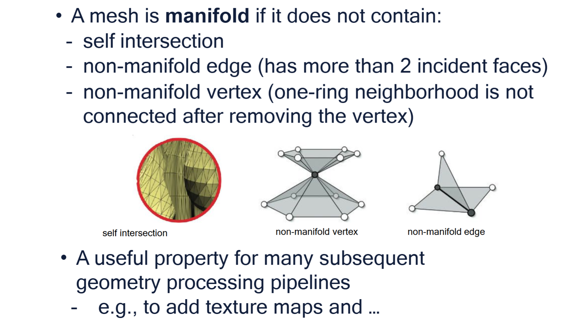 | 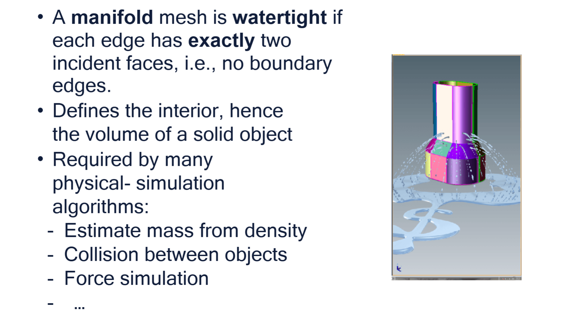 |

##### Explicit Algorithm

**Ball - Pivoting Algorithm**

- **Input**: A point cloud and a hyper - parameter $\rho$.

- **Assumption**: Input points are dense enough such that a ball of radius $\rho$ cannot pass through the surface without touching the points.

- **Principle for face formation**: Three points form a triangle if a ball of radius $\rho$ touches them without containing any other points.

  

- **Procedure**:

  - Start with a corner point and a $\rho$-ball.

  - Verify potential edges (triangles) in the $\rho$-neighborhood.

  - The ball pivots around an edge (triangle) until it touches another point, forming another triangle.

    | ---                                                          | ---                                                          |
    | ------------------------------------------------------------ | ------------------------------------------------------------ |
    | 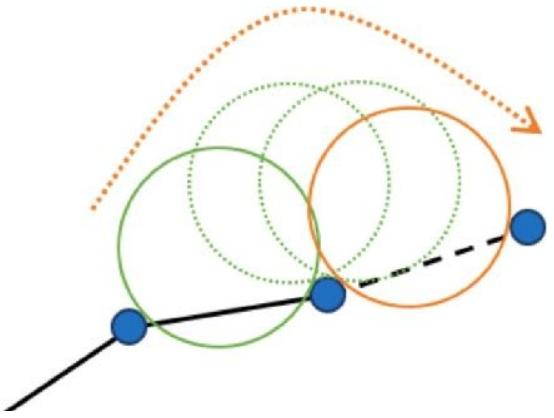 | 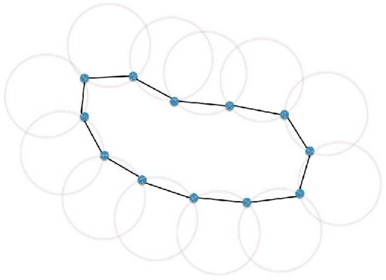 |

    

  - The process continues until all reachable edges have been tried. Then start from another seed triangle until all points have been considered.

- **Radius - related issues**:

  - **Appropriate radius**: It can correctly connect points to form a proper mesh.

  - **Radius too small**: Some edges will not be created, leaving holes.

  - **Large radius**: Some points will not be reached when the curvature of the manifold is larger than $1/\rho$.

    

- **Iterative Approach**: Using multiple radii, iteratively connect the points. Small radii capture high frequencies, and large radii close holes.

  

- **Ambiguous Structures**: Traditional rule - based methods (like the ball - pivoting algorithm) cannot handle ambiguous structures (e.g., thin structures & adjacent parts) well. Defining a rule for structure estimation is sometimes hard, and no single $\rho$ value can separate some complex point cloud structures.

  

- **Learning - Based Method**: Train a network to filter out incorrect connections and utilize the Intrinsic - Extrinsic Ratio to guide the training.

- **Pros and Cons**:

  - **Pros**: Linear complexity (fast) and no dependence on normals.
  - **Cons**: Can lead to non - manifold situations, and there is no watertight guarantee. Regarding robustness, learning can improve it, but current learning - based methods still do not work well when the sampling density is low.

##### Implicit Algorithms

- For a 3D space, we have:
  - Interior: $F(x, y, z)<0$
  - Exterior: $F(x, y, z)>0$
  - Surface: $F(x, y, z)=0$ (zero set, zero iso - surface)
  - Example implementation: Signed Distance Function (SDF), $F(x, y, z)=$ distance to the surface.

- **Two basic steps** of **Implicit Meshing Algorithm**
  - Estimate an implicit field function from data.
  - Extract the zero iso - surface.

>Estimate an implicit field function from data.

1. **Radial Basis Functions (RBF)**

   - **Definition**: Radial basis functions $\phi_{c}(x)$: function value depends only on the distance from a center point $c$, i.e., $\phi_{c}(x)=\phi(\|x - c\|)$. Use a weighted sum of radial basis functions to approximate the shape: $f(x)=\sum_{i = 1}^{n}\omega_{i}\phi(\|x - x_{i}\|)+p(x)$, where $p$ is a polynomial of low degree.

     

   - **Constraints**: $f(x_{i}) = 0$ is not enough as it may get the trivial solution $f(x)\equiv0$. So we use normal to **add off - surface points**:

     - $f(x_{i}) = 0$

     - $f(x_{i}+\lambda\vec{n}_{i})=\lambda$

     - $f(x_{i}-\lambda\vec{n}_{i})=-\lambda$

       

   - Consistent Normals are Required

     

   - **Estimate Parameters Estimate Parameters**

     

   - **Implementation Details**:

     - Use triharmonic basis functions $\phi(r)=r^{3}$ for its extrapolation ability. Avoid using RBF with compact or local support (e.g., Gaussian density).
     - A third - order polynomial is practically good.
     - Do not need to use all the input data points as RBF centers. Use a greedy algorithm to select a subset of points. For noisy data, treat the linear equation as solving a linear square problem and add a smoothness term.

   - **Pros and Cons**:

     - **Pros**: Global definition, single function, globally optimal.
     - **Cons**: Global definition leads to global optimization, which is slow.

2. **Moving Least Squares (MLS)**

   - Do purely local approximation of the SDF. The weights change depending on where we are evaluating.

     

   - Polynomial least - squares approximation:

     - For a general polynomial in 3D, $f\in\Pi_{k}^{3}: f(x, y, z)=a_{0}+a_{1}x + a_{2}y+a_{3}z+a_{4}x^{2}+a_{5}xy+\cdots+a_{*}z^{k}$, $f(x)=b(x)^{T}a$, where $a=(a_{1},a_{2},\cdots,a_{*})^{T}$ and $b(x)^{T}=(1,x,y,z,x^{2},xy,\cdots,z^{k})$.
     - In MLS, we find $a$ that minimizes the weighted sum of squared differences: $a_{x}=\underset{a}{argmin}\sum_{m = 0}^{N - 1}\theta(\|x - c_{m}\|)(b(c_{m})^{T}a - d_{m})^{2}$

     

   - **Weight Functions**:

     - Gaussian: $\rho(r)=e^{-\frac{r^{2}}{h^{2}}}$, where $h$ is a smoothing parameter.

       

     - Wendland function: Defined in $[0, h]$ and $\theta(r)=(1 - r/h)^{4}(4r/h + 1)$, $\theta(0)=1$, $\theta(h)=0$, $\theta'(h)=0$, $\theta''(h)=0$.

     - Singular function: $\theta(r)=\frac{1}{r^{2}+\varepsilon^{2}}$, for small $\varepsilon$, weights are large near $r = 0$ (interpolation).

     - The MLS function $F$ is continuously differentiable if and only if the weight function $\theta$ is continuously differentiable. In general, $F$ is as smooth as $\theta$.

3. **Poisson Surface Reconstruction**

   - **Poisson surface reconstruction (Kazhdan M, Bolitho M, Hoppe H. “Poisson surface reconstruction.” ESGP, 2006)**:
     - **Advantages**: Robust to noise, adapts to the sampling density.
     - **Disadvantages**: Over - smoothing.
   - **Screened Poisson surface reconstruction (Kazhdan M, Hoppe H. “Screened poisson surface reconstruction.” ToG, 2013)**:
     - **Advantages**: Sharper reconstruction, faster.
     - **Disadvantages**: Assumes clean data.

>Extract the zero iso - surface

1. **Marching Cubes (3D) and Marching Squares (2D)**

   - **2D Marching Square**:

     - Give every cell a number based on which corners are true/false.
     - Look up the contour in a look - up table and put the contour lines in the database.
     - Determine the line end - points values and use linear interpolation to get a more accurate position.

     

   - **3D Marching Cube**:

     - There are $2^{8}=256$ cases in total. The first published version exploits rotation and inversion and only considers 15 unique cases.
     - **Ambiguity**: Ambiguity can lead to holes.
     - **Solution to Ambiguity**: Considering more cases in the look - up table by watching a larger context.

     


1. **Using Neural Network to Approximate Implicit Field Function**

   - **DeepSDF**:

     

     - **Single Shape DeepSDF**: Use the network to overfit a single shape.
     - **Coded Shape DeepSDF**: Use a latent code to represent a shape, so that the network can be used for multiple shapes.

   - **Learning - Based Marching Cube**: Such as Deep Marching Cubes: Learning Explicit Surface Representations and Neural Dual Contouring.

   - **Sign Agnostic Learning of Shapes from Raw Data**:

     - Unsigned distance is easy to obtain (distance to the point cloud & triangle soup).

     - Learn signed distance from unsigned distance ground - truth. Require a special loss function: $loss(\theta)=\mathbb{E}_{x\sim D_{\chi}}\tau(f(x;\theta),h_{\chi}(x))$, where $\chi\subset\mathbb{R}^{3}$ is the input raw data (e.g., a point cloud or a triangle soup), $f(x;\theta):\mathbb{R}^{3}\times\mathbb{R}^{m}\to\mathbb{R}$ is the learned signed function, $D_{\chi}$ is the distribution of the training samples defined by $\chi$, $h_{\chi}(x)$ is some unsigned distance measure to $\chi$, and $\tau:\mathbb{R}\times\mathbb{R}_{+}\to\mathbb{R}$ is a similarity function. For example, $\tau_{\ell}(a, b)=\|a|-b|^{\ell}$.

       | Loss design                                                  | 2d result                                                    |
       | ------------------------------------------------------------ | ------------------------------------------------------------ |
       | 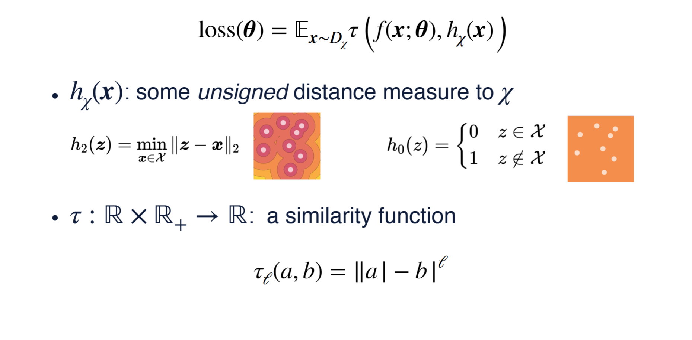 | 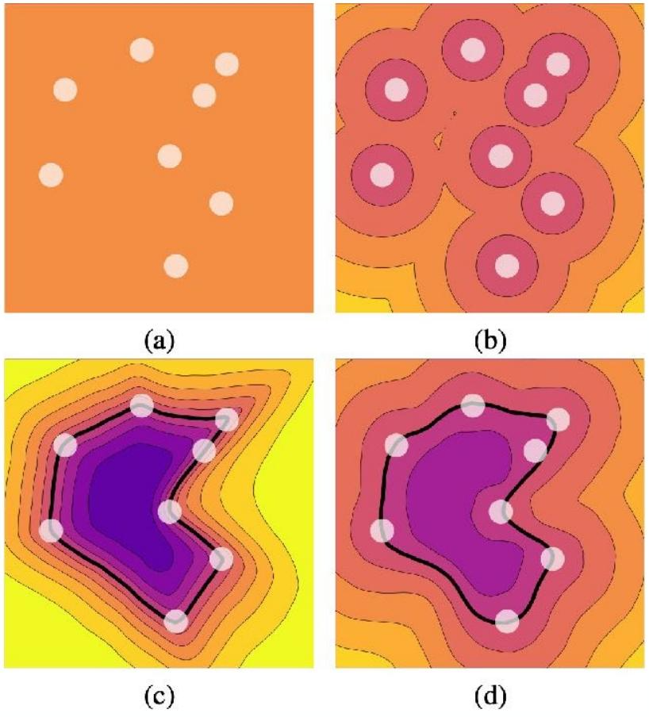 |

     - There are two local minima in the loss function. We prefer the case where $f$ is a signed function and $|f|$ resembles $h_{\chi}(x)$ to use marching cube. We can pick a special weight initialization $\theta^{0}$ so that $f(x;\theta^{0})\approx\varphi(\|x\|-r)$ (signed distance function to an $r$ - radius sphere) to avoid convergence to the unsigned local minima. 

### 4.3 **Modern 3D Generation Pipeline** [Lecture 9]

#### 4.3.1 GAN

#####  2D GAN


GAN's learning Objective: Generate output that is indistinguishable from a ‘real’ example

##### Pipeline


| Generator                                                    | Latent Vector Arithmetic                                     |
| ------------------------------------------------------------ | ------------------------------------------------------------ |
| 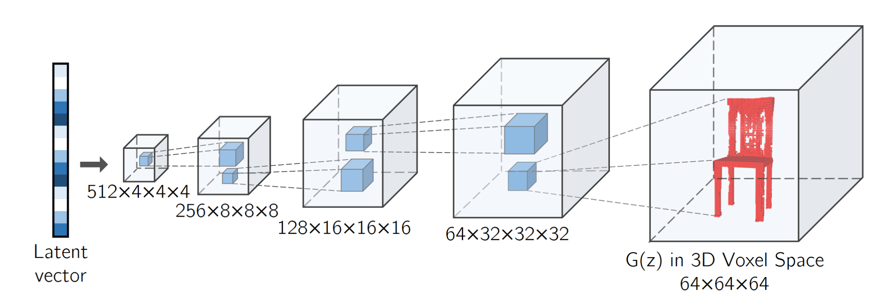 | 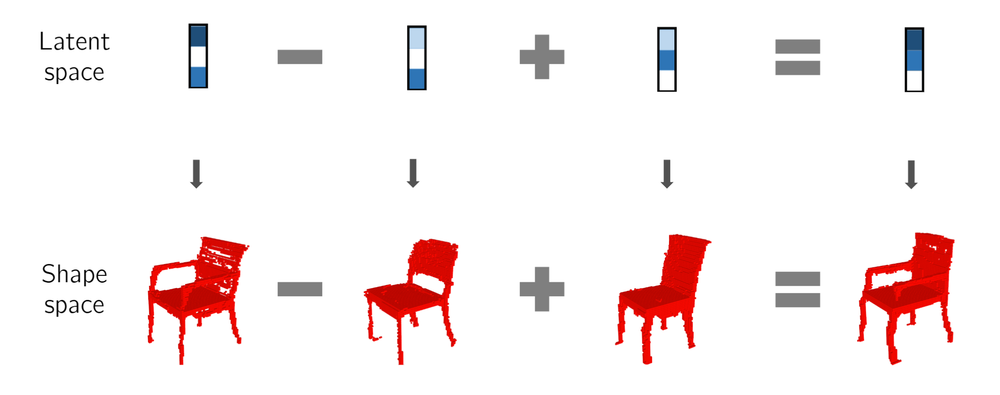 |

Generator: Incrementally increase resolution via convolutions and upsampling layers.

##### Issues in 3D GAN

| GANs don’t maximize likelihood of dat                        | ---                                                          |
| ------------------------------------------------------------ | ------------------------------------------------------------ |
| 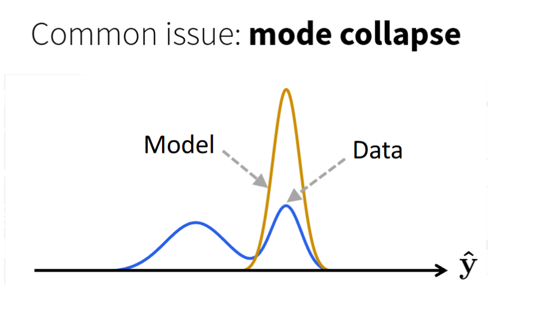 | 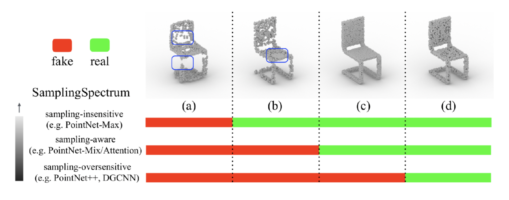 |

#### 4.3.2 Autoregressive Models

##### 2D Autogressive Model 

| Definition                                                   | 2d Pipeline                                                  |
| ------------------------------------------------------------ | ------------------------------------------------------------ |
| 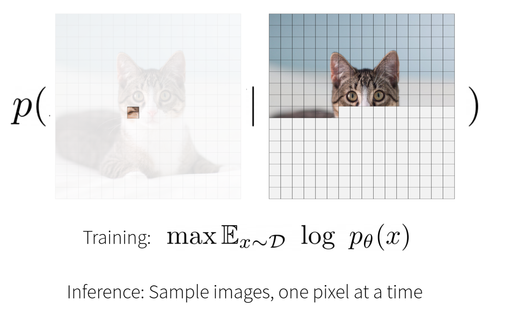 | 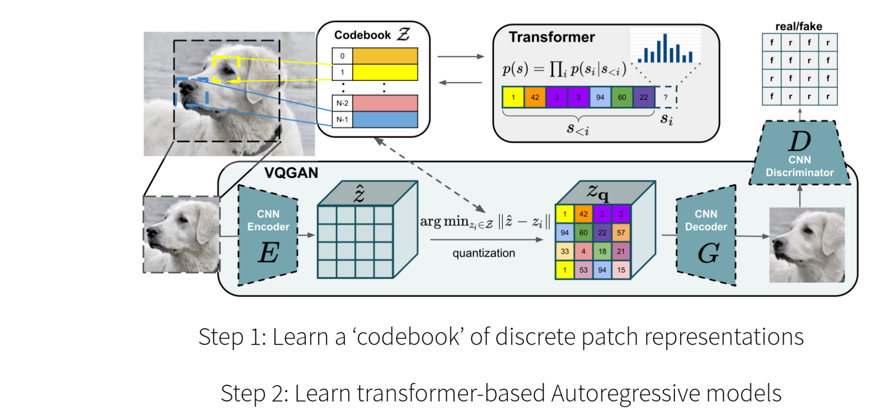 |

##### Pipeline


#### 4.3.3 Diffusion Models

##### 2D Diffusion

| Pipeline                                                     | ---                                                          |
| ------------------------------------------------------------ | ------------------------------------------------------------ |
| 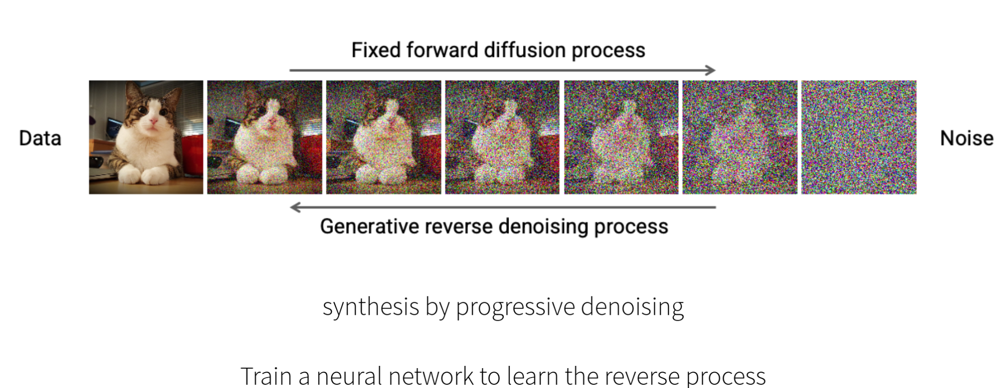 | 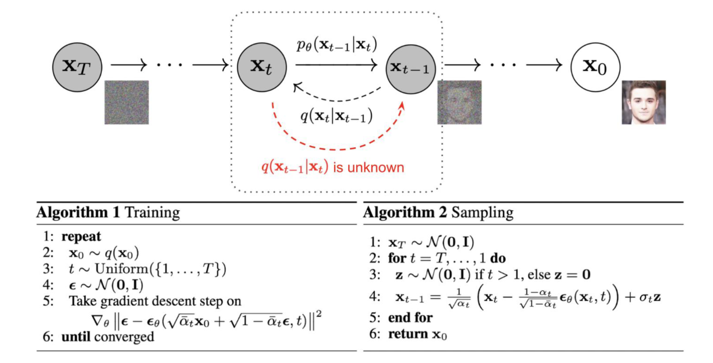 |

##### Point Cloud Diffusion


##### Conditioned Diffusion / Stable Diffusion

- Recap in 2D:

  

- 3D

  

#### 4.3.4 Generation without 3D Training Data

##### Pipeline

Key idea is that generate 3D representations such that their renderings are indistinguishable from real sample.


##### Text conditioned 3D Generation


#### 4.3.5 Part-based 3D Generation

##### Semantic-level Synthesis and Assembly


- For fine-grained parts, we need coarse-to-fine generation

  

##### Hierarchical Generation


StructureNet represents shapes as a hierarchy of graphs $S = (P, H, R)$ for 3D shape generation. It uses a Variational Autoencoder with hierarchical graph networks for encoding and decoding. The encoder maps shapes to a latent feature vector $z$ through a geometry encoder for leaf nodes and a graph encoder for intermediate nodes. The decoder transforms $z$ back into a shape. The VAE is trained with a loss function $\mathcal{L}_{total}=\mathbb{E}_{S \sim S}[\mathcal{L}_{r}(S)+\mathcal{L}_{sc}(S)+\beta \mathcal{L}_{v}(S)]$, which includes reconstruction, structure consistency, and variational regularization losses. This framework enables various applications such as shape reconstruction, generation, interpolation, abstraction, and editing, outperforming baseline methods in experiments. 

## Chapter 5 3D Comprehension [after Lecture 10]

> This chapter introduces networks and pipelines that comprehends and analysis 3D object.

### 5.1 **3D Backbone** [Lecture 10]

#### 5.1.1 Overview

To understand 3D data (voxel, point cloud), special network design is necessary. 3D backbone takes 3D data as input and is the foundamental of down stream tasks like object classification, object part segmentation and semantic scene parsing.

#### 5.1.2 Voxel Networks

- **Voxelization**: Represents the occupancy of regular 3D grids. A 3D CNN on volumetric data uses 4D kernels. However, it has a complexity issue. For example, the input resolution of 3D voxel data in 3DShapeNets (2015) is $30\times30\times30$ with $27000$ elements, compared to AlexNet's 2D input resolution of $224\times224$ with $50176$ elements. There is also information loss in voxelization.

  

- **Solutions to Complexity and Information Loss**

  - **Learn to Project**: Use “X - ray” rendering + Image (2D) CNNs, which have a very low number of parameters and low computation.

    

  - **Sparsity of 3D Shapes**: Store only the occupied grids and constrain the computation near the surface. Sparse convolution is used, and there are several implementation libraries like SparseConvNet, MinkowskiEngine, TorchSparse, and Tensorflow3D. **Octree** is another approach, which recursively partitions the space with each internal node having eight children and uses a hash table for neighborhood searching. It shows better memory efficiency compared to voxel CNNs.

    

#### 5.1.3 Point Networks

- **PointNet**

  

   - A point cloud consists of $N$ orderless points, where each point is represented by a $D$-dimensional coordinate. Mathematically, we can represent a point cloud as a set of points $\{x_1, x_2, \cdots, x_N\}$, with $x_i \in \mathbb{R}^D$. When processing point clouds with a deep neural network, the network's output should be invariant to the permutation of these $N$ points. That is, for any permutation $\pi$ of the indices $\{1, 2, \cdots, N\}$, the function $f(x_1, x_2, \cdots, x_N)$ should satisfy $f(x_1, x_2, \cdots, x_N) \equiv f(x_{\pi_1}, x_{\pi_2}, \cdots, x_{\pi_N})$.

  **Constructing Symmetric Functions**

  - PointNet constructs symmetric functions in the form of $f(x_1, x_2, \cdots, x_n)=\gamma \circ g(h(x_1), \cdots, h(x_n))$, where $g$ is a symmetric function. Common examples of symmetric functions $g$ are the maximum operation $g(x_1, x_2, \cdots, x_n)=\max\{x_1, x_2, \cdots, x_n\}$ and the sum operation $g(x_1, x_2, \cdots, x_n)=x_1 + x_2+\cdots+x_n$.
  - $h$ is a function implemented by a Multi - Layer Perceptron (MLP). For each point $x_i$ in the point cloud, $h(x_i)$ maps the original point features to a new feature space. After that, the symmetric function $g$ aggregates these new - mapped features. For example, if $g$ is the max operation, it selects the maximum value among $h(x_1), h(x_2), \cdots, h(x_n)$, which is invariant to the permutation of the input points.
  - $\gamma$ is another function, often implemented by an MLP, which further processes the output of $g$ to generate the final feature representation.

  **Implementation Details **

  - In the implementation of PointNet, after the input points pass through the initial transformation (using T - Net for 3D coordinate transformation and feature transformation), they are fed into MLPs for feature extraction. For example, the input points first go through an MLP with output dimensions $(64, 64)$ and then another MLP with output dimensions $(64, 128, 1024)$.
  - The global feature is obtained by applying a max - pooling operation over the output of the last MLP. Mathematically, if the output of the MLP for $N$ points is $y_1, y_2, \cdots, y_N$, where $y_i \in \mathbb{R}^{1024}$, the global feature $y_{global}=\max\{y_1, y_2, \cdots, y_N\}$. Since the max - pooling operation is a symmetric function, the resulting global feature is invariant to the permutation of the input points. This global feature can then be used for tasks such as classification or further processed for segmentation tasks in PointNet.  

  

  

  

- **PointNet++**

  - **Basic Idea**: Recursively apply PointNet at local regions to achieve hierarchical feature learning, local translation invariance, and permutation invariance. It uses set abstraction (farthest point sampling + grouping + PointNet) for hierarchical point set feature learning. It can be applied to classification and segmentation tasks. For example, in non - Euclidean spaces for animate shape recognition, it can generalize well when using intrinsic point features (HKS, WKS, Gaussian curvature) and intrinsic distance metric (geodesic).

- **Sampling Issues in Point Clouds**

  - **Sampling Caused Domain Gap**: Sampling in point clouds can cause domain gaps, for example, between point clouds captured by different - beam LiDARs.
  - **Solutions**
    - Randomly throw away some points in the training data by a dropout layer (as in PointNet++).
    - Learn to canonicalize the point cloud, such as using a completion network and sparse voxel labeling network to transform the point cloud to a canonical domain.
    - Use density - aware convolution like Monte Carlo Convolution.


