# 3D Vision Computing---PartⅠNotes

> Notes Taking: Alex
>
> Contact: `wang-zx23@mails.tsinghua.edu.cn`
>
> Instructor: Li Yi
>
> Reference: `Li Yi 's 3DV lecture & Hao Su's ML-meets-geometry lecture`

[TOC]

## 0 Introduction

Geometry understanding is very important in Robotics, Augmented Reality Autonomous driving and Medical Image Processing. From geometry understanding the robot can get **a priori knowledge of the 3D world**.

- Geometry theories $\to$ Curves, Surface, Rotation ···
- Sensing: Computer Representation of Geometries $\to$ Mesh, Point, ···
- Sensing: 3D reconstruction from a single image $\to$ 
- Geometry Processing: Local geometric property estimation, Surface reconstruction
- Recognition: Object classification, Object detection, 6D pose estimation, Segmentation,Human pose estimation
- Relationship Analysis: Shape correspondences

## 1 **Geometry: Curves&&Surfaces** 

> This Chapter mainly focus on the basic concepts, definition and of geometry.

### **1.1 Curves**

#### 1.1.1 Parameterization

##### Definition

A parameterized curve is a map from a 1-dimensional region to $R^n$ .

- 2d curve: $\gamma(t) = (x(t), y(t))$  
  Intuition: A particle moving in space with position $\gamma(t)$ at time $t$.

Use parameterized  methods to represent a curve. 

- 3d curve: $\gamma(t) = (x(t), y(t), z(t))| R \to R^3: t \to p(t)$

- $p(t) = r(cos(t), sin(t)), \quad t \in [0,2\pi)$

##### Application

Bezier Curves, Splines: 

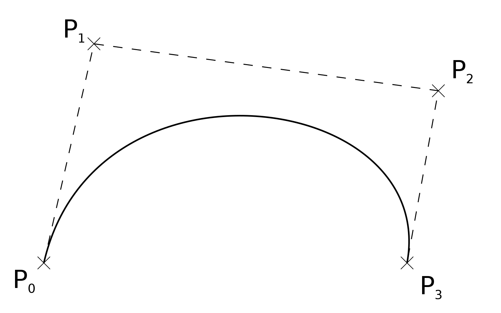

$$
s(t) = \sum_{i = 0}^n \mathbf{p}_iB_i^n(t)
$$


A curve is just like One-dimensional “Manifold", Set of points that locally looks like a line. (however when a cusp occured things becomes extremely  complex)

- **Tangent Vector:**  
  $\gamma'(t) = (x'(t), y'(t)) \in \mathbb{R}^2$  
  Example: For $\gamma(t) = (\cos(t), \sin(t))$,  
  $\gamma'(t) = (-\sin(t), \cos(t))$  
  - $\gamma'(t)$ indicates the direction of movement.  
  - $\|\gamma'(t)\|$ indicates the speed of movement.
- **Arc length**
  $\int_a^b ||\gamma'(t)|| dt$
- **Parameterization by Arc Length**
  $s(t) = \int_{t_0}^t ||\gamma'(t)||dt$
  $t(s)$ = inverse function of $s(t)$ 
  $\hat{\gamma}(s) = \gamma(t(s))$


#### 1.1.2 2D

> Theorem

Define Tangent vector $T(s) = \gamma'(s)$, $ \implies $  $ \|T(s)\| \equiv 1 $  

##### $\|T(s)\| \equiv 1$

> Proof: By definition.

$ S(t) = \int_{t_0}^{t} \|\gamma'(t)\| dt $

$ \frac{ds}{dt} = \|\gamma'(t)\| $

$ T(s) = \|\gamma'(s)\| = \left\|\frac{d\gamma}{ds}\right\| = \left\|\frac{d \gamma}{dt}\right\| \cdot \left\|\frac{dt}{ds}\right\| = |\gamma'(t)| \|\frac{dt}{ds}\| $

$ t(s) = s^{-1}(t)\quad \frac{dt}{ds} = \frac{1}{\frac{ds}{dt}} = \frac{1}{\left\|\gamma'(t)\right\|}$

Thus, $ \|T(s)\| = \frac{\|\gamma'(t)\|}{\|\gamma'(t)\|} = 1 $

##### $N(s):= JT(s)$

Define Normal vector $ N(s)$ where $J$ is the rotation matrix of $90^{\circ}$ in 2D space.
$$
J = 
\begin{bmatrix}
0 & -1\\
1 & 0
\end{bmatrix}
$$
We have the definition of the normal vector: $N(s) := JT(s)$.

##### Frenet Equation

> Theorem

$$
\frac{d}{ds} \begin{bmatrix} T(s) \\ N(s) \end{bmatrix} := \begin{bmatrix} 0 & k(s) \\ -k(s) & 0 \end{bmatrix} \begin{bmatrix} T(s) \\ N(s) \end{bmatrix}
$$
> Proof: By $\|T(s)\| \equiv 1$ and $\frac{d}{dt}<u,v>=\frac{du}{dt}v + \frac{dv}{dt}u$

Now, let's derive the Frenet equations: We know that $T(s)$ is a unit tangent vector, meaning $|T(s)| = 1$, which implies that $\langle T(s), T(s) \rangle = 1$. When we differentiate $\langle T(s), T(s) \rangle = 1$ with respect to $s$, we get: $\langle \frac{dT}{ds}, T \rangle + \langle T, \frac{dT}{ds} \rangle = 0$ $\Rightarrow 2\langle \frac{dT}{ds}, T \rangle = 0$ $\Rightarrow \langle \frac{dT}{ds}, T \rangle = 0$ This shows that $\frac{dT}{ds}$ is orthogonal to $T$. Since $\frac{dT}{ds}$ is orthogonal to $T$, and in a 2D plane, the only orthogonal direction is along the normal vector $N$, we can write $\frac{dT}{ds} = \kappa(s)N(s)$, where $\kappa(s)$ is the curvature. For the normal vector $N(s) = JT(s)$, when we differentiate, we get: $\frac{dN}{ds} = J\frac{dT}{ds} = J(\kappa(s)N(s)) = \kappa(s)JN(s)$ Since $N(s) = JT(s)$, we have $JN(s) = J(JT(s)) = J^2T(s)$ . Computing $J^2$:
$$
J^2 =
\begin{bmatrix}
0 & -1\\
1 & 0
\end{bmatrix}
\begin{bmatrix}
0 & -1\\
1 & 0
\end{bmatrix} =
\begin{bmatrix}
-1 & 0\\
0 & -1
\end{bmatrix} = -I
$$

Therefore, $JN(s) = J^2T(s) = -T(s)$ . Substituting back: $\frac{dN}{ds} = \kappa(s)JN(s) = -\kappa(s)T(s)$

In summary, we have derived: $\frac{dT}{ds} = \kappa(s)N(s)$ $\frac{dN}{ds} = -\kappa(s)T(s)$ These equations can be expressed in matrix form:

$$
\frac{d}{ds} \begin{bmatrix} T(s) \\ N(s) \end{bmatrix} =
\begin{bmatrix}
0 & \kappa(s) \\
-\kappa(s) & 0
\end{bmatrix}
\begin{bmatrix} T(s) \\ N(s) \end{bmatrix}
$$

> Thoughts: Use the geometry self-coordinates to describe the shape of itself.

##### $\mathbb{R}^2$ Curve Theorem  

Radius of Curvature is defined as $\kappa(s) = \frac{1}{R}$  , $R$ is the radius of curvature. The geometry meaning indicated how much the normal changes in the direction tangent to the curve. Or curvature $\kappa(s)$ **characterizes a planar curve up to rigid motion**, which is always positive.

#### 1.1.3 3D

##### Osculating Plane 

The plane determined by $T(s)$ and $N(s)$. And we define the the Binormal Vector $B(s) = T(s) \times N(s)$ Curvature and Torsion

##### Curvature $\kappa$ & Torsion $\tau$

> Definition

$<N'(s), T(s)> = -\kappa(s) \quad <N'(s), B(s)> = \tau(s)$

> Theorem

$T'(s) = \kappa(s)N(s)$  $N'(s) = -\kappa(s)T(s) + \tau(s)B(s)$   $B'(s) = -\tau(s)N(s)$  

> Proof

For the first equation, we know that $T(s)$ is a unit vector, so $\|T(s)\| = 1$. Differentiating $\langle T(s), T(s) \rangle = 1$ with respect to $s$:
$\langle T'(s), T(s) \rangle + \langle T(s), T'(s) \rangle = 0$
$\Rightarrow 2\langle T'(s), T(s) \rangle = 0$
$\Rightarrow \langle T'(s), T(s) \rangle = 0$

This shows that $T'(s)$ is orthogonal to $T(s)$. Since $\{T, N, B\}$ forms an orthonormal basis, $T'(s)$ must lie in the plane spanned by $N$ and $B$:
$T'(s) = \alpha N(s) + \beta B(s)$

To find $\alpha$ and $\beta$, we compute:
$\langle T'(s), N(s) \rangle = \alpha \langle N(s), N(s) \rangle + \beta \langle B(s), N(s) \rangle = \alpha \cdot 1 + \beta \cdot 0 = \alpha$

By definition, $\alpha = \kappa(s)$. Also:
$\langle T'(s), B(s) \rangle = \alpha \langle N(s), B(s) \rangle + \beta \langle B(s), B(s) \rangle = \alpha \cdot 0 + \beta \cdot 1 = \beta$

Since $T$, $N$, and $B$ form a right-handed orthonormal basis, $\langle T'(s), B(s) \rangle = 0$, thus $\beta = 0$.
Therefore, $T'(s) = \kappa(s)N(s)$.

For the second equation, we know that $\{T, N, B\}$ is an orthonormal basis, so $N'(s)$ can be expressed as:
$N'(s) = a T(s) + b N(s) + c B(s)$

Since $\langle N(s), N(s) \rangle = 1$, differentiating gives:
$\langle N'(s), N(s) \rangle + \langle N(s), N'(s) \rangle = 0$
$\Rightarrow 2\langle N'(s), N(s) \rangle = 0$
$\Rightarrow b = 0$

From $\langle N(s), T(s) \rangle = 0$, differentiating:
$\langle N'(s), T(s) \rangle + \langle N(s), T'(s) \rangle = 0$
$\Rightarrow \langle N'(s), T(s) \rangle + \langle N(s), \kappa(s)N(s) \rangle = 0$
$\Rightarrow \langle N'(s), T(s) \rangle + \kappa(s) = 0$
$\Rightarrow a = -\kappa(s)$

By definition, $\langle N'(s), B(s) \rangle = \tau(s)$, thus $c = \tau(s)$.
Therefore, $N'(s) = -\kappa(s)T(s) + \tau(s)B(s)$.

For the third equation, since $B = T \times N$, differentiating:
$B'(s) = T'(s) \times N(s) + T(s) \times N'(s)$
$= \kappa(s)N(s) \times N(s) + T(s) \times (-\kappa(s)T(s) + \tau(s)B(s))$
$= 0 + (-\kappa(s))(T(s) \times T(s)) + \tau(s)(T(s) \times B(s))$
$= 0 + 0 + \tau(s)(T(s) \times B(s))$
$= 0 + 0 + \tau(s)(T(s) \times B(s))$

Since $\{T, N, B\}$ is a right-handed orthonormal basis, $T \times B = -N$. Thus:
$B'(s) = \tau(s)(-N(s)) = -\tau(s)N(s)$
> Thoughts

Curvature indicates how much the **normal** changes in the direction **tangent** to the curve. (Indicates in-plane motion.) Torsion indicates how much normal changes in the direction **orthogonal** to the osculating plane of the curve.(Indicates out-of-plane motion.) Curvature is always **positive** but torsion can be **negative**

##### Frenet Frame

> Theorem:

$$
\frac{d}{ds} \begin{pmatrix} T \\ N \\ B \end{pmatrix} = \begin{pmatrix} 0 & \kappa & 0 \\ -\kappa & 0 & \tau \\ 0 & -\tau & 0 \end{pmatrix} \begin{pmatrix} T \\ N \\ B \end{pmatrix}
$$

> Proof: By the relations above.

##### $\mathbb{R}^3$ Curve Theorem

Curvature $\kappa(s)$ and torsion $\tau(s)$ characterize a 3D curve up to rigid motion.

#### 1.1.4 Geometry Meaning

A curve is defined as a **map** from an **interval** to $\mathbb{R}^n $ The **tangent vecto**r to the curve describes the **direction of motion along the curve**. When the curve is parameterized by arc-length, the derivative of the tangent vector is the normal vector. Both **curvature** and **torsion** are measures that **describe the change in the normal direction of the curve**. Curvature quantifies how much the normal vector changes in the direction tangent to the curve, while **torsion** quantifies **how much the normal vector changes in the direction orthogonal to the osculating plane of the curve**. Curvature is always positive, indicating the rate of bending, whereas torsion can be negative, indicating twisting. Together, curvature and torsion uniquely describe the shape of a curve, up to rigid transformations. The tangent, normal, and binormal vectors together form a moving frame, known as the Frenet frame, which provides a local coordinate system that moves along the curve.

### **1.2 Surface** 

#### 1.2.1 Surface Parametrization

##### $f: U \to \mathbb{R}^3$

- A parameterized surface is a map from a two-dimensional region  $ U \subset \mathbb{R}^2 $ to  $ \mathbb{R}^n $.

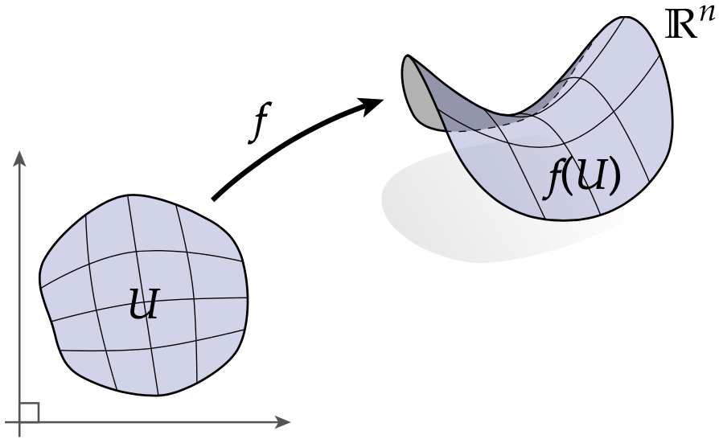

- The set of points $f(U)$ is called the image of the parameterization

###### Saddle Example

$$
U := \{(u, v) \in \mathbb{R}^2 : u^2 + v^2 \leq 1\}\\
f(u, v) = [u, v, u^2 - v^2]^T
$$

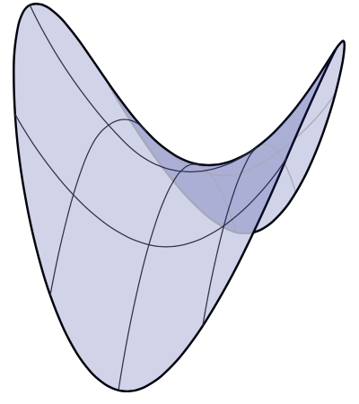

#### 1.2.2 Differentiable Manifold

> Inspiration

- Things that can be discovered by local observation: point + neighborhood.

> Properties

- **Local Properties**: properties that can be discovered by local observation (points + neighborhoods).
- **Smoothness**: a continuous one-to-one mapping from local to global.
- **Tangent Plane**: each point can have a tangent plane attached to it, which contains all possible directions passing tangentially from that point, defined as $T_p(\mathbb{R}^3)$

##### $Df_p$

Differential of a Surface  $Df_p: T_p(\mathbb{R}^2) \to T_{f(p)}(\mathbb{R}^3)$

- Relate the movement of point in the domain and on the surface.

$df = \frac{\partial f}{\partial u} du + \frac{\partial f}{\partial v} dv$

- If the point $ p \in \mathbb{R}^2 $ is moving along the vector $ X = [u, v]^T $ with velocity $ \epsilon $, the motion of the point $ f(p) $ on the surface is:
    $
    \Delta f_p \approx \frac{\partial f}{\partial u} (\epsilon u) + \frac{\partial f}{\partial v} (\epsilon v) = \epsilon \left[ \frac{\partial f}{\partial u}, \frac{\partial f}{\partial v} \right] \begin{bmatrix} u \\\\ v \end{bmatrix} = \epsilon [Df_p]X
    $
  $
  Df_p := \left[ \frac{\partial f}{\partial u}, \frac{\partial f}{\partial v} \right] \in \mathbb{R}^{3 \times 2}
  $ is a linear mapping that maps tangent vectors in the parameter domain to tangent vectors in space, where  $X$ is the velocity in the 2D domain, and the $[Df_P]X$ is the velocity in the 3D space.

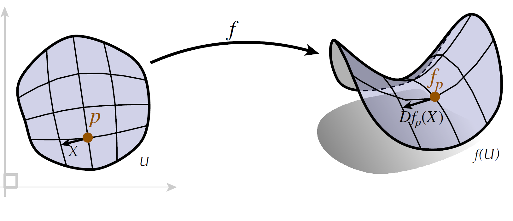

> Thought

- Intuitively, the differential of a parameterized surface tells us how tangent vectors on the domain get mapped to tangent vectors in space. w.r.t, Maps a vector in the tangent space of the domain to the tangent space of the surface.
- Tells us the velocity of point in 3D when the parameter
  changes in 2D.
- Allows us to construct the bases of tangent plane.

###### Saddle Example-Continue

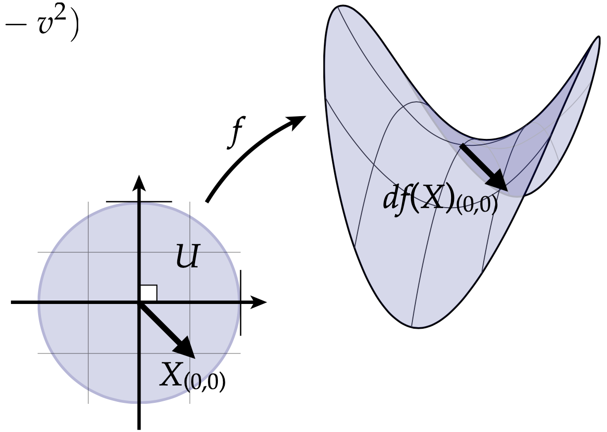
$$
f(u, v) = [u, v, u^2 - v^2]^T\\
Df_p = \begin{bmatrix}
  \frac{\partial f_1}{\partial u} & \frac{\partial f_1}{\partial v} \\
  \frac{\partial f_2}{\partial u} & \frac{\partial f_2}{\partial v} \\
  \frac{\partial f_3}{\partial u} & \frac{\partial f_3}{\partial v}
  \end{bmatrix}
  = \begin{bmatrix}
  1 & 0 \\
  0 & 1 \\
  2u & -2v
  \end{bmatrix}
\\
  X := \frac{3}{4} \begin{bmatrix} 1 \\ -1 \end{bmatrix}
 \quad
  Df(X) = \frac{3}{4} \begin{bmatrix} 1 \\ -1 \\ 2(u + v) \end{bmatrix}
 
 \\
\text{e.g. for } (u, v) = (0,0) \quad 
Df(X) = \left[ \frac{3}{4}, -\frac{3}{4}, 0 \right]^T \\

\text{e.g. for }p = (u, v) = (1, 1), f(p) = (1,1,0) \quad 
\\
T_{f(p)}(\mathbb{R}^3) 
= \text{span of }\begin{bmatrix}
1 & 0\\
0 & 1\\
2 & -1
\end{bmatrix}
$$

#### 1.2.3 Curvature

##### $N_p$

> Definition

$$
N(u, v) = \frac{f_u \times f_v}{\| f_u \times f_v \|}\\
 \text{where} f_u = \frac{\partial f}{\partial u} \quad  f_v = \frac{\partial f}{\partial v}
$$

###### Cylinder Example

$$
f(u, v) := [\cos(u), \sin(u), u + v]^T \\
Df_{(u,v)} = \begin{bmatrix} -\sin(u) & 0 \\ \cos(u) & 0 \\ 1 & 1 \end{bmatrix}\\
N(u,v) = \begin{bmatrix} -\sin(u) \\ \cos(u) \\ 1 \end{bmatrix} \times \begin{bmatrix} 0 \\ 0 \\ 1 \end{bmatrix} = \begin{bmatrix} \cos(u) \\ \sin(u) \\ 0 \end{bmatrix}
$$

| Calculate Normal on a surface                                | Local change of normal                                       |
| ------------------------------------------------------------ | ------------------------------------------------------------ |
| 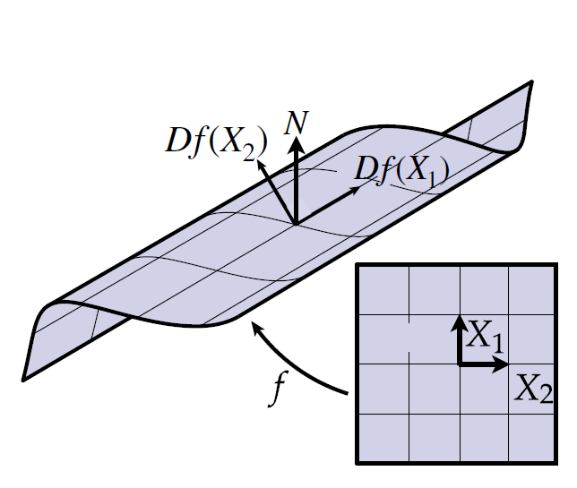 | 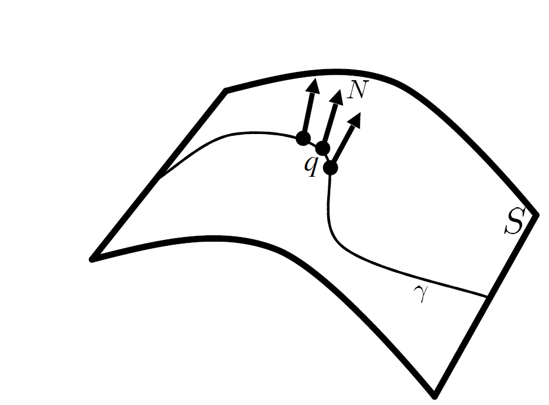 |

> Local change

Assume $q$ moves along a curve $\gamma $ parameterized by arclength $q = \gamma(s)$:, and the normal is $N(s)$ with unit norm. From $\frac{d}{ds}<N(s), N(s)> = 0$ . We know that the local change of normal is always in the tangent plane!

##### $DN_p$

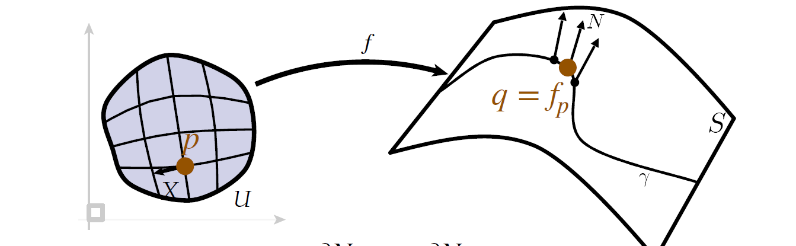
$$
dN = \frac{\partial N}{\partial u} du + \frac{\partial N}{\partial v} dv \\
\text{If point } p \in \mathbb{R}^2 \text{moves with velocity}\\
 X \text{ by }  \epsilon \text{, the movement of } N_p:
\\
\Delta N_p = \frac{\partial N}{\partial u} (\epsilon u) + \frac{\partial N}{\partial v} (\epsilon v) = \epsilon \begin{bmatrix} \frac{\partial N}{\partial u}, \frac{\partial N}{\partial v} \end{bmatrix} \begin{bmatrix} u \\ v \end{bmatrix} = \epsilon [DN_p] X
\\
DN_p := \begin{bmatrix} \frac{\partial N}{\partial u}, \frac{\partial N}{\partial v} \end{bmatrix} \in \mathbb{R}^{3 \times 2} 
$$
Let $\|Df_p[\mu X]\| = 1$, $\mu = \frac{1}{\|Df_pX\|}$, thus $DN_p[\mu X] = \frac{DN_pX}{\|Df_pX\|}$. 

#####  $\mathbf{\kappa} $

> Definition

Vector $\mathbf{\kappa} = DN_p[\mu X] = \frac{DN_pX}{\|Df_pX\|}$

> Principal Curvatures

$$
\kappa_n := <\mathbf{T}, \kappa> = \frac{<Df_pX, DN_pX>}{\|Df_pX|\|^2}>
$$

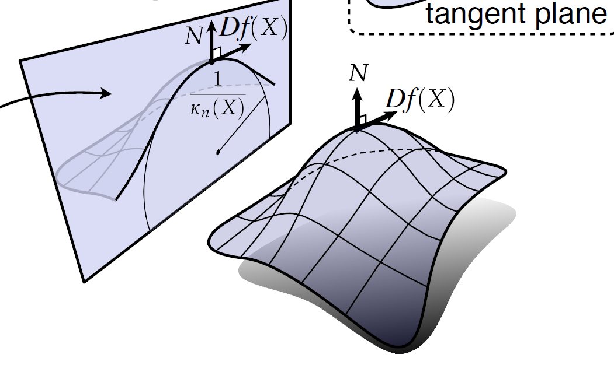

>Geodesic curvature

$$
\kappa_g := <\kappa, \mathbf{N} \times  \mathbf{T}>
$$


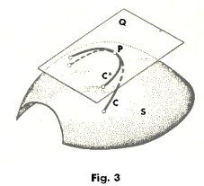

###### Cylinder Example-Continue

| Calculte $\kappa_n$                                          | Cylinder                                                     |
| ------------------------------------------------------------ | ------------------------------------------------------------ |
| $$Df_{p} = \begin{bmatrix} -\sin(u) & 0 \\ \cos(u) & 0 \\ 1 & 1 \end{bmatrix}\\N_p = \begin{bmatrix} -\sin(u) \\ \cos(u) \\ 1 \end{bmatrix} \times \begin{bmatrix} 0 \\ 0 \\ 1 \end{bmatrix} = \begin{bmatrix} \cos(u) \\ \sin(u) \\ 0 \end{bmatrix}\\DN_p =\begin{bmatrix}-\sin(u) & 0\\cos(u) & 0\\0 & 0\end{bmatrix} \\  \text{Thus }  X_1 = \begin{bmatrix} 0 \\ 1 \end{bmatrix}, \quad \kappa_n(X_1) = \frac{\langle Df(X_1), DN(X_1) \rangle}{\|Df(X_1) \|^2} = 0,\\X_2 = \begin{bmatrix} -1 \\ 1 \end{bmatrix}, \quad \kappa_n(X_2) = \frac{\langle Df(X_2), DN(X_2) \rangle}{\|Df(X_2) \|^2} = 1$$ | 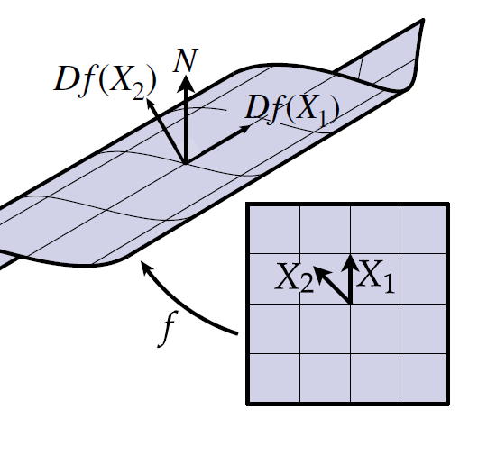 |

##### $\kappa_1$ $\kappa_2$

> Definition

- The direction that bends fastest / slowest are principal directions, which are orthogonal to each other.

$$
\text{Maximum curvature }\kappa_1 = \kappa_{\text{max}} = \max_{\phi} \kappa_n(\phi) , \\
\quad \phi_1 \to \text{Principle directure 1}\\
\text{Minimun curvature } \kappa_2 = \kappa_{\text{min}} = \min_{\phi} \kappa_n(\phi)\\
\quad \phi_2 \to \text{Principle directure 2}\\
$$

| Visualization                                                | min curvature && max curvature                               |
| ------------------------------------------------------------ | ------------------------------------------------------------ |
| 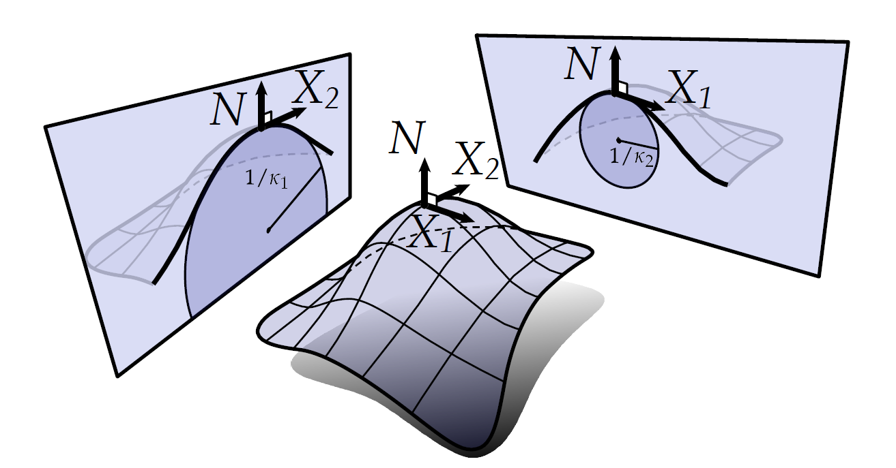 |  |

> Theorem

The principal directions are always orthogonal.

> Proof

Consider the shape operator (Weingarten mapping) $$S_p: T_p(M) \to T_p(M)$$, which can be expressed as:$$S_p(X) = -DN_p(X)$$ where $$DN_p$$ is the normal vector differential. The shape operator is self-adjoint, i.e., for any tangent vectors $X, Y \in T_p(M)$: $$\langle S_p(X), Y \rangle = \langle X, S_p(Y) \rangle$$. The principal curvatures $\kappa_1, \kappa_2$ are the eigenvalues of the shape operator $$S_p$$ and the corresponding principal directions $$\phi_1, \phi_2$$ are its eigenvectors: $$S_p(\phi_1) = \kappa_1 \phi_1$$ $$S_p(\phi_2) = \kappa_2 \phi_2$$. Since $$S_p$$ is self-concomitant, when $$\kappa_1 \neq \kappa_2$$, the corresponding eigenvectors are necessarily orthogonal. The proof is as follows: $$ \langle S_p(\phi_1), \phi_2 \rangle = \langle \kappa_1 \phi_1, \phi_2 \rangle = \kappa_1 \langle \phi_1, \phi_2 \rangle$$ Simultaneous: $$\langle \phi_1, S_p(\phi_2) \rangle = \langle \phi_1, \kappa_2 \phi_2 \rangle = \kappa_2 \langle \phi_1, \phi_2 \rangle$$ By the self-concomitant property: $$\langle S_p(\phi_1), \phi_2 \rangle = \langle \phi_1, S_p(\phi_2) \rangle$$, thus: $$ \kappa_1 \langle \phi_1, \phi_2 \rangle = \kappa_2 \langle \phi_1, \phi_2 \rangle$$ $$(\kappa_1 - \kappa_2) \langle \phi_1, \phi_2 \rangle = 0$$

| ---                                                          | ---                                                          | ---                                                          |
| ------------------------------------------------------------ | ------------------------------------------------------------ | ------------------------------------------------------------ |
| 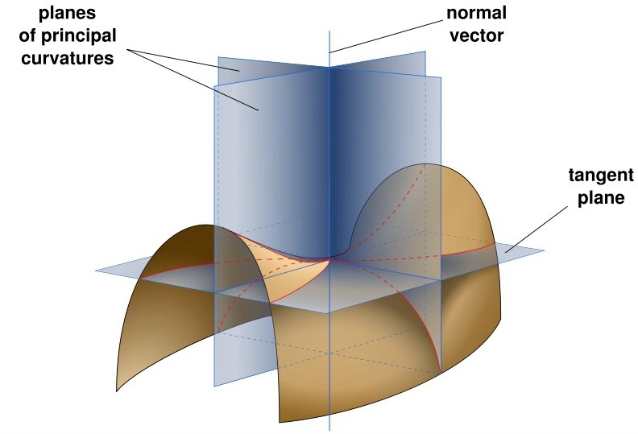 | 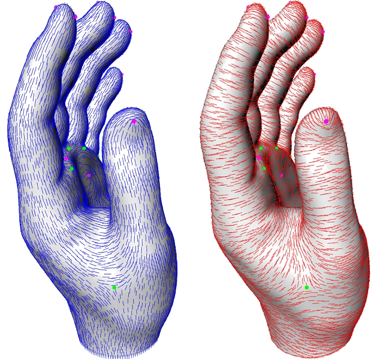 | 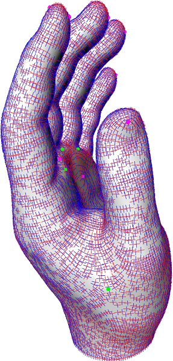 |

> Theorem: Euler’s Theorem: 

Planes of principal curvature are orthogonal and independent of parameterization. 
$$
\kappa_n(\phi) = \kappa_1 \cos^2 \phi + \kappa_2 \sin^2 \phi
$$

##### Shape Operator

> Definition

- The shape operator $S$ is a linear map that relates the change in the normal vector to the change in the surface point. $DN_p(X) $and $ Df_p(X) $ are both in the tangent plane. Therefore, the column space of$DN_p$is a subspace of the column space of $Df_p$.

$$
\exists S \in \mathbb{R}^{2 \times 2} \quad \text{such that} \quad DN_p = Df_p S \\
\text{This implies: }
\forall X \in T_p(\mathbb{R}^2), \quad [DN_p]X = [Df_p]S X
$$

- Actually,  $S$ is the "Normal Change Prediction Operator",  When a point $p$ moves along a direction $SX$, the normal change vector $\vec d \in \mathbb{R}^3$. $S$ can represent some information about the normal of the surface. Actually，this linear map$S$ predicts the normal change when $p$ moves along any direction.

> Computation of Principal Directions

$S$ has some super cool properties:

- The principal directions are the eigenvectors of the shape operator $S$ 
- The principal curvatures are the eigenvalues of $S$
- Note: The shape operator $ S $ is a linear map that relates the change in the normal vector to the change in the surface point.

###### Cylinder-example-continue

$$
f(u, v) = [\cos(u), \sin(u), u + v]^T\\
Df = \begin{bmatrix}
-\sin(u) & 0 \\
\cos(u) & 0 \\
1 & 1
\end{bmatrix}

N = [\cos(u), \sin(u), 0]^T
\\
DN = \begin{bmatrix}
-\sin(u) & 0 \\
\cos(u) & 0 \\
0 & 0
\end{bmatrix}\\
X_1 = \begin{bmatrix} 0 \\ 1 \end{bmatrix}, \quad \kappa_n(X_1) = 0\\
X_2 = \begin{bmatrix} -1 \\ 1 \end{bmatrix}, \quad \kappa_n(X_2) = 1\\
\text{To verify the eigenvalues of} S:
DN_p = Df_p S \Rightarrow S = \begin{bmatrix} 1 & 0 \\ -1 & 0 \end{bmatrix}
$$

#### 1.2.4 First Fundamental Form

##### First Claim 

Curvature completely determines local surface geometry. However, it is insufficient to determine surface globally. See this below as an example：  $\exist f \text{and} f^*$ curvature value and directions are the same for any pair $(f(p), f^*(p)), \forall p \in U$.

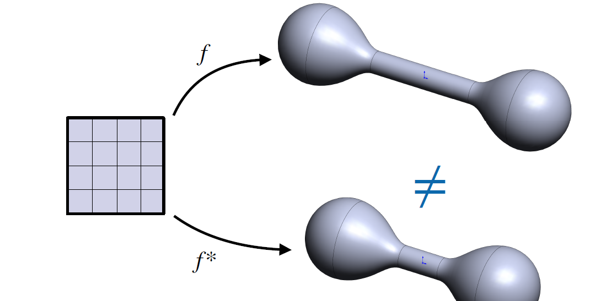

> Inspiration

Other than measuring how the surface bends, we should also measure length and angle.

##### Definition

The first fundamental form $ I_p $ is defined as the inner product in the tangent space $ T_p(\mathbb{R}^3) $.

$I_p(X, Y) = \langle Df_p X, Df_p Y \rangle$ where $ X, Y \in T_p(\mathbb{R}^2) $. $I_p(X, Y) = X^T (Df_p^T Df_p)Y$

 This form $I_p$ is dependent on both the surface $ f $ and the point $ p $.

- Arc-length by $ I(X, Y) $ : The arc-length of a curve on the surface can be determined using the first fundamental form.

  - **Velocity of a Point**:
    
    - Suppose a point $ p \in U $ moves with velocity $ X(t) $.
    - The curve on the surface is given by:
      $
      \gamma(t) = f(p(t)) = f(p_0 + \int_0^t X(t) dt)
      $
    - The derivative of the curve is:
      $
      \gamma'(t) = Df_p(t) [X(t)]
      $
    - The arc-length $ s(t) $ is:
      $$
      s(t) = \int_0^t \| \gamma'(t) \| dt \\
      = \int_0^t \sqrt{\langle Df_p(t) X(t), Df_p(t) X(t) \rangle }dt\\
      = \int_0^t \sqrt{I_p(t)(X(t), X(t))} dt
      $$

- With $I$ , we have completely determined curve length within the surface without referring to $f$

##### Local Isometric Surfaces Example

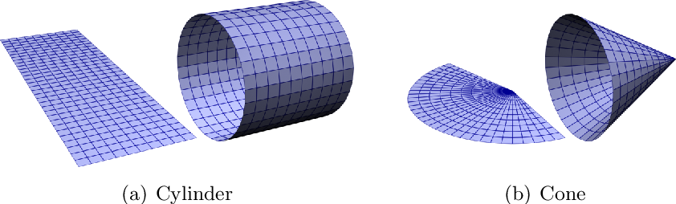

Two surfaces $ M $ and $ M^* $ are locally isometric if there exist parameterizations $ f $ and $ f^* $ such that the first fundamental forms are equal.

$
f(u, v) = [u, v, 0]^T \quad \text{and} \quad f^*(u, v) = [\cos u, \sin u, v]^T
$
on $ U = \{(u, v) : u \in (0, 2\pi), v \in (0, 1)\} $.

Proof:

For the plane parameterization $f(u,v) = [u, v, 0]^T$:
$$Df_p = \begin{bmatrix} 
1 & 0 \\
0 & 1 \\
0 & 0
\end{bmatrix}$$

Computing the first fundamental form matrix:
$$Df_p^T Df_p = \begin{bmatrix} 
1 & 0 & 0 \\
0 & 1 & 0
\end{bmatrix}
\begin{bmatrix} 
1 & 0 \\
0 & 1 \\
0 & 0
\end{bmatrix} = 
\begin{bmatrix} 
1 & 0 \\
0 & 1
\end{bmatrix}$$

For the cylinder parameterization $f^*(u,v) = [\cos u, \sin u, v]^T$:
$$Df^*_p = \begin{bmatrix} 
-\sin u & 0 \\
\cos u & 0 \\
0 & 1
\end{bmatrix}$$

Computing the first fundamental form matrix:
$$Df^*_p{}^T Df^*_p = \begin{bmatrix} 
-\sin u & \cos u & 0 \\
0 & 0 & 1
\end{bmatrix}
\begin{bmatrix} 
-\sin u & 0 \\
\cos u & 0 \\
0 & 1
\end{bmatrix} = 
\begin{bmatrix} 
\sin^2 u + \cos^2 u & 0 \\
0 & 1
\end{bmatrix} = 
\begin{bmatrix} 
1 & 0 \\
0 & 1
\end{bmatrix}$$

Since $\sin^2 u + \cos^2 u = 1$, we have:
$$Df_p^T Df_p = Df^*_p{}^T Df^*_p = 
\begin{bmatrix} 
1 & 0 \\
0 & 1
\end{bmatrix}$$

Therefore, the first fundamental forms of the plane and cylinder are identical:
$$I_p(X, Y) = X^T(Df_p^T Df_p)Y = X^T(Df^*_p{}^T Df^*_p)Y = I^*_p(X, Y)$$

This proves that the plane and cylinder are locally isometric. Intuitively, this makes sense because we can roll a plane into a cylinder without stretching or tearing, preserving all distances and angles.

Here are some applications of first form.

- Shape Classification by Isometry

  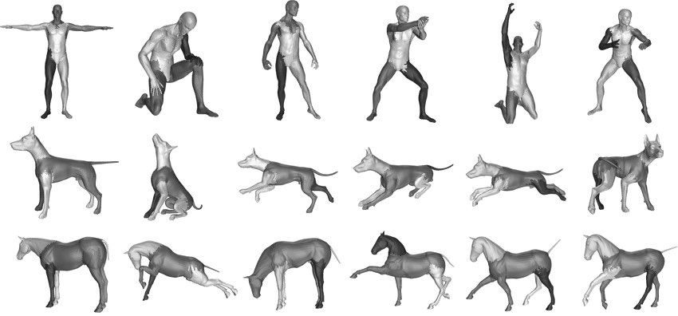

- Geodesic Distances

  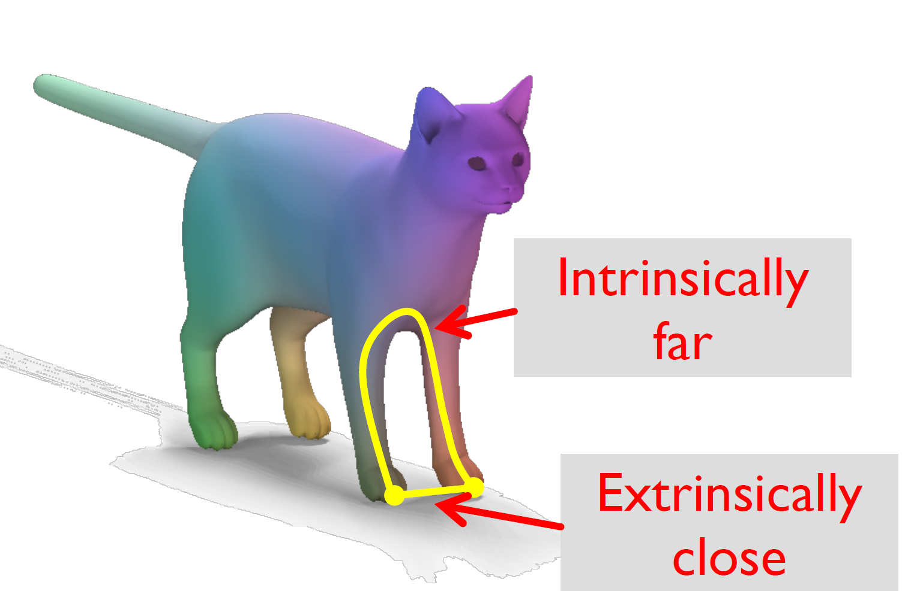


- Distance Distribution Descriptor

  > Compute distribution of distances for point pairs by randomly picked on the surface

  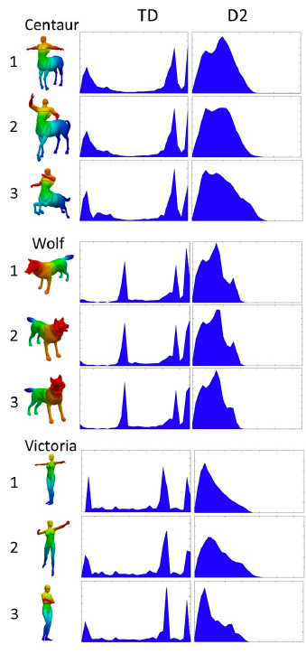


- The angle between two vectors on the surface can be determined using the first fundamental form.
  $ \cos \phi = \frac{\langle Df_p X, Df_p Y \rangle}{\| Df_p X \| \| Df_p Y \|} = \frac{I(X, Y)}{\sqrt{I(X, X) I(Y, Y)}} $

With $I$, we have completely determined angles within the surface without referring to $f$

##### Second Fundamental Form

$$
II(X, Y) = \langle DN_p X, Df_p Y \rangle
$$

> Theorem

A smooth surface is determined up to rigid motion by its first and second fundamental forms.

#### 1.2.6 Gaussian and Mean Curvature

> Definition

- **Gaussian Curvature**:
  $
  K := \kappa_1 \kappa_2
  $
- **Mean Curvature**:
  $
  H := \frac{1}{2} (\kappa_1 + \kappa_2)
  $

> Theorem

Gaussian and mean curvature also fully describe local bending.

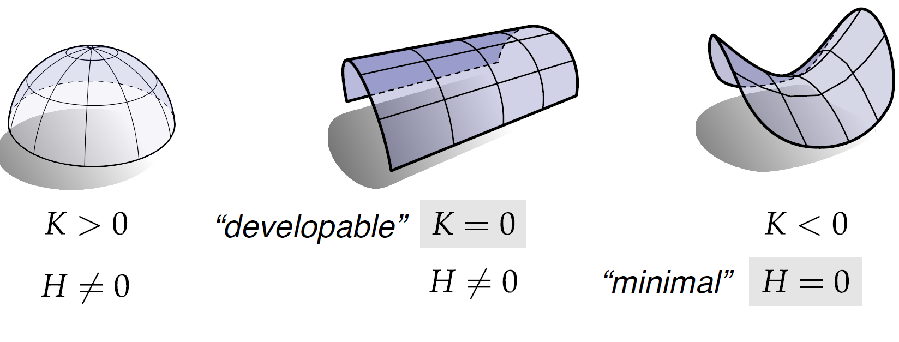

> Gauss's Theorema Egregium

The Gaussian curvature of an embedded smooth surface in  $\mathbb{R}^3$is invariant under the local isometries.

> Thought

Locally Isometric Surfaces are invariant measured by Gaussian curvature. Gaussian curvatures are vulnerable to noises in practice and not informative. Needed for more robust surface analysis.

## 2 **Representations: Mesh&&PointCloud**

> This chapter mainly focuses on 3D representations, including mesh, point cloud and implicit representation methods.

Other than parametric representations, we use rasterized form(regular grids), including **multi-view** representation, **depth map**,  **volumetric**. And also use irregular geometric form like **mesh**, **point cloud** and **implicit shape** methods(use $F(x) = 0$ to represent the geometry of the surface).

### **2.1 Meshes**

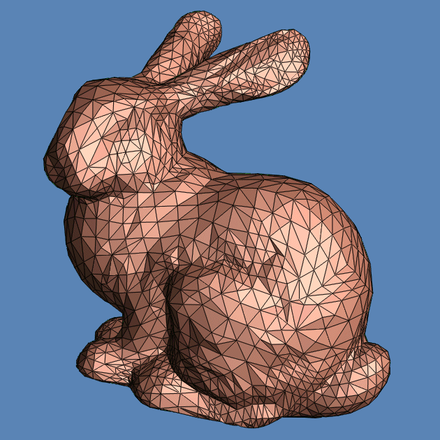

#### 2.1.1 Formulation

Mesh formulation can be seen as **manifold condition** plus a set of :

$V=\{v_1,v_2,...,v_n\} \subset \mathbb{R}^3$

$E=\{e_1,e_2,...,e_k\} \subseteq V \times V$

$F=\{f_1,f_2,...,f_m\} \subseteq V \times V \times V$

Manifold condition of discrete mesh is defined as:

1. Each edge is incident to one or two faces.
2. Faces incident to a vertex form a closed or open fan.

Polygonal meshes are piece-wise linear approximation of smooth surfaces. Assume the situation of that you want to map points to real numbers, a.k.a you want to storage scalar on surface,($f(mesh) \to R$) there exists problem that the scale of  the mesh triangle is very important. Why is Meshing an Issue?
Interpreting one value per vertex can be challenging, especially when storing scalar functions on the surface.

So good triangulation is important (manifold, equi-length). While real-data 3D are often point clouds, meshes are quite often used to visualize 3D and generate ground truth for machine learning algorithms. Non-manifold edges violate the manifold conditions, leading to topological inconsistencies. "Triangle Soup" is a collection of triangles without any connectivity information, meshes with non-uniform areas and angles can lead to poor quality and interpretation issues. Cleaning, repairing and remeshing are techniques to improve mesh quality.

## 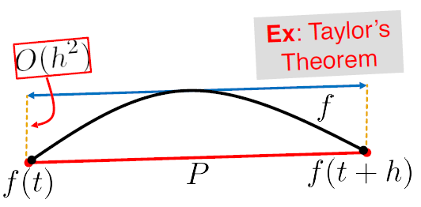

#### 2.1.2 Storage

The geometry(3D coordinates), Topology, Normal, color, texture coordinates, Per vertex, face, edge all should be contained in the mesh information(?)

##### Triangle List

- **STL format**: Used in CAD.
- **Storage**: Each face is stored with 3 positions.
- **No connectivity information**.

##### Indexed Face Set

- **Formats**: OBJ, OFF, WRL.
- **Storage**:
  - Vertex: Position
  - Face: Vertex indices
  - Convention: Save vertices in counterclockwise order for normal computation.

#### 2.1.3  Normals

Normal can be computed using various methods, including the right-hand rule and cross products. By indicating the normal continuity  surface can be divided into orientable  that have a consistent normal direction. Otherwise non-orientable: Surfaces like the Möbius strip.

#### 2.1.4 Curvatures

Rusinkiewicz’s Method
An effective approach for face curvature estimation:

- Assume a local frame at a small triangle.
- Assume that normals are roughly parallel.
- Solve for the shape operator $ S $ using least squares.

 Assume a local $f: U \to \mathbb{R}^{3}$ at a small triangle, $T_{p_{i}}$ ’s are roughly parallel, and $D f[\begin{array}{l}u  \quad v\end{array}]=u \vec{\xi}_{u}+v \vec{\xi}_{v}$, i.e., $D f=[\vec{\xi}_{u}, \vec{\xi}_{v}]$. Recall the shape operator $D N=D f \cdot S$, so $S = D f^{T} D N$. (This is because we can choose the $Df$ to be orthogonal ). By approximating $D f^{T}(D N[\begin{array}{l}u \quad  v\end{array}])\approx D f^{T}\Delta \vec{n}$, we can set up a system of equations. Solving the least - square problem (6 equations and 4 unknowns) gives $S\in \mathbb{R}^{2 ×2}$, from which principal curvatures can be computed. This method is effective for face curvature estimation, robust to moderate noise, and can be used for point clouds as well .

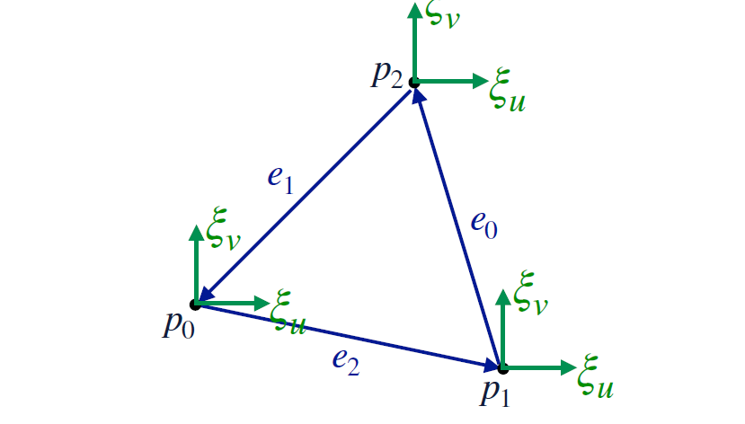

### **2.2 Point Cloud**

#### 2.2.1 Representation

A point cloud is **a set of points** in 3D space, representing the surface of an object.

- **From the real world**:
  - 3D scanning techniques (LIDAR, Kinect, Stereo).
  - Challenges: Resolution, occlusion, noise, registration.
- **From existing virtual shapes**:
  - Lightweight shape representation.
  - Compact storage and easy to build algorithms.

#### 2.2.2 Application-based Sampling

- **Storage or analysis purposes**:
  - Preserve surface information.
- **Learning data generation**:
  - Minimize virtual-real domain gap.

##### (point cloud) Uniform Sampling

- Independent identically distributed (i.i.d.) samples by surface area, and usually the easiest to implement

- Issue: Irregularly spaced sampling.

  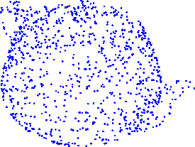

##### (point cloud) Farthest Point Sampling

- Goal: Sampled points are far away from each other.
- NP-hard problem.
- Greedy approximation method.

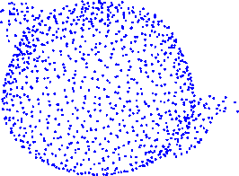


> Iterative Furthest Point Sampling

- Step 1: Over-sample the shape by any fast method.

- Step 2: Iteratively select $ K $ points.

  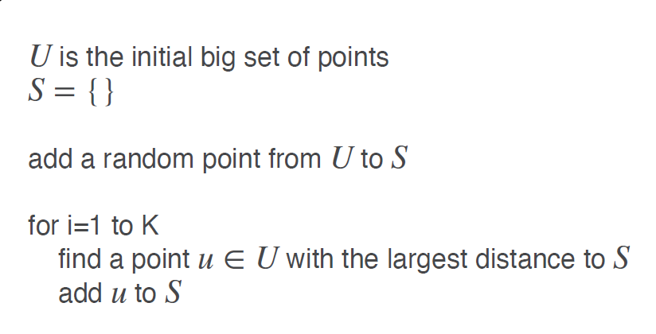

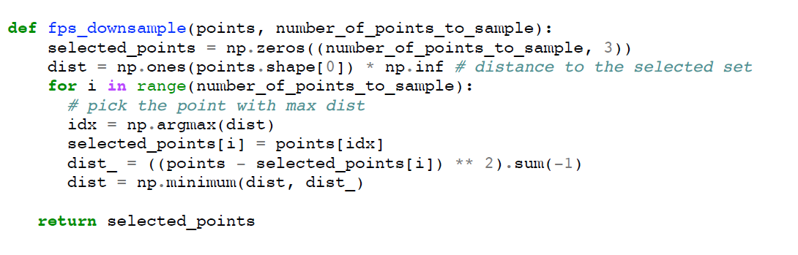

> Issues Relevant to Speed

- Naive implementation complexity: $ \mathcal{O}(KN) $.
- Optimization techniques:
  - CPU: Vectorization (numpy, scipy.spatial.distance.cdist).
  - GPU: Shared memory, complexity reduced to $ \mathcal{O}(K(N/M + \log M)) $.

> Implementation Tricks

- References for GPU implementations:
  - [mvpnet](https://github.com/maxjaritz/mvpnet/blob/master/mvpnet/ops/cuda/fps_kernel.cu)
  - [Pointnet2_PyTorch](https://github.com/erikwijmans/Pointnet2_PyTorch/blob/master/pointnet2_ops_lib/pointnet2_ops/_extsrc/src/sampling_gpu.cu)

#### 2.2.3 Voxel Down sampling

- Uses a regular voxel grid to downsample.
- Allows higher parallelization.
- Generates regularly spaced sampling.

> Issues Relevant to Speed

- Mapping each point to a bin.
- Complexity: $ \mathcal{O}(N) $.

> Dictionary-based Implementation in Numpy

```python
def voxel_downsample(points: np.ndarray, voxel_size: float):
    points_downsampled = dict()
    points_voxel_coords = (points / voxel_size).astype(int)
    for point_idx, voxel_coord in enumerate(points_voxel_coords):
        key = tuple(voxel_coord.tolist())
        if key not in points_downsampled:
            points_downsampled[key] = points[point_idx]
    points_downsampled = np.array(list(points_downsampled.values()))
    return points_downsampled
```

> Unique-based Implementation in Torch

```python
def voxel_downsample_torch(points: torch.Tensor, voxel_size: float):
    points = torch.as_tensor(points, dtype=torch.float32)
    points_voxel_coords = (points / voxel_size).long()
    unique_voxel_coords, points_voxel_indices, count_voxel_coords = torch.unique(
        points_voxel_coords, return_inverse=True, return_counts=True, dim=0
    )
    M = unique_voxel_coords.size(0)
    points_downsampled = points.new_zeros([M, 3])
    points_downsampled.scatter_add_(
        dim=0, index=points_voxel_indices.unsqueeze(-1).expand(-1, 3), src=points
    )
    points_downsampled = points_downsampled / count_voxel_coords.unsqueeze(-1)
    return points_downsampled
```

#### 2.2.4 Estimating Normals

- **Plane-fitting**: Find the plane that best fits the neighborhood of a point of interest.

##### Least-square Formulation

- Assume the plane equation is $ w^T(x - c) = 0 $ with $ \|w\| = 1 $.
- Solve the least square problem:
  $$
  \min_{w,c} \sum_i \|w^T(x_i - c)\|^2_2 \quad \text{subject to} \quad \|w\|^2 = 1
  $$
- Solution:
  - Let $ M = \sum_i (x_i - \bar{x})(x_i - \bar{x})^T $ and $ \bar{x} = \frac{1}{n} \sum_i x_i $.
  - $ w $ is the smallest eigenvector of $ M $.
  - $ c = w^T \bar{x} $.

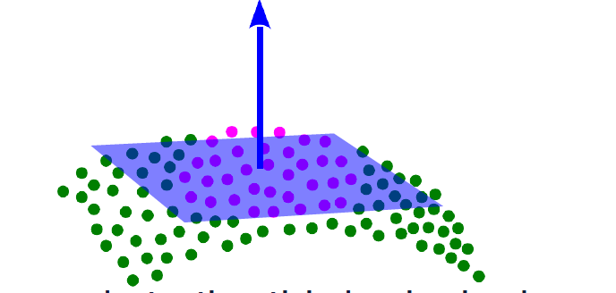

Normal can be computed through PCA over a local neighborhood. And the choice of neighborhood size is important. RANSAC can improve quality in the presence of outliers.

### **2.3 Implicit Representations**

In explicit representations of geometry, all points are given directly, genrally can be represented as $f: \mathbb{R}^2 \to \mathbb{R}^3 ; (u, v) \to (x, y,z)$. In the explicit representations points sampling is quite easy which make some tasks easy. However for the task that distinguish something inside or outside of the surface, we can turn to the implicit representations of geometry.

- How to constructive solid geometry: We can combine implicit geometry via Boolean operations.

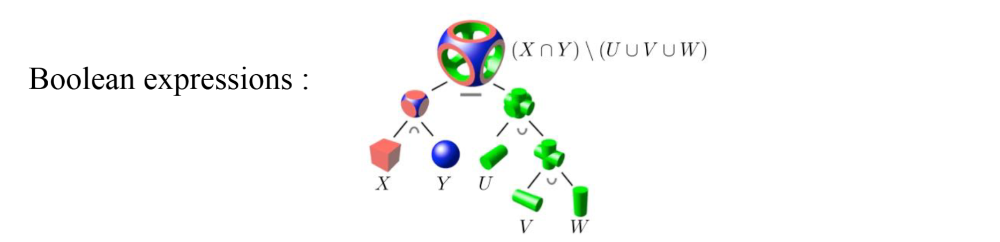

- Distance functions: giving minimum distance (could be signed distance) from anywhere to object. Instead of booleans, gradually blend surfaces together using distance functions.

  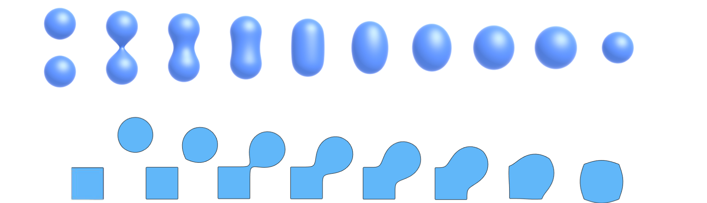

- There are no “best” geometric representation !

## 3 **Transformation**

> This chapter focuses on the transformation and rotation of 3D objects.

#### 3.1 **Homogeneous Transformation**

> Rigid Transformations and Homogeneous Coordinates

- Degrees of Freedom **DoF**: Degree of freedom, representing the number of independent parameters required to describe a transformation.

##### 3.1.1 Rigid Transformation

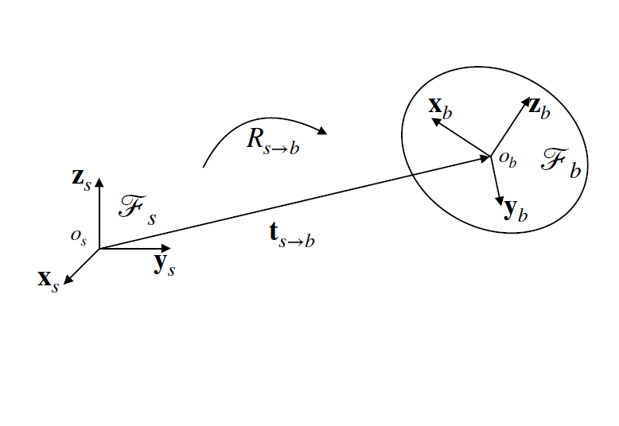

A rigid transformation can be described using a pair $(R_{s \rightarrow b}, \mathbf{t}_{s \rightarrow b})$, where:
- $R_{s \rightarrow b}$ is the rotation matrix.
- $\mathbf{t}_{s \rightarrow b}$ is the translation vector.

We use $\mathcal{F}_s$ to denote the coordinate frame. For example:

- The origin of frame $b$ in frame $s$ is given by:
  $$
  o_b^s = o_s^s + \mathbf{t}_{s \rightarrow b}^s
  $$
- A point $x_b$ in frame $b$ is transformed to frame $s$ as:
  $$
  [x_b^s, \cdots] = R_{s \rightarrow b}^s [x_s^s, \cdots]
  $$

Combining these, the relationship between points in frames $s$ and $b$ is:
$$
p^s = R_{s \rightarrow b}^s p^b + \mathbf{t}_{s \rightarrow b}^s
$$

The transformation is non-linear due to the translation component. For example:
$$
p_2^s = R_{s \rightarrow b}^s p_2^b + \mathbf{t}_{s \rightarrow b}^s
$$
$$
p_1^s + p_2^s \neq R_{s \rightarrow b}^s (p_1^b + p_2^b) + \mathbf{t}_{s \rightarrow b}^s \quad \text{when} \quad \mathbf{t}_{s \rightarrow b}^s \neq \mathbf{0}
$$

- Homogeneous Coordinates

To represent translations as linear transformations, we use homogeneous coordinates:
$$
\hat{x} = [x, 1]^T \in \mathbb{R}^4
$$

- Homogeneous Transformation Matrix

The homogeneous transformation matrix $T_{s \rightarrow b}^s$ is defined as:
$$
T_{s \rightarrow b}^s = \begin{bmatrix}
R_{s \rightarrow b}^s & \mathbf{t}_{s \rightarrow b}^s \\
0 & 1
\end{bmatrix}
$$

- Linear Form of Coordinate Transformation

Using homogeneous coordinates, the transformation can be written in linear form:
$$
\hat{x}^s = T_{s \rightarrow b}^s \hat{x}^b
$$

For a general notation, we can write:
$$
\hat{x}^1 = T_{1 \rightarrow 2}^1 \hat{x}^2
$$

The transformation between two coordinate systems is related by the inverse of the transformation matrix:
$$
T_{2 \rightarrow 1}^2 = (T_{1 \rightarrow 2}^1)^{-1}
$$

##### 3.1.2 Transformations

- Visualizing 2D Transformations in 2D-H

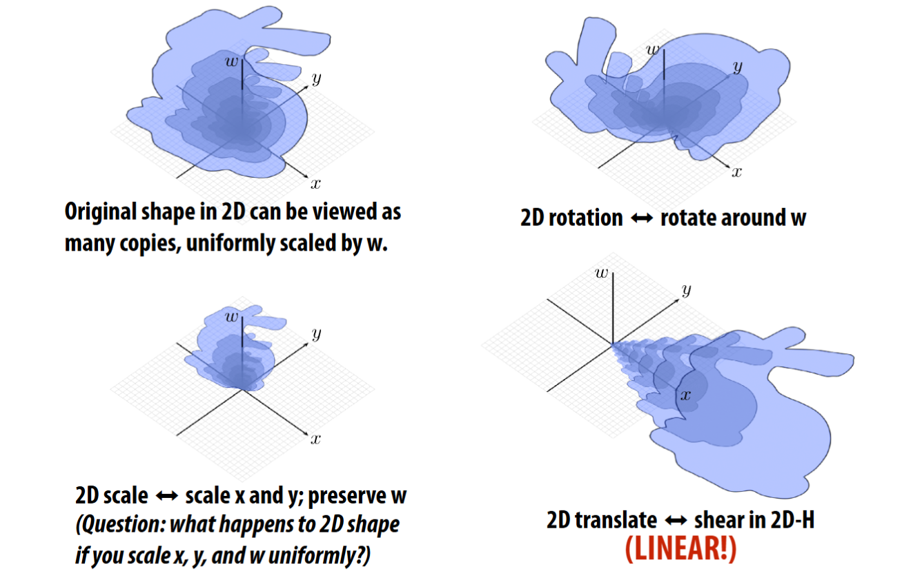

- **Scaling**

$$
S_s = \begin{bmatrix}
  s_x & 0 & 0 & 0 \\
  0 & s_y & 0 & 0 \\
  0 & 0 & s_z & 0 \\
  0 & 0 & 0 & 1
  \end{bmatrix}
$$
- **Reflection**

$$
R = T_{\mathbf{p}_0} R_{\mathbf{n}} T_{-\mathbf{p}_0}\\
T_{\mathbf{p}_0} = \begin{bmatrix}
1 & 0 & 0 & x_0 \\
0 & 1 & 0 & y_0 \\
0 & 0 & 1 & z_0 \\
0 & 0 & 0 & 1
\end{bmatrix}, \quad
R_{\mathbf{n}} = \begin{bmatrix}
1 - 2a^2 & -2ab & -2ac & 0 \\
-2ab & 1 - 2b^2 & -2bc & 0 \\
-2ac & -2bc & 1 - 2c^2 & 0 \\
0 & 0 & 0 & 1
\end{bmatrix}, \quad
T_{-\mathbf{p}_0} = \begin{bmatrix}
1 & 0 & 0 & -x_0 \\
0 & 1 & 0 & -y_0 \\
0 & 0 & 1 & -z_0 \\
0 & 0 & 0 & 1
\end{bmatrix}
$$

- **Translation**
  $$
  T_{\mathbf{t}} = \begin{bmatrix}
  1 & 0 & 0 & t_x \\
  0 & 1 & 0 & t_y \\
  0 & 0 & 1 & t_z \\
  0 & 0 & 0 & 1
  \end{bmatrix}
  $$

- **Rotation**
  $$
  R_z(\theta) = \begin{bmatrix}
  \cos \theta & -\sin \theta & 0 & 0 \\
  \sin \theta & \cos \theta & 0 & 0 \\
  0 & 0 & 1 & 0 \\
  0 & 0 & 0 & 1
  \end{bmatrix}
  $$


#### 3.2 **Rotation**

##### 3.2.1 Mathematics about Rotations

The set of rotations in $n$-dimensional space is defined by the Special Orthogonal Group $SO(n)$, which consists of all $n \times n$ orthogonal matrices with determinant 1:
$$
SO(n) = \{ R \in \mathbb{R}^{n \times n} : \det(R) = 1, RR^T = I \}
$$
This group is significant because:

- **Group**: It forms a group under matrix multiplication.
- **Orthogonal**: Matrices satisfy $RR^T = I$.
- **Special**: The determinant of each matrix is 1.

Specific cases include:

- $SO(2)$: 2D rotations, with 1 degree of freedom (DoF).
- $SO(3)$: 3D rotations, with 3 degrees of freedom (DoF).

> Topology of $SO(n)$

The topology of $SO(n)$ is crucial for understanding its properties:

- $SO(2)$ has the same topology as a circle, indicating it is a one-dimensional manifold.


- $SO(3)$ has a different topology from $(-1,1)^n$, which is significant because:
  - Circles do not have the same topology as $(-1,1)^n$, meaning there are no differentiable bijections between $SO(2)$ and $(-1,1)^n$.
  - This difference affects how rotations can be parameterized and used in computational models.

##### 3.2.2 Parameterizing Rotation in NN

When using rotations in neural networks, ideal parameterizations should:

1. Map from $(-l, l)^n$ (as network output) to $SO(2)$.
2. Be a differentiable bijection.

However, challenges arise when:

- Input data points are close, but their corresponding $\theta$ predictions are far apart after convergence. Since the network is a continuous function, it may make inaccurate predictions between these points.
- Special network designs are needed to handle these issues effectively.

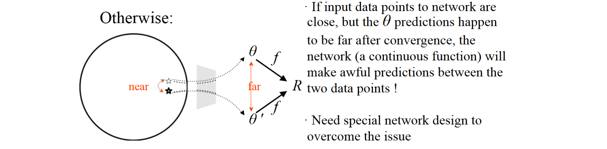

##### 3.2.3 Three kinds of Representations

- **Euler Angles**

Euler angles are a way to represent 3D rotations using three angles. These angles represent rotations about the principal axes $(x, y, z)$. The rotation matrix for Euler angles $(\alpha, \beta, \gamma)$ is given by:
$$
R = R_z(\gamma) R_y(\beta) R_x(\alpha)
$$
where:
$$
R_x(\alpha) = \begin{bmatrix}
1 & 0 & 0 \\
0 & \cos \alpha & -\sin \alpha \\
0 & \sin \alpha & \cos \alpha
\end{bmatrix}, \quad
R_y(\beta) = \begin{bmatrix}
\cos \beta & 0 & \sin \beta \\
0 & 1 & 0 \\
-\sin \beta & 0 & \cos \beta
\end{bmatrix}, \quad
R_z(\gamma) = \begin{bmatrix}
\cos \gamma & -\sin \gamma & 0 \\
\sin \gamma & \cos \gamma & 0 \\
0 & 0 & 1
\end{bmatrix}
$$


Euler angles provide an intuitive way to represent rotations but suffer from gimbal lock.

(1) Non-uniqueness in representation.


(2) Loss of a degree of freedom under certain conditions, making it impossible to distinguish between certain rotations. Eg: for $\beta = \pi /2$


Since changing  and  has the same effects, a  degree of freedom disappears.

- **Axis-Angle Representation**

> Euler Theorem: Any rotation in the special orthogonal group $SO(3)$ can be represented as a rotation about a fixed axis $\hat{\omega} \in \mathbb{R}^3$ through a positive angle $\theta$

$\hat{\omega}$ denotes the unit vector of the rotation axis, ensuring that $\|\hat{\omega}| = 1$, and $\theta$ is the angle of rotation. This relationship can be mathematically expressed as $R \in SO(3) := \text{Rot}(\hat{\omega}, \theta)$. Given a unit vector $\hat{\omega}$ and an angle $\theta$, determining the corresponding rotation matrix $R \in SO(3)$ involves understanding the dynamics of point rotation around the specified axis. Consider a point $q$. At time $t = 0$, its position is $q_0$. Rotating $q$ with a unit angular velocity around axis $\hat{\omega}$ can be described by the equations:
$$
\dot{q}(t) = \hat{\omega} \times q(t) = [\hat{\omega}]q(t)
$$
This leads to the **solution of the ordinary differential equation** (ODE) being $q(t) = e^{[\hat{\omega}]t}q_0$. Given that $\|\hat{\omega}| |= 1$, the swept angle $\theta$ is equivalent to $t$, i.e., $\theta = \|\hat{\omega}t\| = t$. Consequently, the position at time $\theta$ is $q(\theta) = e^{[\hat{\omega}]\theta}q_0$, and the rotation matrix can be expressed as $\text{Rot}(\hat{\omega}, \theta) = e^{[\hat{\omega}]\theta}$, which is known as the exponential map. The exponential map can be further elaborated using the definition of matrix exponential:
$$
e^{[\hat{\omega}]\theta} = I + \theta[\hat{\omega}] + \frac{\theta^2}{2!}[\hat{\omega}]^2 + \frac{\theta^3}{3!}[\hat{\omega}]^3 + \cdots
$$
The sum of this infinite series can be simplified using the **Rodrigues formula**, which leverages the fact that $[\hat{\omega}]^3 = -[\hat{\omega}]$. By applying the Taylor expansion of sine and cosine, the formula becomes:
$$
e^{[\hat{\omega}]\theta} = I + [\hat{\omega}]\sin\theta + [\hat{\omega}]^2(1 - \cos\theta)
$$
where $[\mathbf{\omega}]$ is represented as **a skew-symmetric matrix**:
$$
[\mathbf{\omega}] = \begin{bmatrix}
0 & -\omega_z & \omega_y \\
\omega_z & 0 & -\omega_x \\
-\omega_y & \omega_x & 0
\end{bmatrix}
$$

The parameterization of rotations is not unique. For instance, $(\hat{\omega}, \theta)$ and $(-\hat{\omega}, -\theta)$ yield the same rotation. Moreover, when $R = I$, $\theta = 0$, and $\hat{\omega}$ can be arbitrary. However, under the restriction that $\theta \in (0, \pi]$ and $\text{tr}(R) \neq -1$, a unique parameterization exists. 

> Rotation Matrix to Axis-Angle

The angle $\theta$ can be computed by 
$$
\theta = \arccos\frac{1}{2}[\text{tr}(R) - 1]
$$
 and the skew-symmetric matrix $[\hat{\omega}]$ can be derived as
$$
[\hat{\omega}] = \frac{1}{2\sin\theta}(R - R^T)\text{ when }\text{tr}(R) \neq -1
$$
 In cases where $\text{tr}(R) = -1$, $\theta = \pi$, corresponding to rotations around the x, y, or z axis by $\pi$.

> Rotations distance in $SO(3)$

 How to measure the distance between two rotations, represented by matrices $R_1$ and $R_2$ in the special orthogonal group $SO(3)$?

To measure the distance between two rotations, a natural approach is to quantify the minimal effort required to rotate one body from the pose described by $R_1$ to the pose described by $R_2$. This can be mathematically formulated by considering the rotation matrix $R_2R_1^T$, which represents the relative rotation from $R_1$ to $R_2$. The distance between these rotations is given by the angle $\theta$ of this relative rotation, which can be computed using the formula:
$$
\text{dist}(R_1, R_2) = \theta(R_2R_1^T) = \arccos \frac{1}{2}[\text{tr}(R_2R_1^T) - 1]
$$
This formula arises from the properties of rotation matrices and the relationship between the trace of a matrix and the cosine of the rotation angle. 

From a learning perspective, particularly when these rotations are parameterized and used within neural networks, a significant challenge emerges. Suppose we are estimating a rotation represented as a 3D vector $\theta \hat{\omega}$, where $\hat{\omega}$ is a unit vector and $\theta$ is the angle of rotation. To maintain a unique parameterization, it's assumed that $\theta \in (0, \pi]$. However, if the current solution is $\pi \hat{\omega}$, then $(\pi - \epsilon)(-\hat{\omega})$ maps to a nearby point in $SO(3)$ but not within the neighborhood of the domain, causing issues for gradient descent optimization methods. This discrepancy highlights the need for special network designs that can effectively handle such scenarios.

- **Quaternion Representation**

Quaternions are a four-dimensional extension of complex numbers and can be used to represent 3D rotations.A quaternion $ q $ is defined as $ q = w + xi + yj + zk $, where $ w $ is the real part and $ (x, y, z) $ form the imaginary part. The imaginary units $ i, j, k $ satisfy the following anti-commutative properties: $ i^2 = j^2 = k^2 = ijk = -1 $, $ ij = k = -ji $, $ jk = i = -kj $, and $ ki = j = -ik $.
$$
q = w + xi + yj + zk
$$
The product of two quaternions $ q_1 = (w_1, \mathbf{v}_1) $ and $ q_2 = (w_2, \mathbf{v}_2) $ is given by $ q_1 q_2 = (w_1 w_2 - \mathbf{v}_1^T \mathbf{v}_2, w_1 \mathbf{v}_2 + w_2 \mathbf{v}_1 + \mathbf{v}_1 \times \mathbf{v}_2) $. The conjugate of a quaternion $ q $ is defined as $ q^* = (w, -\mathbf{v}) $, and its norm is $ \|q\|^2 = w^2 + \mathbf{v}^T \mathbf{v} = qq^* = q^* q $. The inverse of a quaternion is $ q^{-1} = \frac{q^*}{\|q\|^2} $.

A unit quaternion can represent a rotation in 3D space. Geometrically, it can be thought of as the shell of a 4D sphere. To rotate a vector $ \mathbf{x} $ by a quaternion $ q $, the vector is first augmented to a quaternion $ \mathbf{x}' = (0, \mathbf{x}) $, and then the rotation is performed as $ \mathbf{x}' = q \mathbf{x} q^{-1} $. Composing rotations using quaternions is straightforward: if a vector is first rotated by $ q_1 $ and then by $ q_2 $, the combined rotation can be represented as $ q_2 q_1 $, since $ (q_2 (q_1 \mathbf{x} q_1^*) q_2^*) = (q_2 q_1) \mathbf{x} (q_1^* q_2^*) $.

> **Quaternion to Rotation Matrix**

Quaternions can also be converted to and from rotation matrices. Given a quaternion $ q $, the corresponding rotation matrix $ R(q) $ can be computed as $ R(q) = E(q) G(q)^T $, where $ E(q) = [-\mathbf{v}, wI + [\mathbf{v}]_\times] $ and $ G(q) = [-\mathbf{v}, wI - [\mathbf{v}]_\times] $. Here, $ [\mathbf{v}]_\times $ denotes the skew-symmetric matrix of $ \mathbf{v} $.

Where $(w, x, y, z)$ are real numbers and $i, j, k$ are the quaternion units. The rotation matrix corresponding to a quaternion $q$ is:
$$
R(q) = \begin{bmatrix}
1 - 2y^2 - 2z^2 & 2xy - 2wz & 2xz + 2wy \\
2xy + 2wz & 1 - 2x^2 - 2z^2 & 2yz - 2wx \\
2xz - 2wy & 2yz + 2wx & 1 - 2x^2 - 2y^2
\end{bmatrix}
$$

> **Axis-Angle to Quaternion**:

Quaternions are closely related to the angle-axis representation of rotations. The exponential coordinate quaternion is given by $ q = [\cos(\theta/2), \sin(\theta/2) \hat{\omega}] $, where $ \theta $ is the rotation angle and $ \hat{\omega} $ is the unit axis of rotation. Conversely, given a quaternion $ q = [w, \mathbf{v}] $, the rotation angle $ \theta $ can be obtained as $ \theta = 2 \arccos(w) $, and the rotation axis $ \hat {\omega} $ is $ \hat \omega = \frac{\mathbf{v}}{\sin(\theta/2)} $ if $ \theta \neq 0 $, otherwise $ \hat \omega = 0 $. 

Each representation has its own advantages and disadvantages, and converting between them allows us to choose the most suitable representation for a given task. Euler angles are intuitive but suffer from gimbal lock. Axis-angle representation is useful for understanding the geometric interpretation of rotations. Quaternions provide a compact and efficient way to represent and compose rotations, making them popular in computer graphics and robotics.

> Thought about Axis angle

The axis-angle representation of rotations offers an intuitive way to describe rotations. By constraining the domain of $\theta$, this representation can be unique at most points. It can be converted to and from rotation matrices via the exponential map and its inverse, when possible. Moreover, this representation induces a distance between rotations, which serves as a metric in $SO(3)$, independent of the parameterization used. From a learning perspective, each rotation corresponds to two quaternions, which is known as "double-covering." When using quaternions in neural networks, it is necessary to normalize them to unit length, which may cause issues with gradient magnitudes in practice. Quaternions are computationally efficient and are widely used in various applications, such as physical engines and robotics. It is important to pay attention to the convention used for representing quaternions, such as $(w, x, y, z) $or$ (x, y, z, w)$. Some popular conventions include $(w, x, y, z) $for SAPIEN, transforms3d, Eigen, Blender, MuJoCo, and V-Rep, while $(x, y, z, w)$ is used in ROS, PhysX, and PyBullet.

