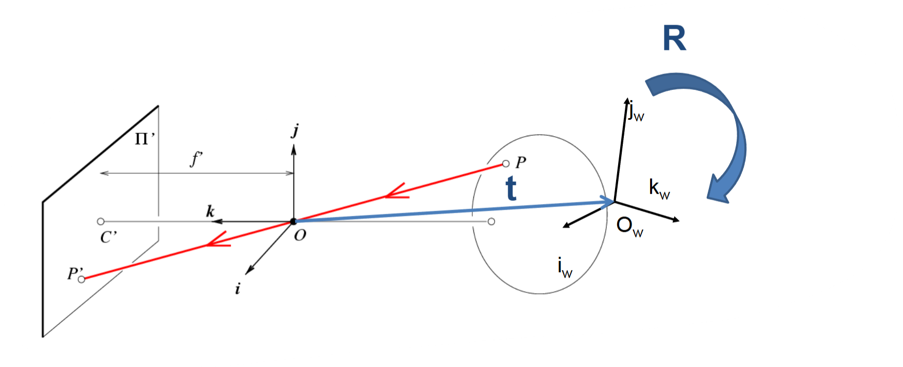

## Chapter 3 3D Reconstruction [Lecture 4-8]

> *: not include in lectures

### 3.0 2D-3D Basics

#### 3.0.0 Camera Model: Mapping 3D to 2D

> 注意：这一小节使用的都是小孔相机模型

##### Conventions

- Camera coordinate system $ O^c: [X^c, Y^c, Z^c]^T \in \mathbb{R}^3 $ with units in millimeters.
- World coordinate system $ O^w: [X^w, Y^w, Z^w]^T \in \mathbb{R}^3 $ with units in millimeters.
- Physical imaging plane $ O: [x, y]^T \in \mathbb{R}^2 $ with units in millimeters.
- Pixel space $ \mathbf{p}: [x_{pixel}, y_{pixel}， 1]^T, \in \mathbb{R}^2 $, dimensionless.

##### Intrinsic

According to the principles of lens imaging, the object plane can be approximated as being at infinity, with the image formed on the physical image plane. The relationship between the camera coordinate system $ O^c: [X^w, Y^w, Z^w]^T \in \mathbb{R}^3 $ and the physical imaging plane $ O: [x, y]^T \in \mathbb{R}^2 $ can be directly derived through similar triangles:

$$
\begin{cases} 
x = f \frac{X^c}{Z^c} \\
y = f \frac{Y^c}{Z^c} \\
\end{cases} \quad \text{Homogenized to} \quad
Z^c \begin{bmatrix} x \\ y \\ 1 \end{bmatrix} = \begin{bmatrix} f & 0 & 0 & 0 \\ 0 & f & 0 & 0 \\ 0 & 0 & 1 & 0 \end{bmatrix} \begin{bmatrix} X^c \\ Y^c \\ Z^c \\ 1 \end{bmatrix}
\text{Vectorized to} \quad
Z^c\mathbf{p} = \mathbf{M}\mathbf{P^c} \quad \mathbf{M} = \begin{bmatrix} f & 0 & 0 & 0 \\ 0 & f & 0 & 0 \\ 0 & 0 & 1 & 0 \end{bmatrix}
$$
rom the physical imaging plane $ O $ to the pixel space $ \mathbf{p}: [x_{pixel}, y_{pixel}]^T, \in \mathbb{R}^2 $, considerations must be made for central shift and distortion. Let $ k = \frac{1}{d_x} \quad l = \frac{1}{d_y} $ where $ d_x $ and $ d_y $ are the pixel width and height (in millimeters), respectively.

$ u_0 $ and $ v_0 $ are dimensionless central shift quantities. Substituting $ x, y $ into the expressions gives:
$$
\begin{cases} 
x_{pixel} = \frac{1}{d_x}x -\frac{1}{d_x}\cot \theta y + u_0 \\
y_{pixel} = \frac{1}{d_y \sin \theta} y + v_0\\
\end{cases}
\to
\begin{cases} 
x_{pixel}  = \alpha \frac{X^c}{Z^c} - \alpha \cot \theta \frac{Y^c}{Z^c} + u_0 \\
y_{pixel}  = \frac{\beta}{\sin \theta} \frac{Y^c}{Z^c} + v_0 
\end{cases}\quad
\alpha = kf, \beta = lf
$$
Thus, we have:

$$
Z^c  \begin{bmatrix}
x_{pixel} \\
y_{pixel} \\
1
\end{bmatrix}
=
\begin{bmatrix} \alpha & -\cot \theta & u_0 \\ 0 & \frac{\beta}{\sin \theta} & v_0 \\ 0 & 0 & 1 \end{bmatrix} \begin{bmatrix} X^c \\ Y^c \\ Z^c \end{bmatrix}
\text{Vectorized to}
\to
\mathbf{p} = \frac{1}{Z^c} \mathbf{K}\mathbf{P^c} =\mathbf{K}\begin{bmatrix} \frac{X^c}{Z^c} \\ \frac{Y^c}{Z^c} \\ 1 \end{bmatrix}
$$
有时候，为了方便讨论，我们会引入一个虚拟的归一化成像平面，$O': \mathbf{P'} = [X^c/Z^c, Y^c/Z^c, 1] \in \mathbb{R}^2$，则
$$
\mathbf{p} = \mathbf{K} \mathbf{P'}
$$
这个式子在后面会经常用到

##### Extrinsic

(Transformation from the world coordinate system $ O^w: [X^w, Y^w, Z^w]^T $ to the camera coordinate system $ O^c: [X^c, Y^c, Z^c]^T $)

$$
O^w \to O^c: \quad \mathbf{P^c} = \mathbf{R} \mathbf{P^w} + \mathbf{t}\\
  \begin{bmatrix} X^c \\ Y^c \\ Z^c \\ 1 \end{bmatrix} = \begin{bmatrix} \mathbf{R} & \mathbf{t} \\ 0 & 1 \end{bmatrix} \begin{bmatrix} X^w \\ Y^w \\ Z^w \\ 1 \end{bmatrix}\quad 
\begin{bmatrix} X^c \\ Y^c \\ Z^c \end{bmatrix} = \begin{bmatrix} \mathbf{R} & \mathbf{t} \end{bmatrix} \begin{bmatrix} X^w \\ Y^w \\ Z^w \\ 1 \end{bmatrix}
$$

##### **Imaging Formula**

From the world coordinate system $ O^w: [X^w, Y^w, Z^w]^T $ to the pixel space $ \mathbf{p} = [x_{pixel}, y_{pixel}] $

$$
\mathbf{P^c} = [\mathbf{R} \quad \mathbf{t}]\mathbf{P^w} \quad 
\mathbf{p}_{pixel} = \frac{1}{Z^c} \mathbf{K} \mathbf{P^c}\to
\mathbf{p}_{pixel} = \frac{1}{Z^c}\mathbf{K}[\mathbf{R} \quad \mathbf{t}]\mathbf{P^w}\\
\text{where }
\mathbf{K} = 
\begin{bmatrix} \alpha & -\cot \theta & u_0 \\ 0 & \frac{\beta}{\sin \theta} & v_0 \\ 0 & 0 & 1 \end{bmatrix}

 ,\mathbf{R} = \begin{bmatrix} R_{11} & R_{12} & R_{13} \\ R_{21} & R_{22} & R_{23} \\ R_{31} & R_{32} & R_{33} \end{bmatrix} ,\mathbf{t} = \begin{bmatrix} t_1 \\ t_2 \\ t_3 \end{bmatrix} \\
$$

#### 3.0.1 Camera Calibration*

Camera calibration involves determining the intrinsic and extrinsic parameters of a camera to accurately map 3D world coordinates to 2D image coordinates.

Assume $ n $ images are captured, each with $ k $ chessboard corners.

- **Input**: Chessboard corner coordinates $ M_j (j \in 1,2,...,k) $ and their corresponding image coordinates $ m_{ij} (i \in 1,2,...,n, j \in 1,2,...,k) $.
- **Output**: Camera intrinsic parameters $ \mathbf{K} $, and extrinsic parameters $ \mathbf{R}_i, \mathbf{t}_i $ for each image.
- **Objective**: Minimize the reprojection error:

$$
\sum_{i=1}^{n} \sum_{j=1}^{k} \| m_{ij} - \hat{m}(\mathbf{K}, \mathbf{R}_i, \mathbf{t}_i, M_j) \|^2
$$

where $ \hat{m}(\mathbf{K}, \mathbf{R}_i, \mathbf{t}_i, M_j) $ represents the projection of $ M_j $ onto the $ i $-th image.

##### Process

1. **Collect Data**: Capture a set of images of a known calibration pattern (e.g., a checkerboard) from different viewpoints.
2. **Detect Feature Points**: Detect and identify feature points in each image.
3. **Estimate Intrinsic Parameters**: Use a nonlinear optimization algorithm to minimize the reprojection error.
4. **Estimate Extrinsic Parameters**: Estimate the extrinsic parameters for each image.
5. **Refine the Model**: Iteratively refine the camera model by re-estimating the parameters.
6. **Validate the Model**: Validate the accuracy of the camera model.

##### Projection Model

In homogeneous coordinates, the projection point in the chessboard coordinate system is $ \tilde{m} = [u, v, 1]^T $, which has the corresponding relationship:
$$
\lambda \tilde{m} = \lambda \begin{bmatrix} u \\ v \\ 1 \end{bmatrix} = \mathbf{K} \begin{bmatrix} r_1 & r_2 & r_3 & t \end{bmatrix} \begin{bmatrix} X \\ Y \\ Z \\ 1 \end{bmatrix}
$$
Assuming the chessboard corners are on the plane $ Z = 0 $:
$$
\lambda \tilde{m} = \lambda \begin{bmatrix} u \\ v \\ 1 \end{bmatrix} = \mathbf{K} \begin{bmatrix} r_1 & r_2 & t \end{bmatrix} \begin{bmatrix} X \\ Y \\ 1 \end{bmatrix}
$$
Let $ \tilde{M} = [X, Y, 1]^T $, then:
$$
\lambda \tilde{m} = \mathbf{H} \tilde{M} \quad \mathbf{H} = \mathbf{K} \begin{bmatrix} r_1 & r_2 & t \end{bmatrix}
$$
where $ \mathbf{H} $ is the homography matrix.

#### 3.0.3  Epipolar Geometry: 2-view Sterio

##### 对极约束

如图两平面均是

- Epipolar constraint: x1对应的三维点X在另一图像上的投影必然在另一图像的对极线上。如图p1的潜在匹配点一定位于极线l2上面。

##### 本质矩阵关联两视点

- I1平面到I2平面的坐标系变换是$R | t$即，对于一个在I1坐标系内坐标为$X$的点，在I2坐标系为$RX+t$,也可表述为O2相对于O1的外参数是R和t

- 下图中的两个蓝色框代表的是**像素平面**（这次使用的是透视相机模型而非前面的小孔相机模型），p1p2均是像素平面上的点，选择左边的相机坐标系作为世界坐标系，右边的相机相对于左相机的外参数是$[R|t]$根据$\mathbf{p} = \frac{1}{Z^c} \mathbf{K}\mathbf{P^c}$有$z_1p_1 = K_1P \quad z_2p_2 = K_2 (RP + t)$
- 在尺度的意义下有$z_1 \approx z_2$因此可以得到$p1 = $
- 那么如何使用对极约束来关联两个视图: 下图中x1x2都是**归一化成像平面**上的点，即$P'$，根据$\mathbf{p} = \mathbf{K} \mathbf{P'}$有

| ---                                                          | ---                                                          |
| ------------------------------------------------------------ | ------------------------------------------------------------ |
|  |  |

| ---                                                          | ---                                                          |
| ------------------------------------------------------------ | ------------------------------------------------------------ |
|  |  |

#### 3.0.4 Depth Images: 2.5D Representation*

We want to aggregate complete 3D scenes from partial observation of the world. Beyond the image taken by camera which are in 2D pictures(single view/ single frame), there are actually different types of sensors and visual data as input.

#### 

Depth sensors are a form of 3D range finder, which measure multi-point distance information across a wide Field-of-View (FoV)

这一部分需要简要总结**相机模型**、内外参数矩阵、深度图、对极几何、相机标定、立体匹配的基本知识

结合知乎内容二六七+lyb第一讲+wanghe第9讲

什么是视差->使用视差来估计图像深度

### 3.1 SFM: Structure from Motion

Hight level idea: SFM is an algorithm that takes 2 or more images as input, reconstruct the camera pose and reconstruct the position of 3D points.

1. 提取特征点并进行匹配
2. 选择一组场景（两张图片），基于这两张图片估计相机位姿，并重建三维坐标点
3. 用[Bundle Adjustment](https://zhida.zhihu.com/search?content_id=166307793&content_type=Article&match_order=1&q=Bundle+Adjustment&zhida_source=entity)进行优化
4. 对于剩下每一个的场景（图片），重复2-3步进行三维重建

最好还补充一些SLAM算法什么的paper

Bundle Adjustment是指在结构从运动（SfM）和同步定位与地图构建（SLAM）等任务中，通过最小化重投影误差来优化相机姿态和3D点坐标的过程。具体来说，它是通过调整相机的外参（姿态和位置）以及3D点的位置，使得每个3D点在不同视角下的**重投影误差之和最小化**。这个过程通常采用最小二乘法进行求解，是这些任务中获得高精度三维重建和相机姿态的关键步骤.

这一部分结合知乎第八（已知参数的两个相机从双目相机到视察）第九（SFM）+论文SFM+课堂PPT

### 3.2 MVS: Muti-View Stereo

yiliPPT+苏昊PPT+知乎第十讲+lybPPT

### 3.3 Single image to 3D

### 3.4 NeRF: 

### 3.5 Surface Reconstruction

## Chapter 4 3D Generation [Lecture 9]

## Chapter 5 3D Comprehension [Lecture 10]

