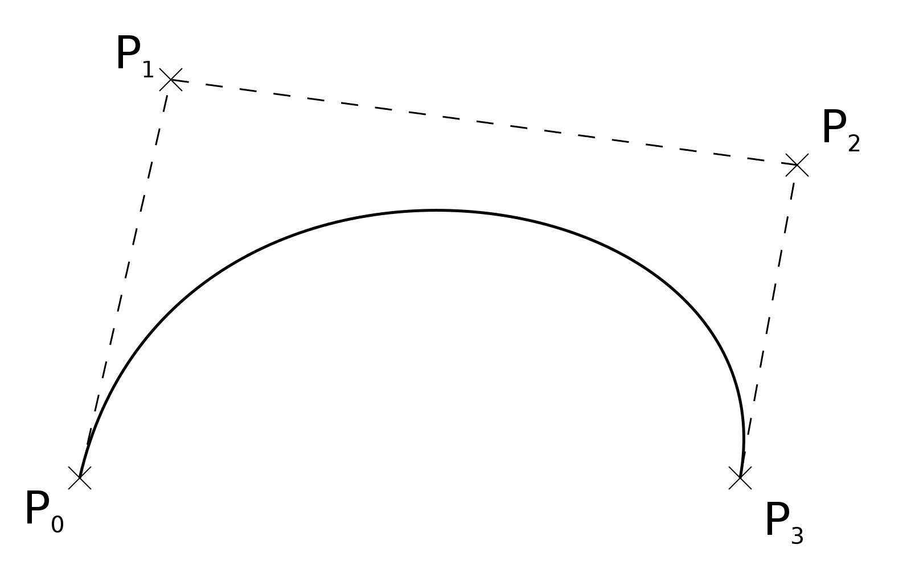

# 3DV

> Notes Taking: Alex
>
> Contact: `wang-zx23@mails.tsinghua.edu.cn`
>
> Reference: `Li Yi 's 3DV lecture & Hao Su's ML-meets-geometry lecture`

[TOC]

## 0 Introduction

Geometry understanding is very important in Robotics, Augmented Reality Autonomous driving and Medical Image Processing. From geometry understanding the robot can get **a priori knowledge of the 3D world**.

- Geometry theories $\to$ Curves, Surface, Rotation ···
- Sensing: Computer Representation of Geometries $\to$ Mesh, Point, ···
- Sensing: 3D reconstruction from a single image $\to$ 
- Geometry Processing: Local geometric property estimation, Surface reconstruction
- Recognition: Object classification, Object detection, 6D pose estimation, Segmentation,Human pose estimation
- Relationship Analysis: Shape correspondences

## 1 Geometry Basic

### **1.1 Curves**

##### Definition

- **Parameterized Curve:**  
  $\gamma(t) = (x(t), y(t))$  
  Intuition: A particle moving in space with position $\gamma(t)$ at time $t$.

Use parameterized  methods to represent a curve. $\gamma(t) = (x(t), y(t), z(t))| R \to R^3: t \to p(t)$

eg: 

$p(t) = r(cos(t), sin(t)), \quad t \in [0,2\pi)$

Application: Bezier Curves, Splines: 

$$
s(t) = \sum_{i = 0}^n \mathbf{p}_iB_i^n(t)
$$

A curve is just like One-dimensional “Manifold", Set of points that locally looks like a line. (however when a cusp occured things becomeds complex)

##### Parameterization

- **Tangent Vector:**  
  $\gamma'(t) = (x'(t), y'(t)) \in \mathbb{R}^2$  
  Example: For $\gamma(t) = (\cos(t), \sin(t))$,  
  $\gamma'(t) = (-\sin(t), \cos(t))$  
  - $\gamma'(t)$ indicates the direction of movement.  
  - $\|\gamma'(t)\|$ indicates the speed of movement.
- **Arc length**
  $\int_a^b ||\gamma'(t)|| dt$
- **Parameterization by Arc Length**
  $s(t) = \int_{t_0}^t ||\gamma'(t)||dt$
  $t(s)$ = inverse function of $s(t)$ 
  $\hat{\gamma}(s) = \gamma(t(s))$

##### Geometry Meaning

A curve is defined as a **map** from an **interval** to $\mathbb{R}^n $ The **tangent vecto**r to the curve describes the **direction of motion along the curve**. When the curve is parameterized by arc-length, the derivative of the tangent vector is the normal vector. Both **curvature** and **torsion** are measures that **describe the change in the normal direction of the curve**. Curvature quantifies how much the normal vector changes in the direction tangent to the curve, while **torsion** quantifies **how much the normal vector changes in the direction orthogonal to the osculating plane of the curve**. Curvature is always positive, indicating the rate of bending, whereas torsion can be negative, indicating twisting. Together, curvature and torsion uniquely describe the shape of a curve, up to rigid transformations. The tangent, normal, and binormal vectors together form a moving frame, known as the Frenet frame, which provides a local coordinate system that moves along the curve.

#### 2D Curves

> Theorem

Define Tangent vector $T(s) = \gamma'(s)$, $ \implies $  $ \|T(s)\| \equiv 1 $  

##### $\|T(s)\| \equiv 1$

> Proof: By definition.

$ S(t) = \int_{t_0}^{t} \|\gamma'(t)\| dt $

$ \frac{ds}{dt} = \|\gamma'(t)\| $

$ T(s) = \|\gamma'(s)\| = \left\|\frac{d\gamma}{ds}\right\| = \left\|\frac{d \gamma}{dt}\right\| \cdot \left\|\frac{dt}{ds}\right\| = |\gamma'(t)| \|\frac{dt}{ds}\| $

$ t(s) = s^{-1}(t)\quad \frac{dt}{ds} = \frac{1}{\frac{ds}{dt}} = \frac{1}{\left\|\gamma'(t)\right\|}$

Thus, $ \|T(s)\| = \frac{\|\gamma'(t)\|}{\|\gamma'(t)\|} = 1 $

##### $N(s):= JT(s)$

Define Normal vector $ N(s)$ where $J$ is the rotation matrix of $90^{\circ}$ in 2D space.
$$
J = 
\begin{bmatrix}
0 & -1\\
1 & 0
\end{bmatrix}
$$
We have the definition of the normal vector: $N(s) := JT(s)$.

##### 2d curve Frenet Equation

> Theorem

$$
\frac{d}{ds} \begin{bmatrix} T(s) \\ N(s) \end{bmatrix} := \begin{bmatrix} 0 & k(s) \\ -k(s) & 0 \end{bmatrix} \begin{bmatrix} T(s) \\ N(s) \end{bmatrix}
$$
> Proof: By $\|T(s)\| \equiv 1$ and $\frac{d}{dt}<u,v>=\frac{du}{dt}v + \frac{dv}{dt}u$

Now, let's derive the Frenet equations: We know that $T(s)$ is a unit tangent vector, meaning $|T(s)| = 1$, which implies that $\langle T(s), T(s) \rangle = 1$. When we differentiate $\langle T(s), T(s) \rangle = 1$ with respect to $s$, we get: $\langle \frac{dT}{ds}, T \rangle + \langle T, \frac{dT}{ds} \rangle = 0$ $\Rightarrow 2\langle \frac{dT}{ds}, T \rangle = 0$ $\Rightarrow \langle \frac{dT}{ds}, T \rangle = 0$ This shows that $\frac{dT}{ds}$ is orthogonal to $T$. Since $\frac{dT}{ds}$ is orthogonal to $T$, and in a 2D plane, the only orthogonal direction is along the normal vector $N$, we can write $\frac{dT}{ds} = \kappa(s)N(s)$, where $\kappa(s)$ is the curvature. For the normal vector $N(s) = JT(s)$, when we differentiate, we get: $\frac{dN}{ds} = J\frac{dT}{ds} = J(\kappa(s)N(s)) = \kappa(s)JN(s)$ Since $N(s) = JT(s)$, we have $JN(s) = J(JT(s)) = J^2T(s)$ . Computing $J^2$:
$$
J^2 =
\begin{bmatrix}
0 & -1\\
1 & 0
\end{bmatrix}
\begin{bmatrix}
0 & -1\\
1 & 0
\end{bmatrix} =
\begin{bmatrix}
-1 & 0\\
0 & -1
\end{bmatrix} = -I
$$

Therefore, $JN(s) = J^2T(s) = -T(s)$ . Substituting back: $\frac{dN}{ds} = \kappa(s)JN(s) = -\kappa(s)T(s)$

In summary, we have derived: $\frac{dT}{ds} = \kappa(s)N(s)$ $\frac{dN}{ds} = -\kappa(s)T(s)$ These equations can be expressed in matrix form:

$$
\frac{d}{ds} \begin{bmatrix} T(s) \\ N(s) \end{bmatrix} =
\begin{bmatrix}
0 & \kappa(s) \\
-\kappa(s) & 0
\end{bmatrix}
\begin{bmatrix} T(s) \\ N(s) \end{bmatrix}
$$

> Thoughts: Use the geometry self-coordinates to describe the shape of itself.

##### $\mathbb{R}^2$ Curve Theorem  

Radius of Curvature is defined as $\kappa(s) = \frac{1}{R}$  , $R$ is the radius of curvature. The geometry meaning indicated how much the normal changes in the direction tangent to the curve. Or curvature $\kappa(s)$ **characterizes a planar curve up to rigid motion**, which is always positive.

#### 3D Curves

##### Osculating Plane 

The plane determined by $T(s)$ and $N(s)$. And we define the the Binormal Vector $B(s) = T(s) \times N(s)$ Curvature and Torsion

##### Curvature $\kappa$ & Torsion $\tau$

> Definition

$<N'(s), T(s)> = -\kappa(s) \quad <N'(s), B(s)> = \tau(s)$

> Theorem

$T'(s) = \kappa(s)N(s)$  $N'(s) = -\kappa(s)T(s) + \tau(s)B(s)$   $B'(s) = -\tau(s)N(s)$  

> Proof

For the first equation, we know that $T(s)$ is a unit vector, so $\|T(s)\| = 1$. Differentiating $\langle T(s), T(s) \rangle = 1$ with respect to $s$:
$\langle T'(s), T(s) \rangle + \langle T(s), T'(s) \rangle = 0$
$\Rightarrow 2\langle T'(s), T(s) \rangle = 0$
$\Rightarrow \langle T'(s), T(s) \rangle = 0$

This shows that $T'(s)$ is orthogonal to $T(s)$. Since $\{T, N, B\}$ forms an orthonormal basis, $T'(s)$ must lie in the plane spanned by $N$ and $B$:
$T'(s) = \alpha N(s) + \beta B(s)$

To find $\alpha$ and $\beta$, we compute:
$\langle T'(s), N(s) \rangle = \alpha \langle N(s), N(s) \rangle + \beta \langle B(s), N(s) \rangle = \alpha \cdot 1 + \beta \cdot 0 = \alpha$

By definition, $\alpha = \kappa(s)$. Also:
$\langle T'(s), B(s) \rangle = \alpha \langle N(s), B(s) \rangle + \beta \langle B(s), B(s) \rangle = \alpha \cdot 0 + \beta \cdot 1 = \beta$

Since $T$, $N$, and $B$ form a right-handed orthonormal basis, $\langle T'(s), B(s) \rangle = 0$, thus $\beta = 0$.
Therefore, $T'(s) = \kappa(s)N(s)$.

For the second equation, we know that $\{T, N, B\}$ is an orthonormal basis, so $N'(s)$ can be expressed as:
$N'(s) = a T(s) + b N(s) + c B(s)$

Since $\langle N(s), N(s) \rangle = 1$, differentiating gives:
$\langle N'(s), N(s) \rangle + \langle N(s), N'(s) \rangle = 0$
$\Rightarrow 2\langle N'(s), N(s) \rangle = 0$
$\Rightarrow b = 0$

From $\langle N(s), T(s) \rangle = 0$, differentiating:
$\langle N'(s), T(s) \rangle + \langle N(s), T'(s) \rangle = 0$
$\Rightarrow \langle N'(s), T(s) \rangle + \langle N(s), \kappa(s)N(s) \rangle = 0$
$\Rightarrow \langle N'(s), T(s) \rangle + \kappa(s) = 0$
$\Rightarrow a = -\kappa(s)$

By definition, $\langle N'(s), B(s) \rangle = \tau(s)$, thus $c = \tau(s)$.
Therefore, $N'(s) = -\kappa(s)T(s) + \tau(s)B(s)$.

For the third equation, since $B = T \times N$, differentiating:
$B'(s) = T'(s) \times N(s) + T(s) \times N'(s)$
$= \kappa(s)N(s) \times N(s) + T(s) \times (-\kappa(s)T(s) + \tau(s)B(s))$
$= 0 + (-\kappa(s))(T(s) \times T(s)) + \tau(s)(T(s) \times B(s))$
$= 0 + 0 + \tau(s)(T(s) \times B(s))$

Since $\{T, N, B\}$ is a right-handed orthonormal basis, $T \times B = -N$. Thus:
$B'(s) = \tau(s)(-N(s)) = -\tau(s)N(s)$
> Thoughts

Curvature indicates how much the **normal** changes in the direction **tangent** to the curve. (Indicates in-plane motion.) Torsion indicates how much normal changes in the direction **orthogonal** to the osculating plane of the curve.(Indicates out-of-plane motion.) Curvature is always **positive** but torsion can be **negative**

##### 3d curve Frenet Frame

> Theorem:

$$
\frac{d}{ds} \begin{pmatrix} T \\ N \\ B \end{pmatrix} = \begin{pmatrix} 0 & \kappa & 0 \\ -\kappa & 0 & \tau \\ 0 & -\tau & 0 \end{pmatrix} \begin{pmatrix} T \\ N \\ B \end{pmatrix}
$$

> Proof: By the relations above.

##### $\mathbb{R}^3$ Curve Theorem

Curvature $\kappa(s)$ and torsion $\tau(s)$ characterize a 3D curve up to rigid motion.

### **1.2 Surface** 

